## Outline

::: {.columns}
::: {.column width="50%"}

1. Why PPLs for Causal Inference?
2. Bayesian A/B Testing
3. Bayesian Power Analysis
4. Bayesian CUPED

:::

::: {.column width="50%"}

5. Confounders: An Example
6. Fixed & Random Effects
7. Mediation Analysis
8. Marketing Mix Modeling
9. References

:::
:::

## What is Causal Inference? {.smaller}

- **Goal:** Estimate the effect of a treatment $T$ on an outcome $Y$.
- **Potential outcomes** (Rubin, 1974): For each unit $i$, there exist two potential outcomes:
  - $Y_i(1)$: outcome if treated
  - $Y_i(0)$: outcome if not treated
- **Individual Treatment Effect:** $\tau_i = Y_i(1) - Y_i(0)$
- **Average Treatment Effect (ATE):** 

$$
\text{ATE} = \mathbb{E}[Y(1) - Y(0)]
$$


::: {.callout-warning}

## The Fundamental Problem of Causal Inference

We can **never observe both** $Y_i(1)$ and $Y_i(0)$ for the same unit. One potential outcome is always **missing** (counterfactual).

$$
\text{Observed: } Y_i = T_i \cdot Y_i(1) + (1 - T_i) \cdot Y_i(0)
$$

This is why naive comparisons (treated vs. untreated) can be **biased**: the groups may differ systematically due to **confounders**.

:::

## What is Bayesian Statistics? {.smaller}

**Bayes' theorem:** Update beliefs about parameters $\theta$ after observing data $y$:

$$
\underbrace{p(\theta \mid y)}_{\text{posterior}} \propto \underbrace{p(y \mid \theta)}_{\text{likelihood}} \cdot \underbrace{p(\theta)}_{\text{prior}}
$$

::: incremental

- **Prior** $p(\theta)$: encodes domain knowledge before seeing data.
- **Likelihood** $p(y \mid \theta)$: how probable the data is given the parameters.
- **Posterior** $p(\theta \mid y)$: updated beliefs after observing data.

:::

::: {.callout-tip}
## The PPL bridge

In a generative graphical model, every distribution **starts as a prior** over the data-generating process. Once we **condition on observed data**, those priors become **likelihoods**. A causal model and a Bayesian model are the **same object**, viewed before and after observing data.
:::

::: {.callout-note}

## Probabilistic Programming Languages (PPLs)

PPLs let you write generative models as code and automate posterior inference. Examples: [PyMC](https://www.pymc.io/), [NumPyro](https://num.pyro.ai/), [Stan](https://mc-stan.org/).

:::

## Why PPLs for Causal Inference? 

::: {.callout-tip appearance="simple"}

- **Model = DAG:** Writing the generative process forces you to explicitly state your causal assumptions: this alone is valuable!

- **Uncertainty for free:** Posterior distributions over causal effects.

- **Prior Modeling:** Setting priors to reflect our domain knowledge.

- **Flexible modeling:** Swap likelihoods (Normal $\to$ Gamma), add hierarchical structure (Mundlak), or latent variables for unobserved confounders (CEVAE).

- **`do`-operator:** Intervene on the generative model for counterfactual reasoning.

- **Fast inference:** Modern MCMC (NUTS) and SVI make posterior computation scalable and reliable.

:::

::: {.callout-warning appearance="simple" .smaller}
This **does not** imply that Bayesian methods are better than frequentist methods! For every framework, you need to know the assumptions and the limitations.

PPLs do not solve **identification**! They make **estimation** under causal assumptions.
:::

## Bayesian A/B Testing {.smaller}

::: {.callout-tip appearance="simple"}
A/B testing is the **gold standard of causal inference**: random assignment makes treatment independent of all confounders, observed and unobserved. The hard part shifts from **identification** to **estimation under uncertainty**.
:::


```{.python code-line-numbers="|1|2-4|5-7|8-11|"}
with pm.Model() as non_informative_model:
    conversion_rate_control = pm.Uniform(
      "conversion_rate_control", lower=0, upper=1
    )
    conversion_rate_treatment = pm.Uniform(
        "conversion_rate_treatment", lower=0, upper=1
    )
    relative_lift = pm.Deterministic(
        "relative_lift",
        conversion_rate_treatment / conversion_rate_control - 1,
    )
```
::: {.columns}
::: {.column width="70%"}

::: {.bordered}
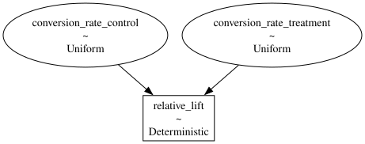{fig-align="center" width="650"}
:::

:::
::: {.column width="30%"}


\begin{align*}
\text{cr}_\text{c} & \sim \text{Beta}(1, 1) \\
\text{cr}_\text{t} & \sim \text{Beta}(1, 1) \\
\text{lift} & = \text{cr}_\text{t} / \text{cr}_\text{c} - 1 \\
N_{\text{c}} & \sim \text{Binomial}(N, \text{cr}_\text{c}) \\
N_{\text{t}} & \sim \text{Binomial}(N, \text{cr}_\text{t}) \\
\end{align*}

:::
:::

::: footer
[Prior Predictive Modeling in Bayesian A/B Testing](https://juanitorduz.github.io/prior_predictive_ab_testing/)
:::

## Uninformative Priors: Implications

::: {.callout-important}
## Uninformative Priors yield implausible values for the relative lift.

Setting uninformative priors for the conversion rates yields implausible values for the relative lifts as this is a ratio of two random variables, so it can blow up to infinity or zero.

:::

::: {.columns}
::: {.column width="40.5%"}

::: {.bordered}
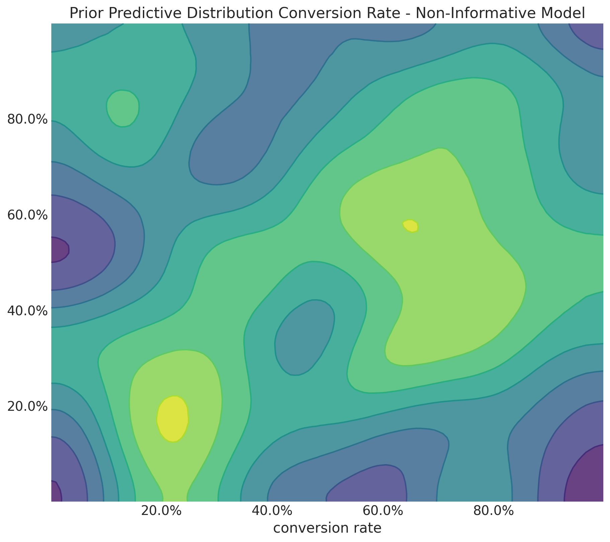{fig-align="center" width="700"}
:::

:::
::: {.column width="59.5%"}

::: {.bordered}
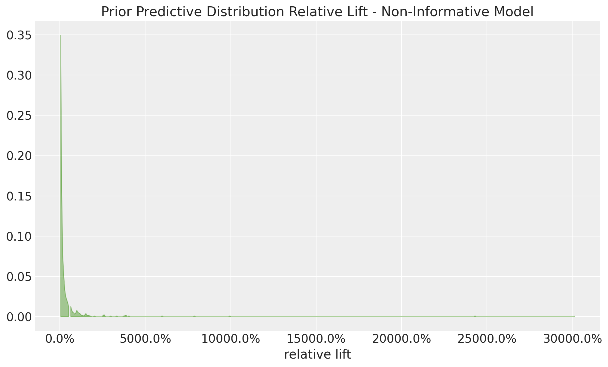{fig-align="center" width="700"}
:::

:::
:::

::: footer
[Prior Predictive Modeling in Bayesian A/B Testing](https://juanitorduz.github.io/prior_predictive_ab_testing/)
:::

## Informative Priors: Implications {.smaller}

::: {.columns}
::: {.column width="30%"}

::: {.bordered}
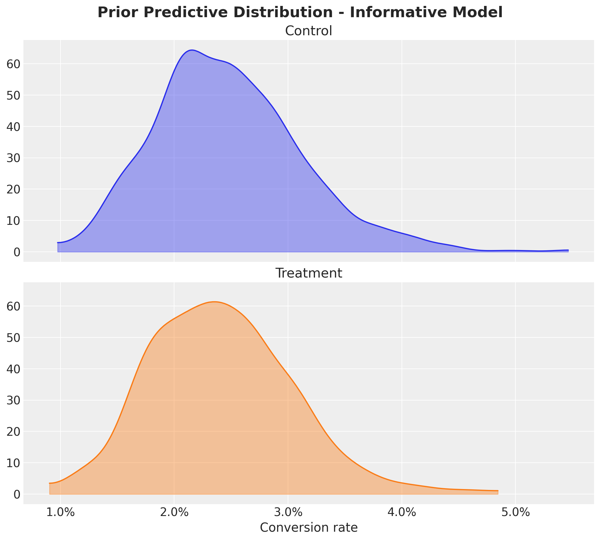{fig-align="center" width="400"}

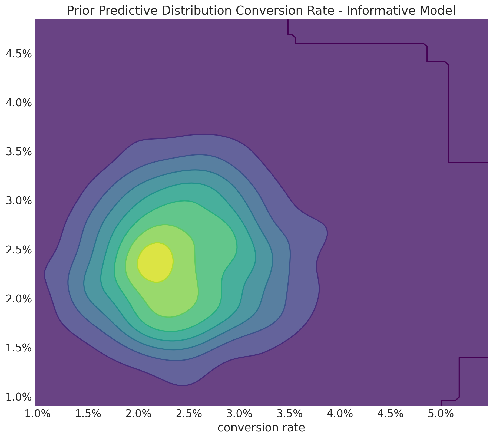{fig-align="center" width="400"}
:::

:::

::: {.column width="70%"}

::: {.callout-warning}
## Informative Priors

Even if we set informative priors for the conversion rates, the relative lift range is still unreasonably wide.

:::

::: {.bordered}
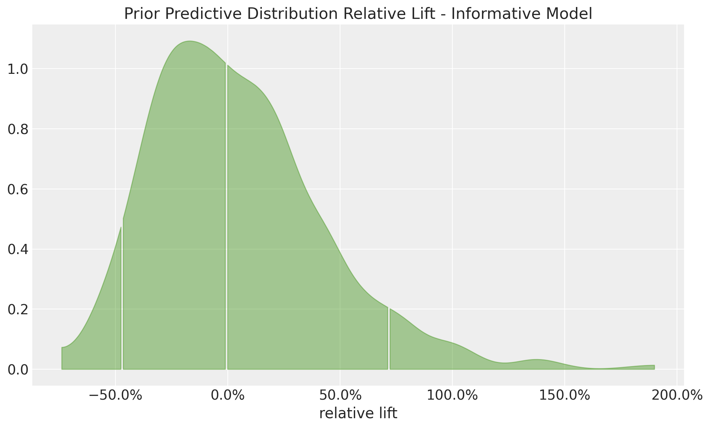{fig-align="center" width="800"}
:::

:::

:::

::: footer
[Prior Predictive Modeling in Bayesian A/B Testing](https://juanitorduz.github.io/prior_predictive_ab_testing/)
:::


## Correlated Priors: Implications {.smaller}

::: {.columns}
::: {.column width="55%"}

```{.python code-line-numbers="|2-4|5-7|8-11|"}
with pm.Model() as correlated_model:
    conversion_rate_control = pm.Beta(
      "conversion_rate_control", alpha=15, beta=600
    )
    relative_lift = pm.Normal(
      "relative_lift", mu=0, sigma=0.1
    )
    conversion_rate_treatment = pm.Deterministic(
        "conversion_rate_treatment",
        conversion_rate_control * (1 + relative_lift)
    )
```

::: bordered
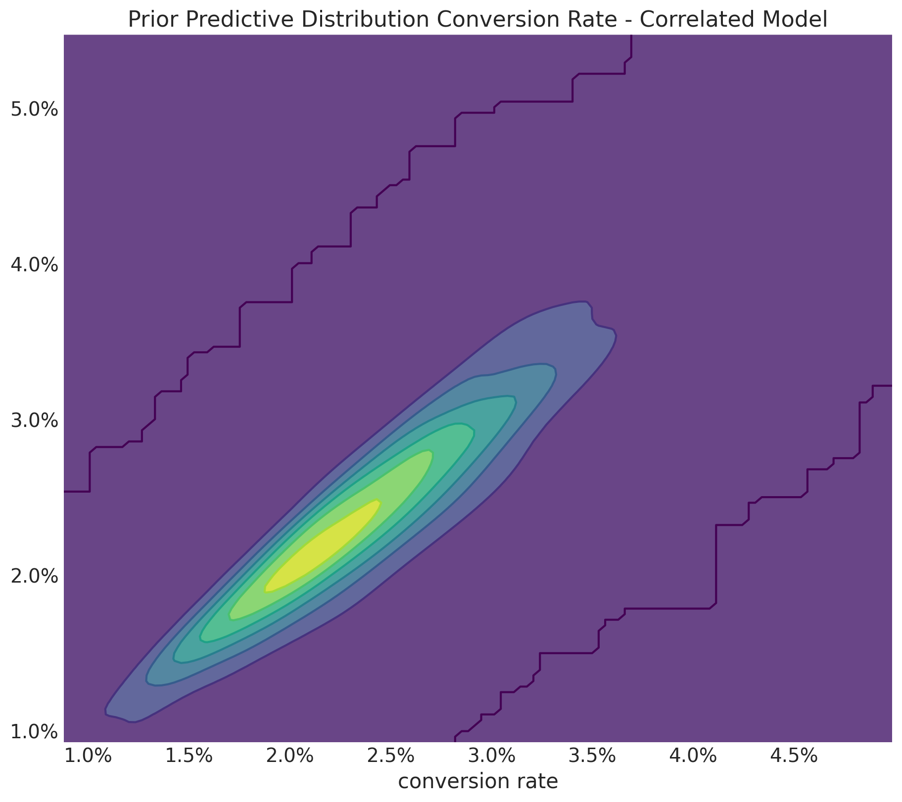{fig-align="center" width="400"}
:::

:::


::: {.column width="45%"}

::: bordered
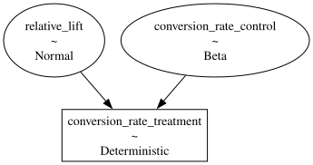{fig-align="center" width="450"}
:::

::: bordered
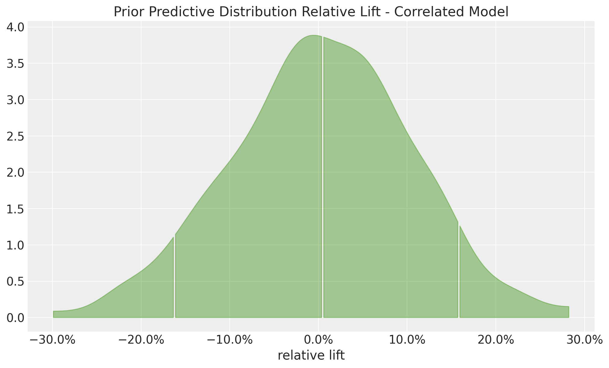{fig-align="center" width="4
:::

:::
:::

::: footer
[Prior Predictive Modeling in Bayesian A/B Testing](https://juanitorduz.github.io/prior_predictive_ab_testing/)
:::

## Inference with Correlated Priors

```{.python code-line-numbers="|2-4|5-7|"}
with correlated_model:
    pm.Binomial(
      "n_control", n=n, p=conversion_rate_control, observed=n_c
    )
    pm.Binomial(
      "n_treatment", n=n, p=conversion_rate_treatment, observed=n_t
    )
```
::: {.columns}
::: {.column width="47%"}

::: bordered
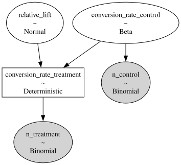{fig-align="center" width="400"}
:::

:::

::: {.column width="53%"}

::: bordered
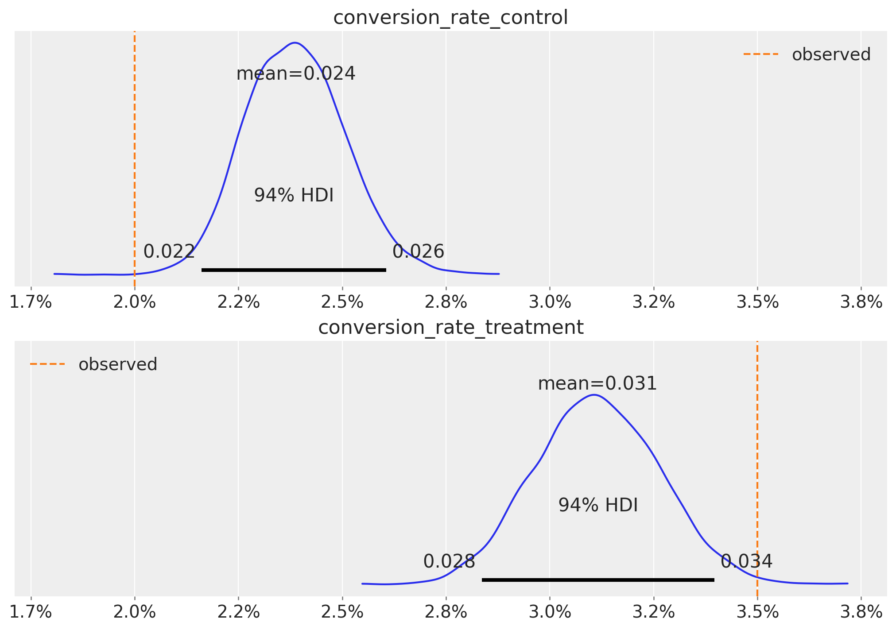{fig-align="center" width="600"}
:::

:::
:::

::: footer
[Prior Predictive Modeling in Bayesian A/B Testing](https://juanitorduz.github.io/prior_predictive_ab_testing/)
:::

## Bayesian Power Analysis {.smaller}

::: {.columns}
::: {.column width="78%"}

::: {.callout-tip}

### HDI + ROPE Framework

[The Bayesian New Statistics: Hypothesis testing, estimation, meta-analysis, and power analysis from a Bayesian perspective](https://link.springer.com/content/pdf/10.3758/s13423-016-1221-4.pdf)

Declare significance when the $94\%$ HDI of the posterior lift **excludes the ROPE** (Region of Practical Equivalence) around zero.

:::

**Five-step process:**

::: incremental

1. Generate parameter values from a hypothetical distribution
2. Simulate data samples using the generative model
3. Compute posterior estimates with Bayesian analysis for various sample sizes
4. Assess whether the $94\%$ HDI excludes the ROPE
5. Repeat to approximate statistical power
:::

:::

::: {.column width="22%"}

::: bordered
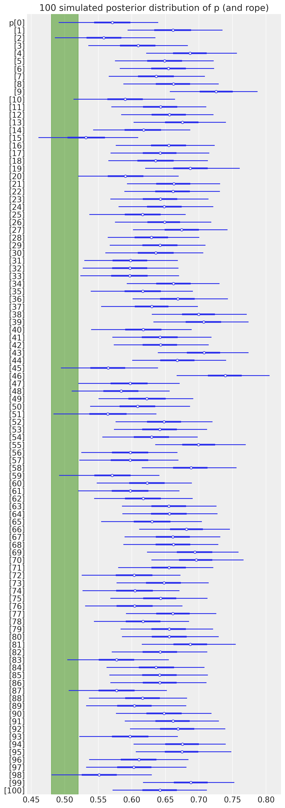{fig-align="center" width="600"}
:::

:::
:::

::: footer
[Introduction to Bayesian Power Analysis: Exclude a Null Value](https://juanitorduz.github.io/power_sample_size_exclude_null/)
:::

## Power Curves

::: bordered
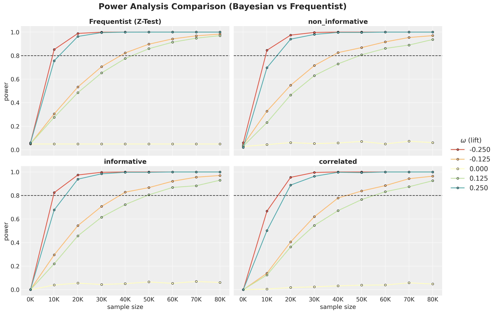{fig-align="center" width="930"}
:::

::: footer
[Bayesian Power Analysis for A/B Testing](https://juanitorduz.github.io/bayesian_power_ab_testing/)
:::

## Bayesian CUPED {.smaller}

::: bordered
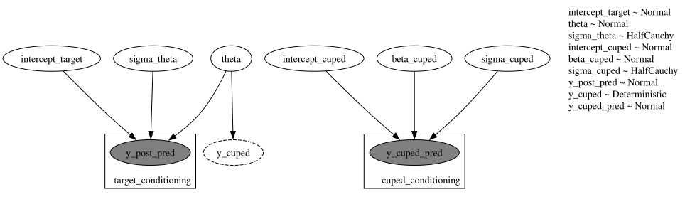{fig-align="center" width="650"}
:::


::: {.columns}
::: {.column width="60%"}

::: {.callout-tip appearance="simple"}

**CUPED:** Use pre-treatment outcome as a covariate to **reduce posterior variance of the causal effect estimate**.

1. Regress $y_{\text{post}}$ on $y_{\text{pre}}$ and estimate the $\theta$ coefficient.

2. Compute $y_{\text{cuped}, i} = y_{\text{post}, i} - \theta \, (y_{\text{pre}, i} - \bar{y}_{\text{pre}})$ for each unit $i$.

3. Compute the difference in means of $y_{\text{cuped}}$ between treatment and control group.

$$
y_{\text{cuped}} = \alpha + \beta_{\text{cuped}} \times \text{treatment} + \varepsilon
$$

:::


:::

::: {.column width="40%"}

::: bordered
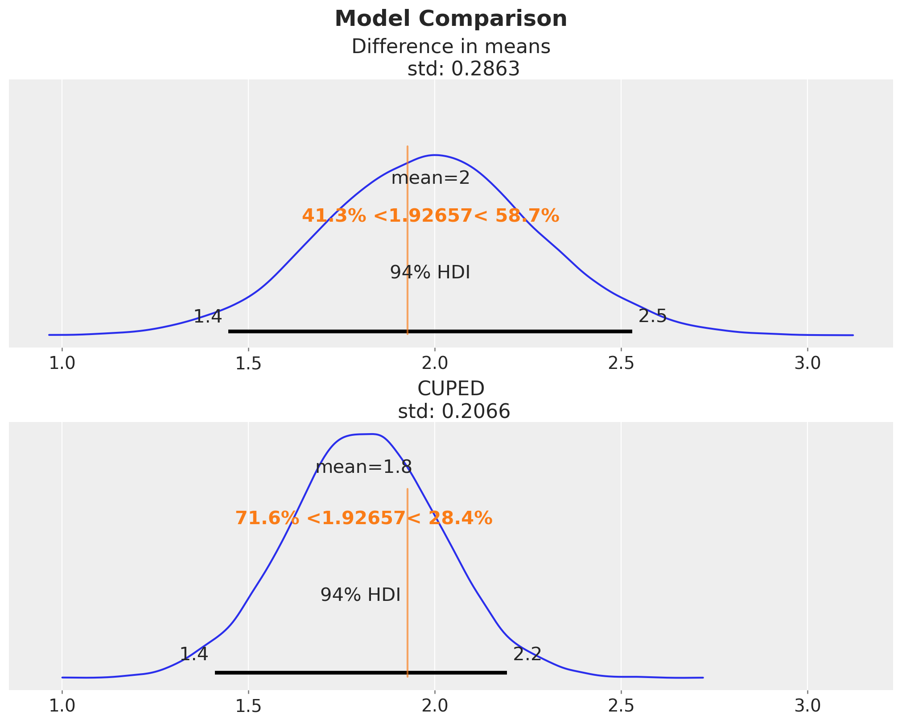{fig-align="center" width="450"}
:::

:::
:::

::: footer
[Bayesian CUPED & Sensitivity Analysis](https://juanitorduz.github.io/bayesian_cuped/)
:::

## Confounders: An Example {.smaller}

**The Lalonde Dataset:** Job training program (National Supported Work, 1970s)

**Question:** Does job training increase earnings?

::: {.columns}
::: {.column width="60%"}

::: incremental

- **Treatment:** Participation in a job training program
- **Outcome:** Earnings in 1978 (`re78`)
- **Covariates:** Education, age, prior earnings (`re75`), race/ethnicity, marital status, degree
- **Naive comparison** (difference in means): treated earned **\$635 less** than untreated
- But treatment was **not** randomly assigned...
- **Confounders** create a spurious association!

:::

:::
::: {.column width="40%"}

::: {.bordered}
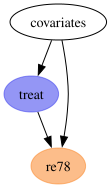{fig-align="center" width="280"}
:::

:::
:::

::: footer
[Introduction to Causal Inference with PPLs](https://juanitorduz.github.io/intro_causal_inference_ppl_pymc/)
:::

## The Causal DAG

::: {.bordered}
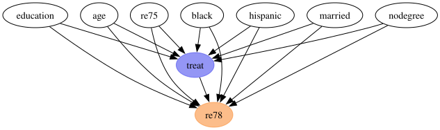{fig-align="center" width="1000"}
:::

**Backdoor criterion:** block all backdoor paths from treatment to outcome to identify the causal effect.

::: footer
[Introduction to Causal Inference with PPLs](https://juanitorduz.github.io/intro_causal_inference_ppl_pymc/)
:::

## ATE Estimation Strategies {.smaller}

Two ways to estimate the ATE:

**(1) Read the estimate from a regression coefficient:**

Fit a linear model of the form

$$
\text{earnings} = \alpha + \beta_{\text{treat}} \text{treat} + \beta_{\text{covariates}} \text{covariates} + \varepsilon
$$

and identify the estimate of $\beta_{\text{treat}}$ as the ATE.

**(2) Use the `do` operator for counterfactual computation:**

$$
\text{ATE} = \mathbb{E}[\text{earnings} \mid \text{do}(\text{treat} = 1)] - \mathbb{E}[\text{earnings} \mid \text{do}(\text{treat} = 0)]
$$


::: {.callout-note}

## Pearl's `do` operator and counterfactuals

The `do` operator implements Pearl's intervention:

$$P(Y \mid \text{do}(T = t))$$

It **cuts** incoming edges to the treatment node, simulating a randomized experiment.
:::

::: footer
[Introduction to Causal Inference with PPLs](https://juanitorduz.github.io/intro_causal_inference_ppl_pymc/)
:::


## PyMC Model: Treatment Sub-model

```{.python code-line-numbers="|1|2-5|7-11|13-17|19-20"}
with pm.Model(coords=coords) as earnings_model:
    # --- Data ---
    covariates_data = pm.Data(
        "covariates_data", covariates_obs, dims=("obs_idx", "covariate")
    )

    # --- Priors ---
    intercept_treat = pm.Normal("intercept_treat", mu=0, sigma=10)
    beta_covariate_treat = pm.Normal(
        "beta_covariate_treat", mu=0, sigma=1, dims=("covariate",)
    )

    # --- Parametrization ---
    logit_p_treat = intercept_treat + pm.math.dot(
        covariates_data, beta_covariate_treat
    )
    p_treat = pm.math.sigmoid(logit_p_treat)

    # --- Likelihood ---
    treat = pm.Bernoulli("treat", p=p_treat, dims=("obs_idx",))
```

::: footer
[Introduction to Causal Inference with PPLs](https://juanitorduz.github.io/intro_causal_inference_ppl_pymc/)
:::

## PyMC Model: Earnings Sub-model

```{.python code-line-numbers="|1-7|9-15|17-20"}
    # --- Priors ---
    intercept_earnings = pm.Normal("intercept_earnings", mu=0, sigma=10)
    beta_treat_earnings = pm.Normal("beta_treat_earnings", mu=0, sigma=1)
    beta_covariate_earnings = pm.Normal(
        "beta_covariate_earnings", mu=0, sigma=1, dims=("covariate",)
    )
    sigma_earnings = pm.HalfNormal("sigma_earnings", sigma=10.0)

    # --- Parametrization ---
    mu_earnings = pm.Deterministic(
        "mu_earnings",
        intercept_earnings + beta_treat_earnings * treat
            + pm.math.dot(covariates_data, beta_covariate_earnings),
        dims=("obs_idx",),
    )
    
    # --- Likelihood ---
    pm.Normal(
      "earnings", mu=mu_earnings, sigma=sigma_earnings, dims=("obs_idx",)
    )
```

::: footer
[Introduction to Causal Inference with PPLs](https://juanitorduz.github.io/intro_causal_inference_ppl_pymc/)
:::

## PyMC Model: Generative Process

::: {.bordered}
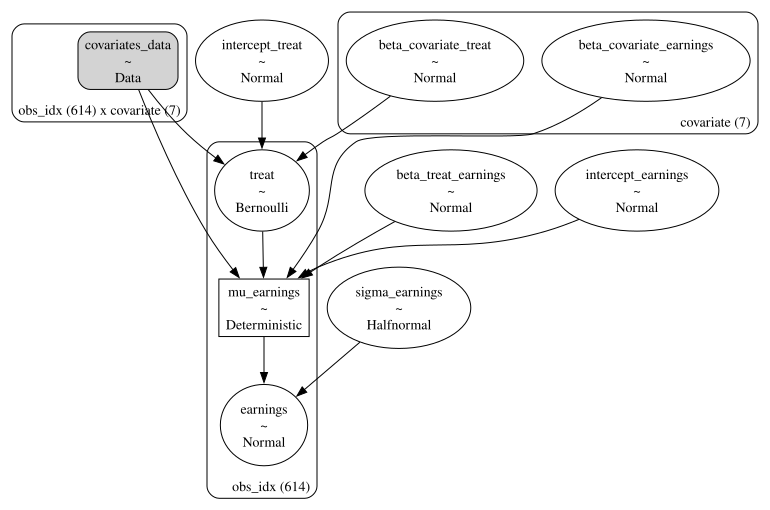{fig-align="center" width="850"}
:::

::: footer
[Introduction to Causal Inference with PPLs](https://juanitorduz.github.io/intro_causal_inference_ppl_pymc/)
:::

## Conditioning on Observed Data

```{.python}
conditioned_earnings_model = observe(
    earnings_model, {"treat": training_obs, "earnings": earnings_obs}
)
```

::: {.bordered}
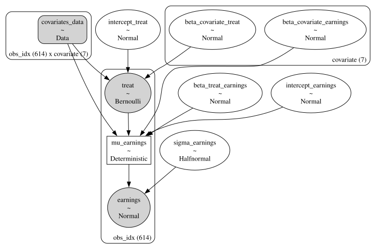{fig-align="center" width="700"}
:::

::: footer
[Introduction to Causal Inference with PPLs](https://juanitorduz.github.io/intro_causal_inference_ppl_pymc/)
:::

## ATE from the Regression Coefficient

::: {.bordered}
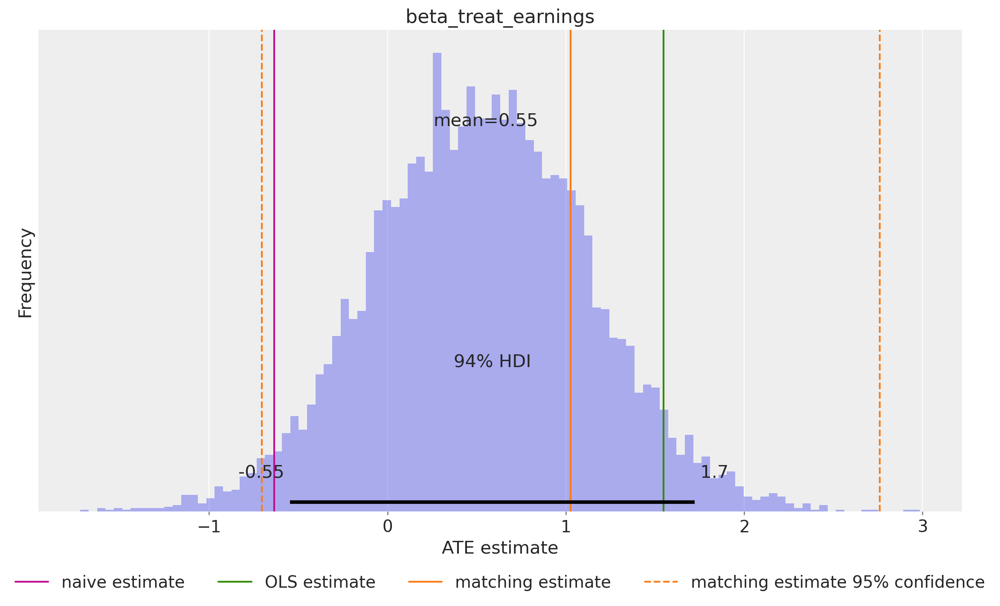{fig-align="center" width="950"}
:::

::: footer
[Introduction to Causal Inference with PPLs](https://juanitorduz.github.io/intro_causal_inference_ppl_pymc/)
:::

## The `do` Operator

The `do` operator implements Pearl's intervention:

$$P(Y \mid \text{do}(T = t))$$

It **cuts** incoming edges to the treatment node, simulating a randomized experiment.

We can use the `do` operator to compute the ATE:

$$
ATE = \mathbb{E}[Y \mid \text{do}(T=1)] - \mathbb{E}[Y \mid \text{do}(T=0)]
$$

::: footer
[Introduction to Causal Inference with PPLs](https://juanitorduz.github.io/intro_causal_inference_ppl_pymc/)
:::

## Do-Operator Resulting Model Graph

```{.python code-line-numbers="|1|2-4|5-10"}
from pymc.model.transform.conditioning import do
# Counterfactual interventions
do_0_model = do(conditioned_earnings_model, {"treat": np.zeros(n_obs)})
do_1_model = do(conditioned_earnings_model, {"treat": np.ones(n_obs)})
```

::: {.bordered}
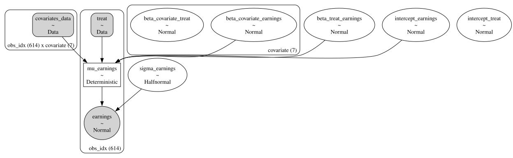{fig-align="center" width="1000"}
:::

::: footer
[Introduction to Causal Inference with PPLs](https://juanitorduz.github.io/intro_causal_inference_ppl_pymc/)
:::

## Individual Counterfactual Predictions

::: {.columns}
::: {.column width="50%"}

::: {.bordered}
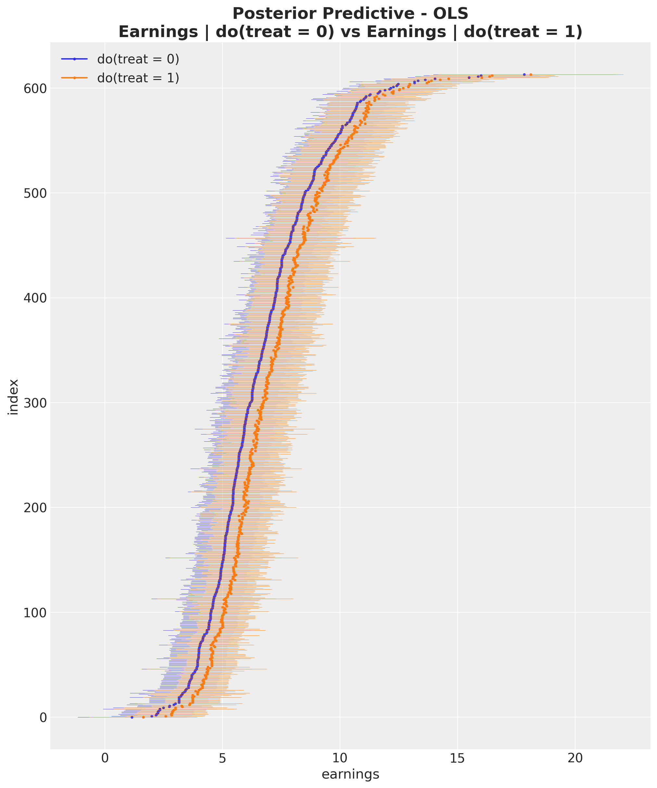{fig-align="center" width="1000"}
:::

:::

::: {.column width="50%"}

Computing the ATE using the `do` operator yields the same result as the regression coefficient approach.

::: {.bordered}
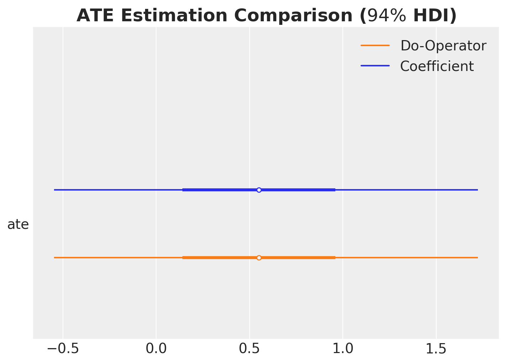{fig-align="center" width="1000"}
:::

:::
:::


::: footer
[Introduction to Causal Inference with PPLs](https://juanitorduz.github.io/intro_causal_inference_ppl_pymc/)
:::

## A more meaningful likelihood {.smaller}
### Gamma Generalized Linear Model

::: {.columns}
::: {.column width="55%"}

::: {.bordered}
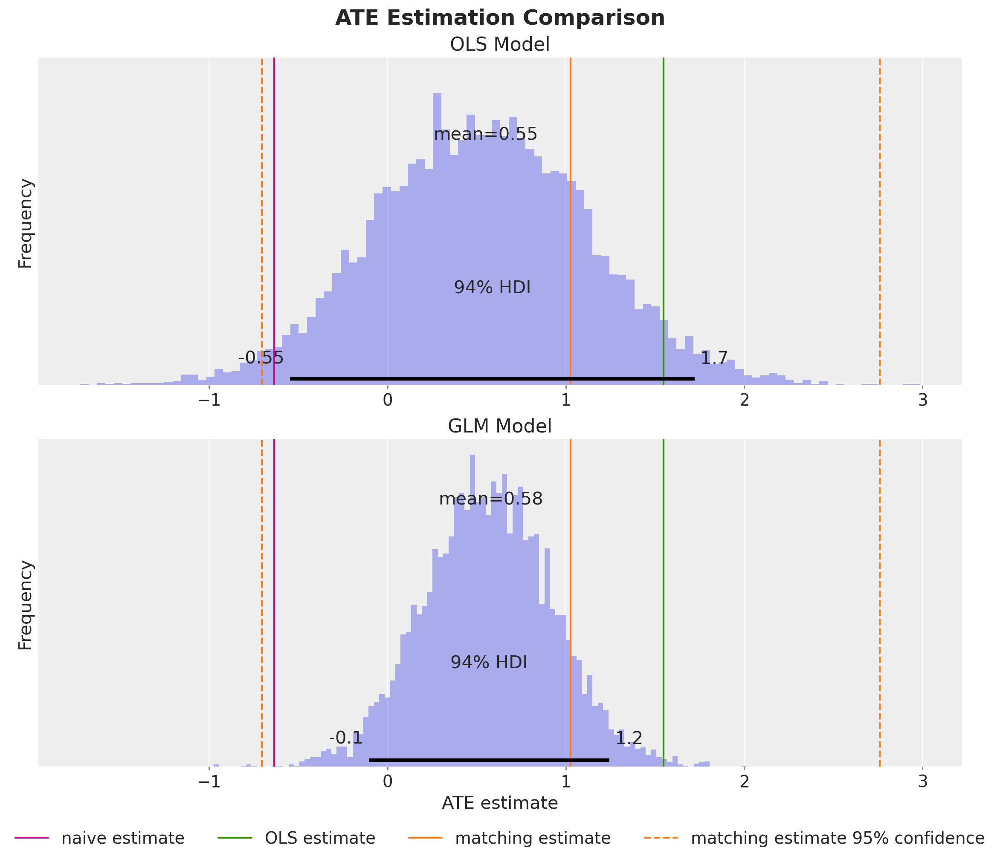{fig-align="center" width="600"}
:::

:::
::: {.column width="45%"}

- Earnings are **non-negative and right-skewed** — Normal puts mass on impossible values.
- **One-line model change:** `pm.Normal(...)` $\to$ `pm.Gamma(...)` with a log link.
- ATE on the original scale comes for free via the `do`-operator.

::: {.callout-tip appearance="simple"}
**Why the `do`-operator now matters:** with a non-linear link, the regression coefficient is **not** the ATE. The `do`-operator handles non-linearity, individual counterfactuals, and joint interventions on multiple variables.
:::

:::
:::

::: footer
[Introduction to Causal Inference with PPLs](https://juanitorduz.github.io/intro_causal_inference_ppl_pymc/)
:::

## Fixed & Random Effects {.smaller}

### Group-Level Confounding

::: {.columns}
::: {.column width="35.5%"}

::: {.bordered}
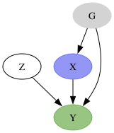{fig-align="center" width="350"}
:::

:::

::: {.column width="64.5%"}

**Problem:** Synthetic dataset where the true causal effect of $X$ on $Y$ is **zero**. We have **group-level confounding** through group-level effect $U_G$.

::: {.bordered}
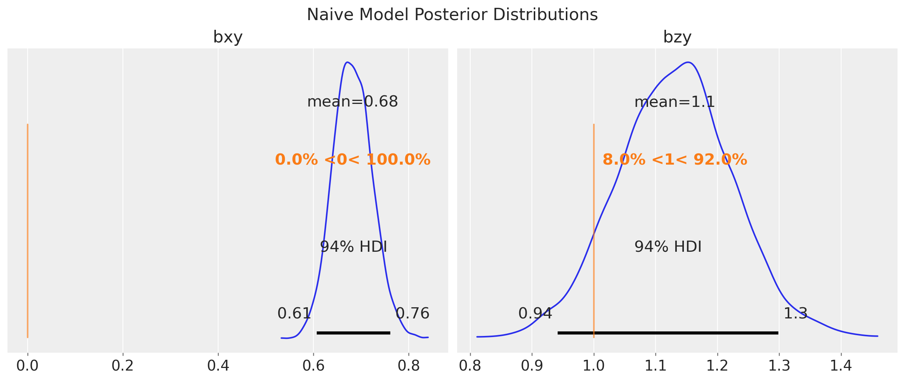{fig-align="center" width="650"}
:::

:::
:::

*Taken from Richard McElreath's Statistical Rethinking [(2026 Lectures)](https://youtube.com/watch?v=XNNcN8sU8us).*

::: footer
[Fixed and Random Effects Models: A Simulated Study](https://juanitorduz.github.io/fixed_random/)
:::

## Five Estimation Strategies

::: {.callout-note}
## Model Structure

| Model | Approach | Recovers true effect? |
|-------|----------|----------------------|
| **Naive** | Ignores groups entirely | No (biased) |
| **Fixed Effects** | Group-specific intercepts | Yes (high variance) |
| **Multilevel** | Hierarchical priors on groups | No (confounded) |
| **Mundlak** | Adds group means of $X$ | Yes (efficient) |
| **Mundlak Latent** | Latent group variable | Yes (best by LOO) |

:::

$$
y = \beta_{xy}x + \beta_{zy}z + \text{?} + \varepsilon
$$

::: {.callout-tip appearance="simple"}

**Key insight (Mundlak trick):** Including group-level means as predictors absorbs the between-group confounding while preserving partial pooling benefits.

:::

::: footer
[Fixed and Random Effects Models: A Simulated Study](https://juanitorduz.github.io/fixed_random/)
:::

## Results: The Mundlak `Latent` Model {.smaller}

::: {.columns}
::: {.column width="60%"}

::: {.bordered}
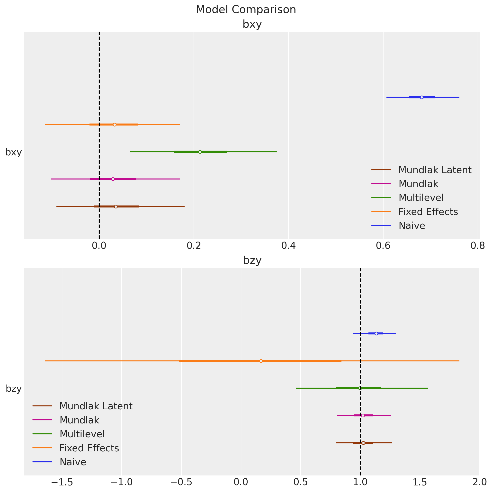{fig-align="center" width="550"}
:::

:::

::: {.column width="40%"}

- Fixed effects

`y ~ 0 + x + z + C(g)`

- Multilevel

`y ~ x + z + (1 | g)`

- Mundlak

`y ~ x + z + (1 | g) + x_bar`

- Mundlak Latent

\begin{align*}
\color{red}{u_{[g]}} & \sim \text{Normal}(\mu_u, \sigma_u) \\
x &= \alpha_x + \beta_{ux}{\color{red}{u_{[g]}}} + \varepsilon_x \\
y &= \alpha_{y, [g]} + \beta_{xy}x + \beta_{zy}z + \beta_{yg}{\color{red}{u_{[g]}}} + \varepsilon_y
\end{align*}

:::

:::

::: footer
[Fixed and Random Effects Models: A Simulated Study](https://juanitorduz.github.io/fixed_random/)
:::


## Mediation Analysis: (In)Direct Effects {.smaller}

**Question:** How does family intervention reduce substance use disorder? Decompose total effect into direct and indirect pathways.

::: {.columns}
::: {.column width="50%"}

::: {.bordered}
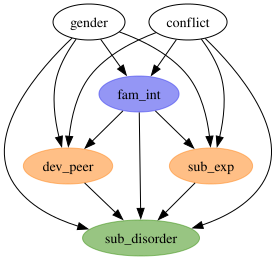{fig-align="center" width="450"}
:::

:::

::: {.column width="50%"}

- Synthetic dataset ($N = 410$) studying family intervention effects during adolescence.
- **Covariates:** `gender` (binary), `conflict` (ordinal family conflict level).
- **Treatment:** `fam_int` (family intervention program, binary).
- **Two mediators:** `dev_peer` (deviant peer engagement), `sub_exp` (drug experimentation).
- **Outcome:** `sub_disorder` (substance use disorder diagnosis, binary).

:::
:::

::: footer
[Mediation Analysis and (In)Direct Effects with PyMC](https://juanitorduz.github.io/mediation/)
:::

## Mediation Analysis: (In)Direct Effects {.smaller}

::: {.callout-tip}

### Effect decomposition

Define $E_{t, t', t''}$ as the expected outcome when `fam_int` $= t$ in the outcome equation, `dev_peer` follows its $\text{do}(T\!=\!t')$ distribution, and `sub_exp` follows its $\text{do}(T\!=\!t'')$ distribution:

$$
E_{t,t',t''} = \sum_{m_1, m_2}
\color{blue}{P(M_1\!=\!m_1 \mid \text{do}(T\!=\!t'))} \cdot
\color{red}{P(M_2\!=\!m_2 \mid \text{do}(T\!=\!t''))} \cdot
\color{green}{P(Y\!=\!1 \mid \text{do}(T\!=\!t, M_1\!=\!m_1, M_2\!=\!m_2))}
$$

The mediators factor because there is **no edge** between `dev_peer` and `sub_exp` in the DAG.

---

We can compute the effects using the `do`-operator:

| Effect | Formula | Interpretation |
|--------|---------|----------------|
| **TE** (Total) | $E_{1,1,1} - E_{0,0,0}$ | Full treatment effect |
| **DE** (Direct) | $E_{1,0,0} - E_{0,0,0}$ | `fam_int` $\to$ `sub_disorder`, mediators at control |
| **IIE$_1$** (via `dev_peer`) | $E_{0,1,0} - E_{0,0,0}$ | Shift `dev_peer` to treated, hold rest at control |
| **IIE$_2$** (via `sub_exp`) | $E_{0,0,1} - E_{0,0,0}$ | Shift `sub_exp` to treated, hold rest at control |
| **INT** (Interaction) | $E_{0,1,1} - E_{0,1,0} - E_{0,0,1} + E_{0,0,0}$ | Joint mediator contribution beyond individual effects |

**Takeaway:** With PPLs, you decompose a single treatment effect into mechanism-specific pathways — each one a posterior distribution, each one a counterfactual query against the **same model**.

:::

::: footer
[Mediation Analysis and (In)Direct Effects with PyMC](https://juanitorduz.github.io/mediation/)
:::


## Mediation Decomposition

::: {.bordered}
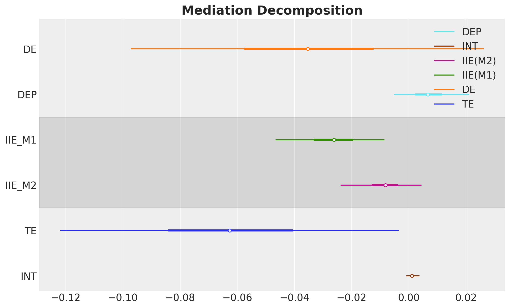{fig-align="center" width="950"}
:::

::: footer
[Mediation Analysis and (In)Direct Effects with PyMC](https://juanitorduz.github.io/mediation/)
:::

## Application: Marketing Mix Modeling {.smaller}

::: {.callout-tip appearance="simple"}
### Marketing Mix Modeling (MMM) is by nature a causal inference problem.

**Question:** How to optimally allocate the budget across channels to maximize the revenue in the next period?

We need to estimate marketing efficiency per channel (ROAS) to then optimize the budget allocation.
:::

::: {.bordered}
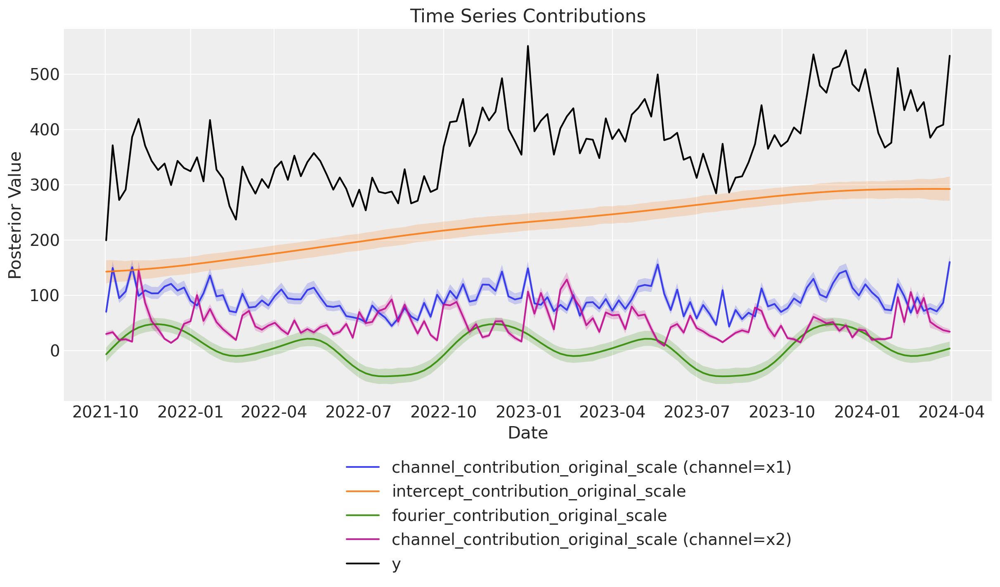{fig-align="center" width="800"}
:::

## MMM is a Causal Model

::: {.bordered}
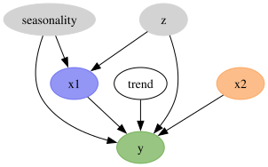{fig-align="center" width="900"}
:::

::: footer
[Media Mix Model and Experimental Calibration: A Simulation Study](https://juanitorduz.github.io/mmm_roas/)
:::

## Lift Test Calibration

### Saturation Curves

::: {.bordered}
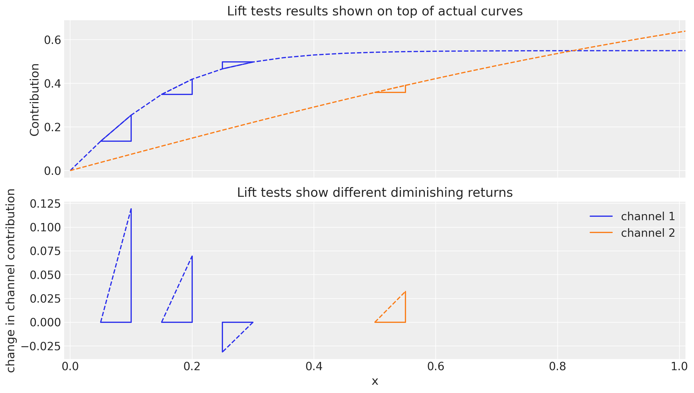{fig-align="center" width="900"}
:::

::: footer
[PyMC-Marketing: Lift Test Calibration](https://www.pymc-marketing.io/en/latest/notebooks/mmm/mmm_lift_test.html)
:::

## Lift Test Calibration

### Additional Likelihood

::: {.columns}
::: {.column width="43%"}
::: {.bordered}
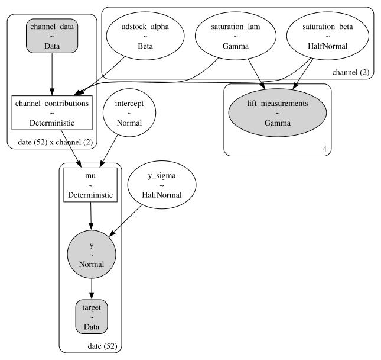{fig-align="center" width="600"}
:::
:::

::: {.column width="57%"}
::: {.bordered}
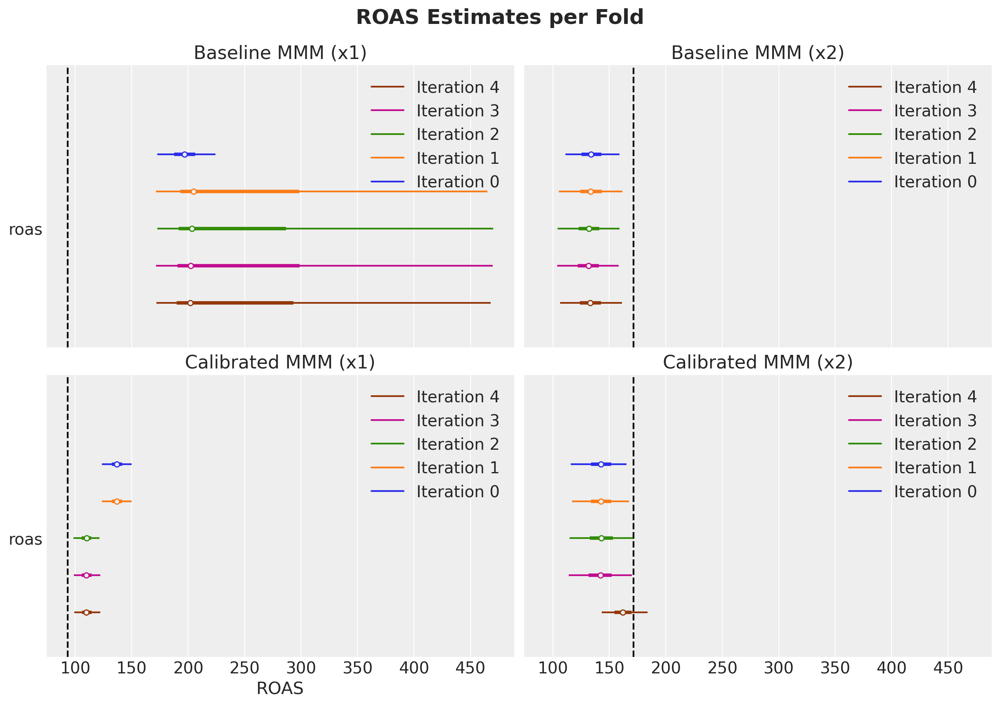{fig-align="center" width="600"}
:::
:::
:::

::: footer
[Mitigating Unobserved Confounders in MMMs with Lift Test Likelihoods](https://www.pymc-marketing.io/en/stable/notebooks/mmm/mmm_roas.html)
:::

## PyMC-Labs Ecosystem

::: {.columns}
::: {.column width="60.5%"}
::: {.bordered}
{fig-align="center" width="500"}
:::
:::
::: {.column width="39.5%"}
::: {.bordered}
{fig-align="center" width="500"}
:::
:::
:::

::: {.bordered}
{fig-align="center" width="500"}
:::

::: footer
[https://github.com/pymc-labs](https://github.com/pymc-labs)
:::


## Takeaways

::: {.callout-tip}
## What PPLs unlock for causal inference

- **Model = DAG.** Writing the generative process *is* stating your assumptions. $\to$ *Lalonde, Mediation*
- **Priors do real work.** Domain knowledge tightens estimates and rules out absurdity. $\to$ *A/B Testing, CUPED*
- **Uncertainty for free.** Posterior credible intervals on every causal estimand. $\to$ *all results slides*
- **Flexible likelihoods & structure.** Swap Normal $\to$ Gamma, add hierarchy, add latents. $\to$ *Gamma GLM, Mundlak, CEVAE*
- **`do`-operator built in.** Counterfactuals are a model transformation, not a separate library. $\to$ *ATE, Mediation*
- **Same machinery everywhere.** From the smallest A/B test to production MMM.

:::

## References — Posts & Packages {.smaller}

::: {.columns}
::: {.column width="70%"}

#### Blog Posts

- [Introduction to Causal Inference with PPLs](https://juanitorduz.github.io/intro_causal_inference_ppl_pymc/)
- [Fixed and Random Effects Models](https://juanitorduz.github.io/fixed_random/)
- [Causal Effect Estimation with Variational Inference and Latent Confounders](https://juanitorduz.github.io/online_game_ate/)
- [Media Mix Model and Experimental Calibration](https://juanitorduz.github.io/mmm_roas/)
- [Mediation Analysis and (In)Direct Effects with PyMC](https://juanitorduz.github.io/mediation/)
- [Mitigating Unobserved Confounders in MMMs with Lift Test Likelihoods](https://www.pymc-marketing.io/en/stable/notebooks/mmm/mmm_roas.html)
- [Prior Predictive Modeling in Bayesian A/B Testing](https://juanitorduz.github.io/prior_predictive_ab_testing/)
- [Introduction to Bayesian Power Analysis](https://juanitorduz.github.io/power_sample_size_exclude_null/)
- [Bayesian Power Analysis for A/B Testing](https://juanitorduz.github.io/bayesian_power_ab_testing/)
- [Bayesian CUPED](https://juanitorduz.github.io/bayesian_cuped/)
:::
::: {.column width="30%"}
#### Packages

- [CausalPy](https://causalpy.readthedocs.io/)
- [ChiRho](https://basisresearch.github.io/chirho/index.html)
- [DoWhy](https://github.com/py-why/dowhy)
- [NumPyro](https://num.pyro.ai/)
- [PyMC](https://www.pymc.io/)
- [PyMC-Marketing](https://www.pymc-marketing.io/)

:::
:::

## References — Books & Papers {.smaller}

#### Books

- Pearl, J. *Causality: Models, Reasoning and Inference*
- McElreath, R. *Statistical Rethinking* (2nd ed.)
- Facure, M. *Causal Inference for The Brave and True*
- Ness, R. O. *Causal AI* (Manning)

#### Papers

- Jin, Yuxue, et al. *Bayesian methods for media mix modeling with carryover and shape effects.* 
- Kruschke, J. K. & Liddell, T. M. (2018). *The Bayesian New Statistics: hypothesis testing, estimation, meta-analysis, and power analysis from a Bayesian perspective.*
- Mundlak, Y. (1978). *On the Pooling of Time Series and Cross Section Data.*
- Rubin, D. B. (1974). *Estimating causal effects of treatments in randomized and nonrandomized studies.*

## [Thank You!]{style="color: white;"} {background-image="hu_causal_inference_2026_files/static/images/logos/pymc-labs-black.jpg"}

#### [juan.orduz@pymc-labs.com](mailto:juan.orduz@pymc-labs.com){style="color: white;"}

{.absolute top=400 right=-100 width=250 height=250}
