## Why Communicating Models Matters {.smaller}

::: {.callout-tip appearance="simple"}
A model is only useful if a decision-maker can act on it. The hard part is rarely fitting; it is turning parameters into a statement someone trusts.
:::

::: incremental

- **Reporting coefficients is not enough.** A single number like "$\beta_{\text{roas}} = 0.23$" hides the link function, the scale, and any non-linearity. Off the identity link, the coefficient is not the effect.

- **Visualization carries the meaning.** Showing the predicted response over a grid of inputs answers the question stakeholders actually ask: *what happens to the outcome if this input moves?*

- **Uncertainty is part of the answer.** Every prediction and every contrast comes with a posterior. Communicating the credible interval is as important as the point estimate.

:::

::: {.callout-note appearance="simple"}
We follow the mental model from the book [Model to Meaning: How to Interpret Statistical Models with marginaleffects](https://marginaleffects.com/): **predictions**, **comparisons**, and **slopes**.
:::

## Outline

::: {.columns}
::: {.column width="50%"}

1. The business problem
2. The panel data
3. Baseline: linear Gaussian
4. The interpretation recipe
5. Predictions, comparisons, slopes

:::

::: {.column width="50%"}

6. Hurdle-Gamma likelihood
7. Hurdle-Gamma + HSGP on ROAS
8. Model comparison
9. Conclusion
10. References

:::
:::

## The Business Problem {.smaller}

An ad platform charges stores per click and reports back **ROAS** (return on ad spend). Stores keep spending while campaigns are worth it; when they are not, they pause.

::: incremental

- **Goal:** predict **next month's budget** from **this month's signals**: ROAS, where the store is in its life-cycle (cohort age), and the time of year.
- ROAS $> 1$ is profitable, ROAS $< 1$ is not. So should the bidding engine just push ROAS as high as possible?
- **No.** Stores have a fixed daily production capacity. Very high ROAS often *precedes a drop* in next month's budget: they hit an inventory ceiling.
- We therefore expect a **non-linear** relationship between ROAS and next month's budget.

:::

::: {.callout-warning appearance="simple"}
This is an oversimplified example: we ignore cannibalization, other drivers, and a richer causal structure. In practice this problem is much harder.
:::

## The Shape We Hope to Recover

::: {.columns}
::: {.column width="60%"}

::: {.bordered}
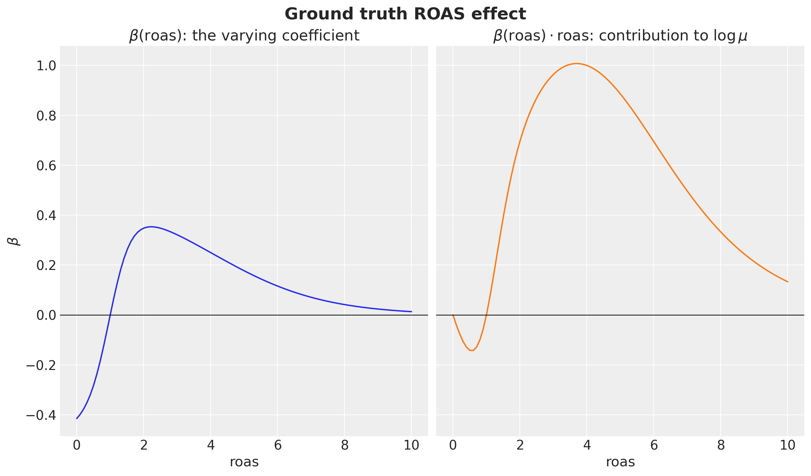{fig-align="center" width="700"}
:::

:::
::: {.column width="40%"}

The synthetic data is generated with a **ROAS coefficient that varies with ROAS itself**:

- below $\text{ROAS}=1$: losing money, effect is negative,
- between $1$ and $4$: the sweet spot, each extra unit pulls budget in,
- past $\text{ROAS}=4$: capacity ceiling, the effect saturates.

This curve is the ground truth. Can a model recover it?

:::
:::

## The Panel Data {.smaller}

::: {.columns}
::: {.column width="50%"}

- **100 stores**, observed for **24 months** each.
- Each row pairs **this month's signals** with **next month's budget** (the leading indicators a store could act on).
- When a store is inactive (no spend), it has no ROAS to report: encoded as `NaN` and dropped at modeling time.
- Budgets are **non-negative** and have **many zeros** (inactive months).

:::
::: {.column width="50%"}

::: {.bordered}
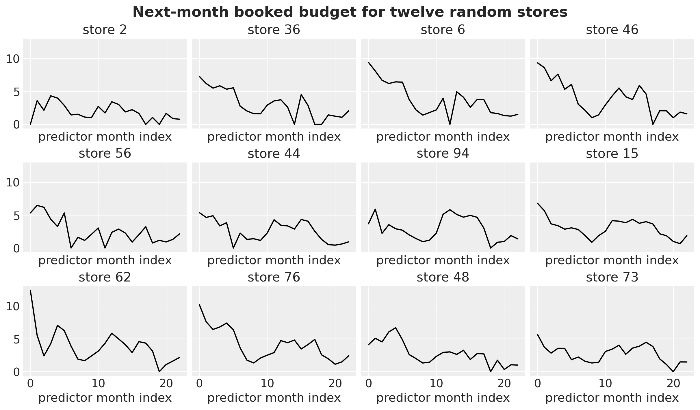{fig-align="center" width="600"}
:::

Next-month booked budget for twelve random stores.

:::
:::

## What Is Already Visible in the Data {.smaller}

::: {.columns}
::: {.column width="58%"}

::: {.bordered}
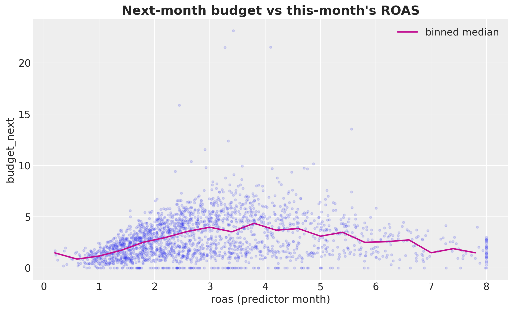{fig-align="center" width="650"}
:::

:::
::: {.column width="42%"}

The **non-linear shape** is visible to the eye: budget rises with ROAS, then levels off past $\text{ROAS} \approx 4$.

::: {.bordered}
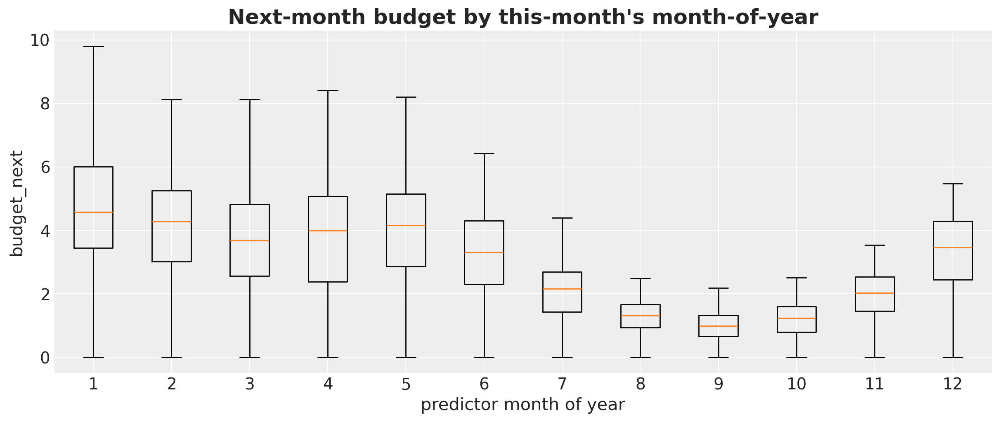{fig-align="center" width="450"}
:::

Yearly seasonality by month-of-year.

:::
:::

## Baseline: Linear Gaussian {.smaller}

The simplest thing that could work: plain linear regression, Gaussian noise, identity link.

\begin{align*}
y_i & \sim \text{Normal}(\mu_i, \sigma^2) \\
\mu_i & = \beta_0 + \beta_{\text{age}} \, \text{cohort\_age}_i + \sum_{m=2}^{12} \beta_m \, \mathbb{1}[\text{month}_i = m] + \beta_{\text{roas}} \, \text{roas}_i
\end{align*}

```{.python code-line-numbers="|1|3-9|11-17"}
formula_lm = bmb.Formula("budget_next ~ 1 + cohort_age + C(month_of_year) + roas")

priors_lm = {
    "Intercept": bmb.Prior("Normal", mu=0.0, sigma=2.0),
    "cohort_age": bmb.Prior("Normal", mu=0.0, sigma=1.0),
    "C(month_of_year)": bmb.Prior("ZeroSumNormal", sigma=1.0),
    "roas": bmb.Prior("Normal", mu=0.0, sigma=2.0),
    "sigma": bmb.Prior("HalfNormal", sigma=5.0),
}

model_lm = bmb.Model(
    formula=formula_lm,
    data=model_df.to_pandas(),
    family="gaussian",
    link="identity",
    priors=priors_lm,
)
```

## Linear Gaussian: Posterior Predictive {.smaller}

::: {.columns}
::: {.column width="60%"}

::: {.bordered}
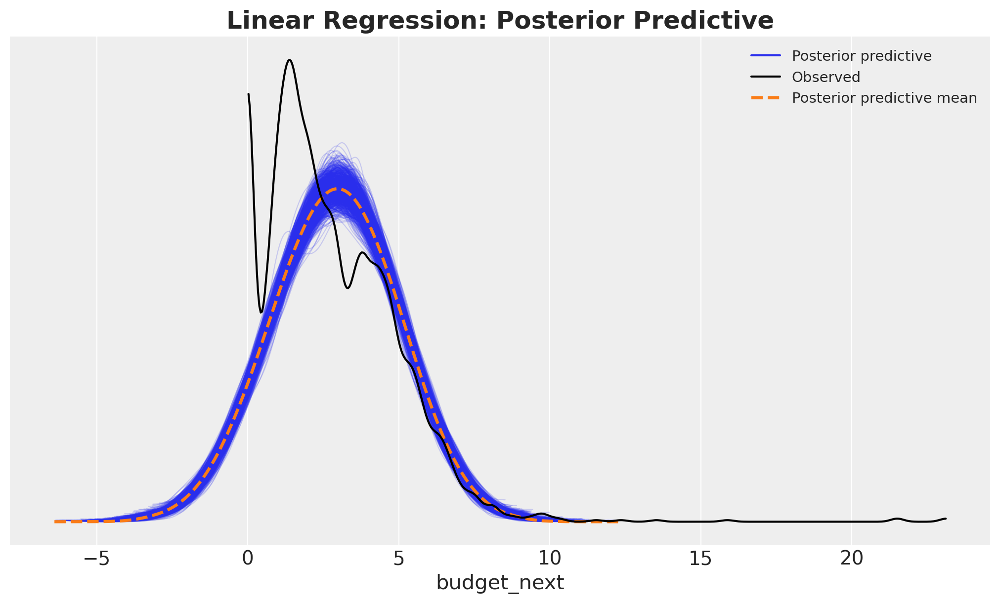{fig-align="center" width="650"}
:::

:::
::: {.column width="40%"}

::: {.callout-important appearance="simple"}
Two defects the wrong likelihood creates:

- it puts mass on **negative** budgets, which are impossible,
- it **misses the spike of zeros** from inactive stores.
:::

We will fix both with a Hurdle-Gamma likelihood later.

:::
:::

## The Coefficient Trap {.smaller}

::: {.columns}
::: {.column width="55%"}

::: {.bordered}
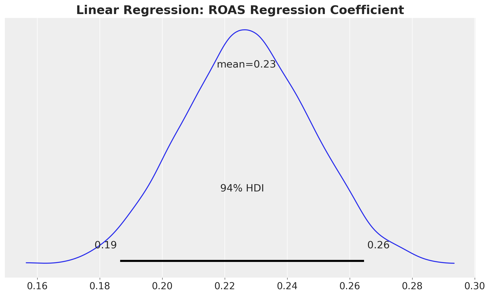{fig-align="center" width="600"}
:::

:::
::: {.column width="45%"}

Read straight off the coefficient: an extra unit of ROAS is associated with $+0.23$ in next month's budget, **holding the rest constant**.

::: {.callout-warning appearance="simple"}
By design this holds at **every** ROAS level: a single slope, no peak, no saturation. That directly contradicts what we just saw in the data.
:::

A single number is the wrong tool for a non-linear question.

:::
:::

## The Interpretation Recipe {.smaller}

Instead of reading coefficients, study the posterior of $\mathbb{E}[Y \mid \text{grid}]$ over a grid of inputs. **This is where the thinking happens:** which question do we want to answer?

```{.python code-line-numbers="|1-6|9-12|15-17"}
# 1. Build a reference grid: vary ROAS, hold the rest at their mean.
roas_datagrid = datagrid(
    roas=roas_grid,
    cohort_age=cohort_age_default,
    month_of_year=month_of_year_default,
    newdata=model_df,
)

# 2. Push the grid through the posterior to get the response mean mu.
def predict_mu(model, idata, grid_pl):
    new_idata = model.predict(idata, data=grid_pl.to_pandas(), kind="response_params", inplace=False)
    return new_idata["posterior"]["mu"]

# 3. Summarize on the response scale (here: 50% and 94% HDI bands).
idata_lm_mu_grid = predict_mu(model_lm, idata_lm, roas_datagrid)
az.plot_hdi(roas_grid, idata_lm_mu_grid, hdi_prob=0.94)
```

## ROAS Effect on Next Month's Budget {.smaller}

::: {.columns}
::: {.column width="60%"}

::: {.bordered}
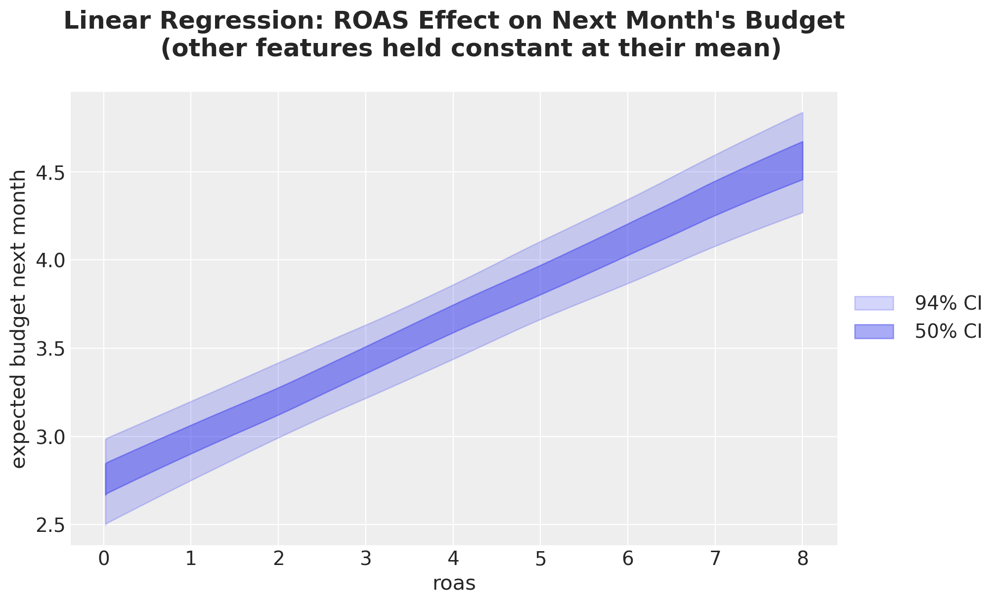{fig-align="center" width="650"}
:::

:::
::: {.column width="40%"}

The slope of this posterior line is exactly $0.23$: the same value as the regression coefficient.

For a linear identity-link model the grid view *equals* the coefficient. The point is that the same recipe **generalizes** to models where no single coefficient exists.

:::
:::

## Split by Cohort Age {.smaller}

::: {.columns}
::: {.column width="60%"}

::: {.bordered}
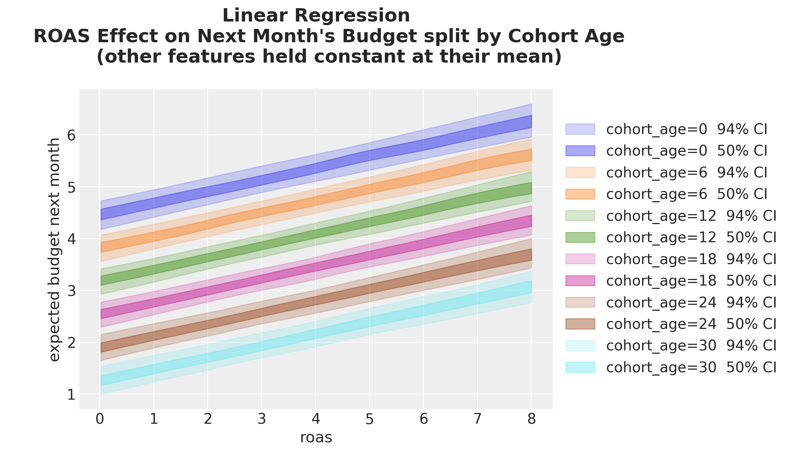{fig-align="center" width="650"}
:::

:::
::: {.column width="40%"}

Adding a second variable to the grid splits the effect into one line per cohort age.

The **slope (ROAS effect) is identical** across cohorts; only the **intercept** shifts down as cohorts get older. That is the linear model's rigid signature.

:::
:::

## Split by Month of Year {.smaller}

::: {.columns}
::: {.column width="60%"}

::: {.bordered}
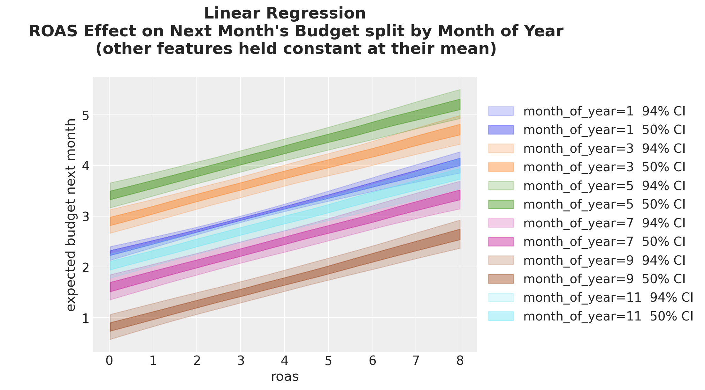{fig-align="center" width="650"}
:::

:::
::: {.column width="40%"}

Same story across months: the ROAS slope is shared, the intercept moves.

The variation is non-linear in the month index because of the `ZeroSumNormal` seasonal contrast, but ROAS itself still enters as one constant slope.

:::
:::

## Comparison: Month 3 vs Month 9 {.smaller}

::: {.columns}
::: {.column width="58%"}

::: {.bordered}
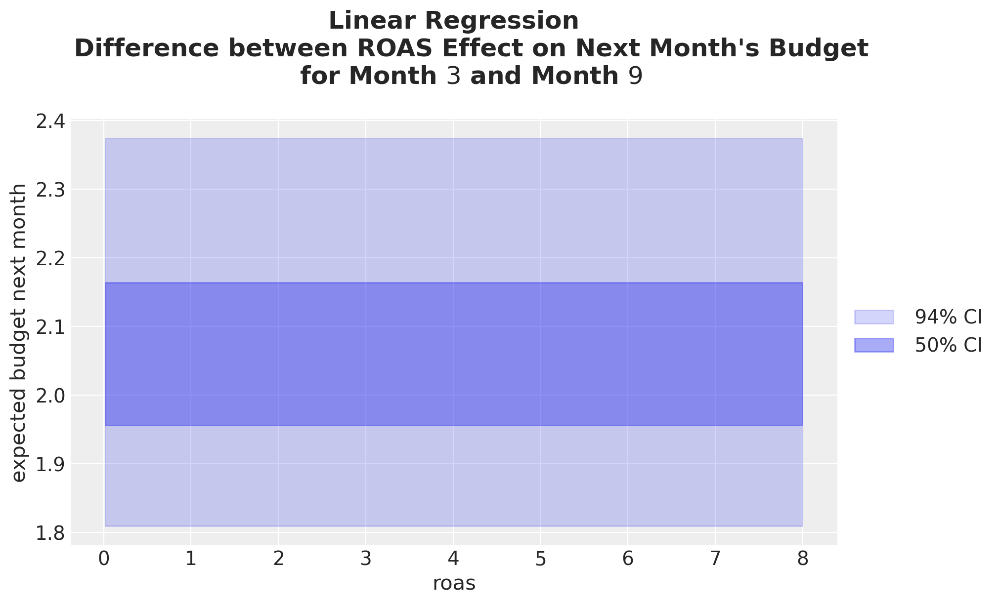{fig-align="center" width="650"}
:::

:::
::: {.column width="42%"}

Beyond predictions, we can **difference** two grids: the gap between month 3 and month 9.

::: {.callout-note appearance="simple"}
The three `marginaleffects` primitives:

- **predictions:** what does the model say here?
- **comparisons:** what changes from A to B?
- **slopes:** what is $\partial \hat{Y} / \partial X$ here?
:::

The difference is **constant in ROAS**: a direct consequence of linearity.

:::
:::

## Cohort Age and Month-of-Year Effects {.smaller}

::: {.columns}
::: {.column width="50%"}

::: {.bordered}
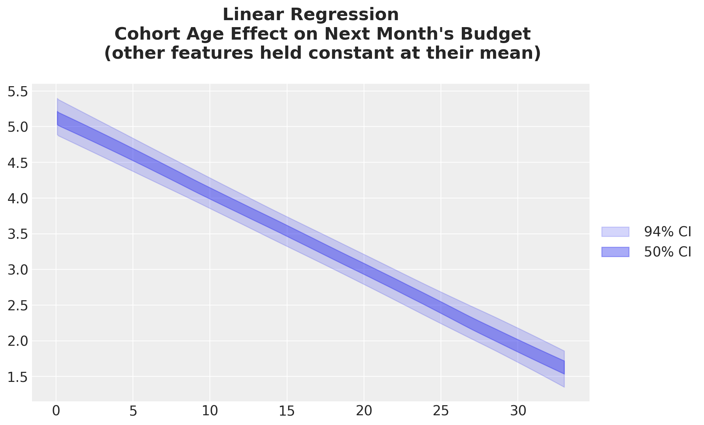{fig-align="center" width="520"}
:::

A linear decay in budget as cohorts age.

:::
::: {.column width="50%"}

::: {.bordered}
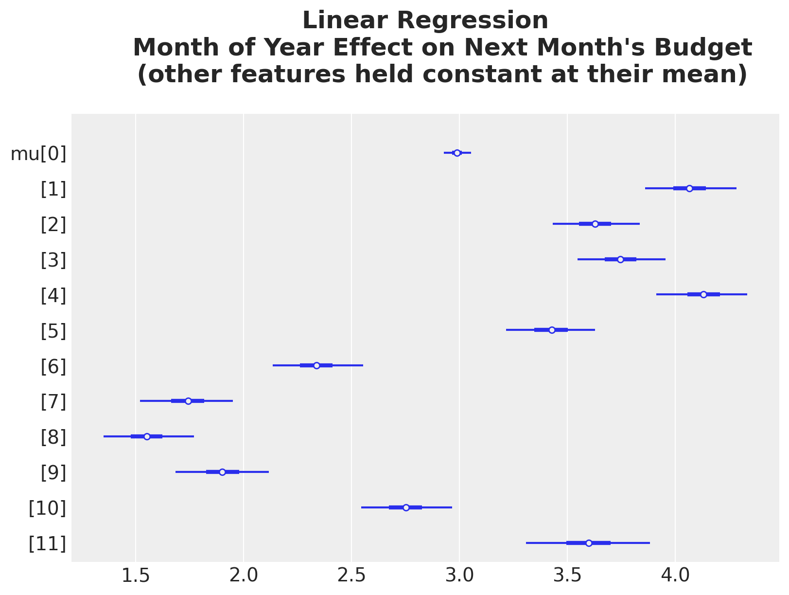{fig-align="center" width="450"}
:::

Month effects via a forest plot, centered on zero by the `ZeroSumNormal` contrast.

:::
:::

## The Same Answers via Bambi's `interpret` {.smaller}

Everything so far we built by hand. Bambi packages the identical recipe behind three one-liners: `plot_predictions`, `plot_comparisons`, `plot_slopes`.

::: {.columns}
::: {.column width="52%"}

```{.python code-line-numbers="|2-9"}
fig, ax = plt.subplots()
bmb.interpret.plot_predictions(
    model_lm,
    idata_lm,
    conditional={
        "roas": roas_grid,
        "cohort_age": cohort_age_default,
        "month_of_year": month_of_year_default,
    },
    ax=ax,
)
```

The first `conditional` key is the x-axis, a second key becomes the color grouping, a third becomes the panel. Omitted covariates are held at mean or mode.

:::
::: {.column width="48%"}

::: {.bordered}
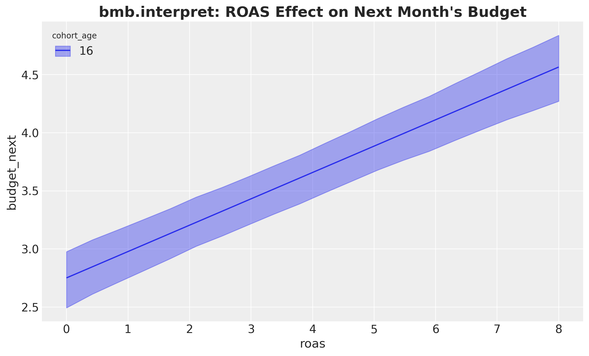{fig-align="center" width="520"}
:::

Same posterior, same grid, same $\mu$: a single $94\%$ band instead of our hand-layered bands.

:::
:::

## What Is a Hurdle Model? {.smaller}

To fix the likelihood we need a response that is **non-negative** and can produce **many zeros**.

\begin{align*}
y_i & \sim \text{HurdleGamma}(\psi, \mu_i, \alpha) \\
\log \mu_i & = \beta_0 + \beta_{\text{age}} \, \text{cohort\_age}_i + \sum_{m} \beta_m \, \mathbb{1}[\text{month}_i = m] + \beta_{\text{roas}} \, \text{roas}_i
\end{align*}

::: incremental

- **Two parts:** a point mass at zero (probability the store is **inactive** next month) plus a **Gamma** density on the positive budgets. $\psi$ is the activity gate, $\mu_i$ the Gamma-conditional mean.
- **Log link:** $\mu_i = \exp(\text{linear predictor})$, so the response stays positive and the coefficient becomes a **multiplicative** effect, $\exp(\beta_{\text{roas}})$ per unit of ROAS.
- A coefficient is now even harder to communicate: the same $+1$ in ROAS means a different absolute change at every level.

:::

## Hurdle-Gamma: Posterior Predictive {.smaller}

::: {.columns}
::: {.column width="60%"}

::: {.bordered}
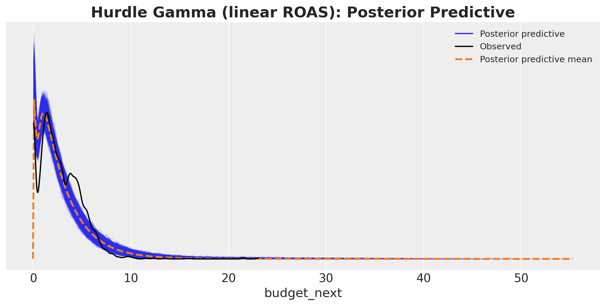{fig-align="center" width="650"}
:::

:::
::: {.column width="40%"}

::: {.callout-tip appearance="simple"}
The likelihood is now right: **non-negative** response and an explicit **zero point-mass**.
:::

The fit is much closer to the data than the Gaussian baseline. The remaining problem is the **shape** of the ROAS effect, which we look at next.

:::
:::

## Hurdle-Gamma: ROAS Effect {.smaller}

The recipe is unchanged: we just swap the model in `predict_mu`. No need to interpret $\exp(\beta)$ at all.

::: {.columns}
::: {.column width="50%"}

::: {.bordered}
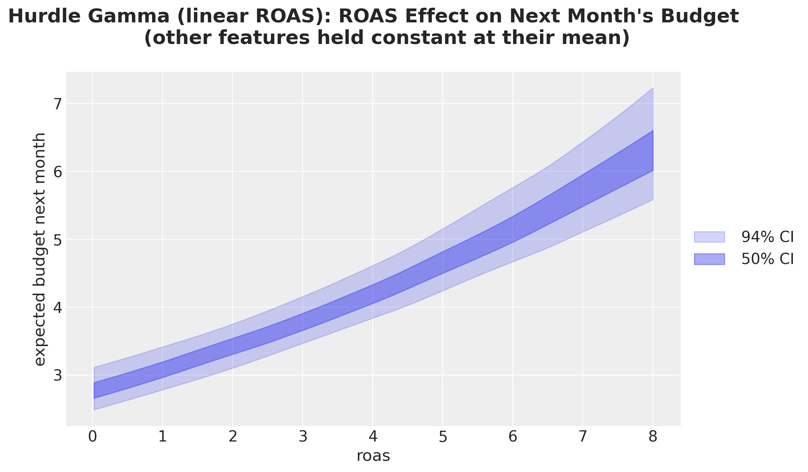{fig-align="center" width="520"}
:::

The log link bends the line into a **monotone curve**: stronger growth at higher ROAS.

:::
::: {.column width="50%"}

::: {.bordered}
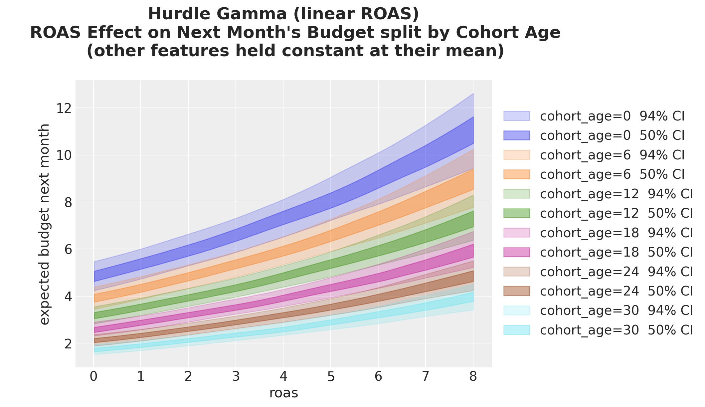{fig-align="center" width="520"}
:::

Split by cohort age: curves now **fan out** on the response scale (parallel on the log scale).

:::
:::

::: {.callout-warning appearance="simple"}
Better likelihood, but still the wrong shape: monotone growth, no peak, no saturation.
:::

## Hurdle-Gamma + HSGP on ROAS {.smaller}

We keep the Hurdle-Gamma likelihood and replace the linear `roas` term with a **Hilbert-space Gaussian process**. The GP lets the data shape the curve: no linearity, no polynomial, no knots.

\begin{align*}
y_i & \sim \text{HurdleGamma}(\psi, \mu_i, \alpha) \\
\log \mu_i & = \beta_0 + \beta_{\text{age}} \, \text{cohort\_age}_i + \sum_{m} \beta_m \, \mathbb{1}[\text{month}_i = m] + f(\text{roas}_i) \\
f & \sim \text{HSGP}(m, c)
\end{align*}

```{.python code-line-numbers="|2"}
formula = bmb.Formula(
    "budget_next ~ 1 + cohort_age + C(month_of_year) + hsgp(roas, m=20, c=1.5, cov='Matern52', centered=True)"
)
```

::: {.callout-note appearance="simple"}
See [A Conceptual and Practical Introduction to Hilbert Space GP Approximation Methods](https://juanitorduz.github.io/hsgp_intro/) for the HSGP background.
:::

## Hurdle-Gamma + HSGP: Posterior Predictive {.smaller}

::: {.columns}
::: {.column width="60%"}

::: {.bordered}
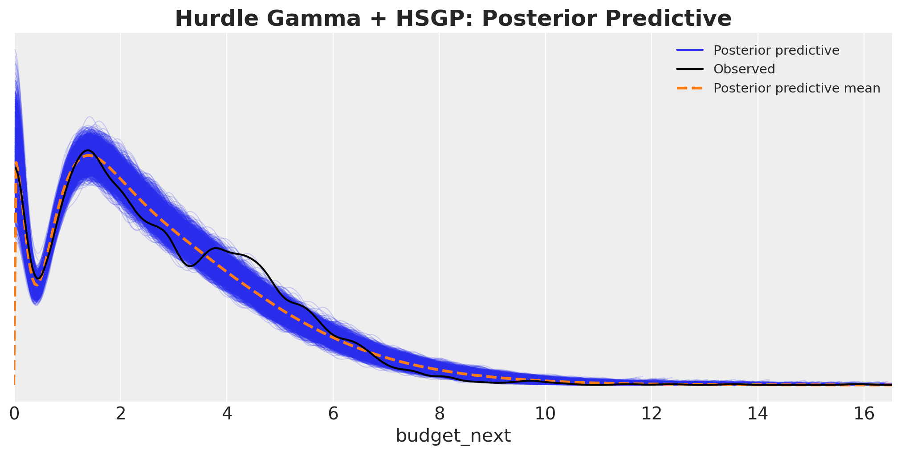{fig-align="center" width="650"}
:::

:::
::: {.column width="40%"}

::: {.callout-tip appearance="simple"}
The best posterior predictive of the three models: it captures the zeros, the non-negativity, and the bulk of the budget distribution.
:::

:::
:::

## Hurdle-Gamma + HSGP: ROAS Effect {.smaller}

::: {.columns}
::: {.column width="50%"}

::: {.bordered}
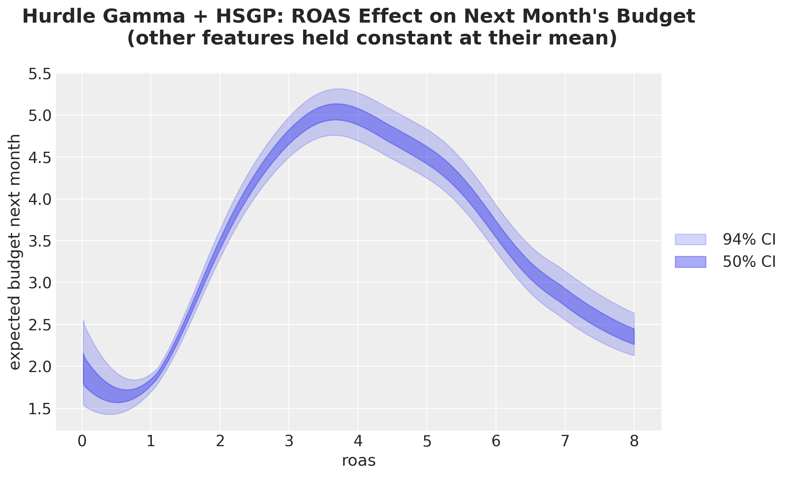{fig-align="center" width="520"}
:::

The curve **rises then saturates past $\text{ROAS} \approx 4$**, exactly the mechanism we built into the problem.

:::
::: {.column width="50%"}

::: {.bordered}
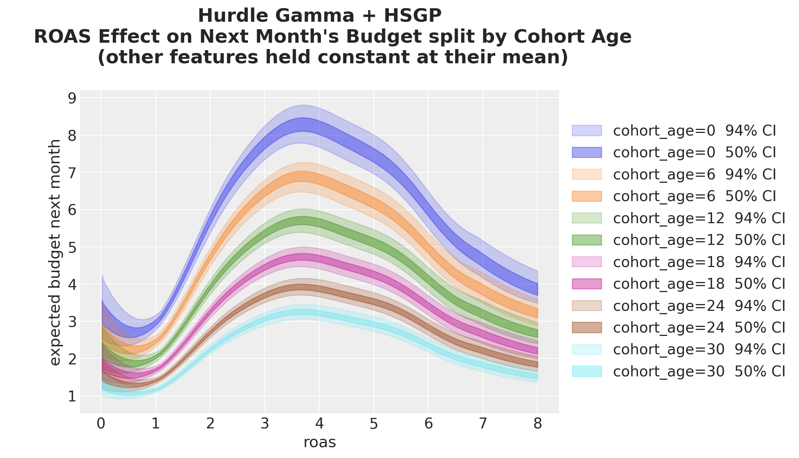{fig-align="center" width="520"}
:::

Split by cohort age: same shape, smaller amplitude for older cohorts.

:::
:::

::: {.callout-tip appearance="simple"}
There is no single ROAS coefficient to report here. The grid-based prediction *is* the answer, and it reads cleanly off the plot.
:::

## Model Comparison: LOO {.smaller}

::: {.columns}
::: {.column width="58%"}

::: {.bordered}
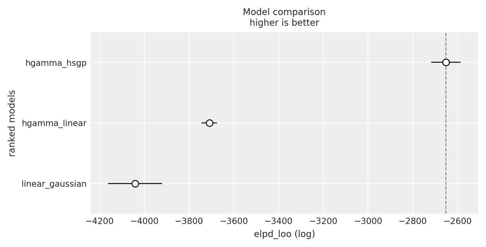{fig-align="center" width="650"}
:::

:::
::: {.column width="42%"}

Leave-one-out cross-validation ranks out-of-sample fit (higher `elpd_loo` is better).

::: incremental

- **Hurdle-Gamma + HSGP** is best.
- **Linear Hurdle-Gamma** second.
- **Linear Gaussian** worst.

:::

:::
:::

## Recovered ROAS Curves vs Ground Truth {.smaller}

::: {.columns}
::: {.column width="60%"}

::: {.bordered}
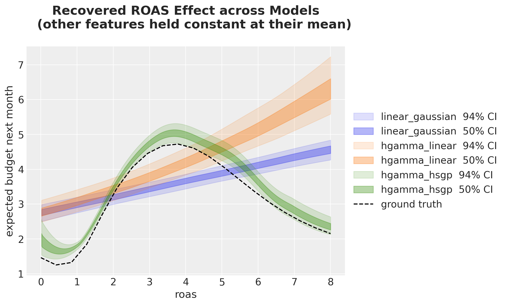{fig-align="center" width="650"}
:::

:::
::: {.column width="40%"}

The complementary check: how close is each recovered ROAS effect to the **ground-truth curve** on the response scale?

::: {.callout-tip appearance="simple"}
The Hurdle-Gamma + HSGP model tracks the true non-linearity, peak and saturation included. The linear models cannot.
:::

:::
:::

## Conclusion {.smaller}

::: {.callout-tip}
## One recipe, three models

- **Linear Gaussian:** a single ROAS coefficient, but the wrong likelihood (negative budgets, missed zeros) and the wrong shape (a line, not a peak).
- **Hurdle-Gamma (linear ROAS):** fixes the likelihood (non-negative, explicit zeros, multiplicative log link); shape still monotone.
- **Hurdle-Gamma + HSGP:** right likelihood *and* a data-driven curve that recovers the truth and wins on LOO.
:::

::: {.callout-important appearance="simple"}
Across all three models the **interpretation recipe is identical**: build a grid with `datagrid`, push it through the posterior with `predict_mu`, summarize on the response scale, with uncertainty. **Raw coefficients answer the wrong question once you leave identity-link land; grid-based predictions, comparisons, and slopes answer the right one.**
:::

## References {.smaller}

::: {.columns}
::: {.column width="55%"}

#### Book & framework

- [Model to Meaning: How to Interpret Statistical Models with marginaleffects](https://marginaleffects.com/)
- [marginaleffects](https://marginaleffects.com/)
- [Bambi `interpret` module](https://bambinos.github.io/bambi/notebooks/#tools-to-interpret-model-outputs)
- [Bambi](https://bambinos.github.io/bambi/)

:::
::: {.column width="45%"}

#### Posts & packages

- [A Conceptual and Practical Introduction to Hilbert Space GP Approximation Methods](https://juanitorduz.github.io/hsgp_intro/)
- [PyMC](https://www.pymc.io/)
- [NumPyro](https://num.pyro.ai/)
- [ArviZ](https://python.arviz.org/)

:::
:::

## [Thank You!]{style="color: white;"} {background-image="interpret_files/static/logos/pymc-labs-black.jpg"}

#### [juan.orduz@pymc-labs.com](mailto:juan.orduz@pymc-labs.com){style="color: white;"}

{.absolute top=400 right=-100 width=250 height=250}
