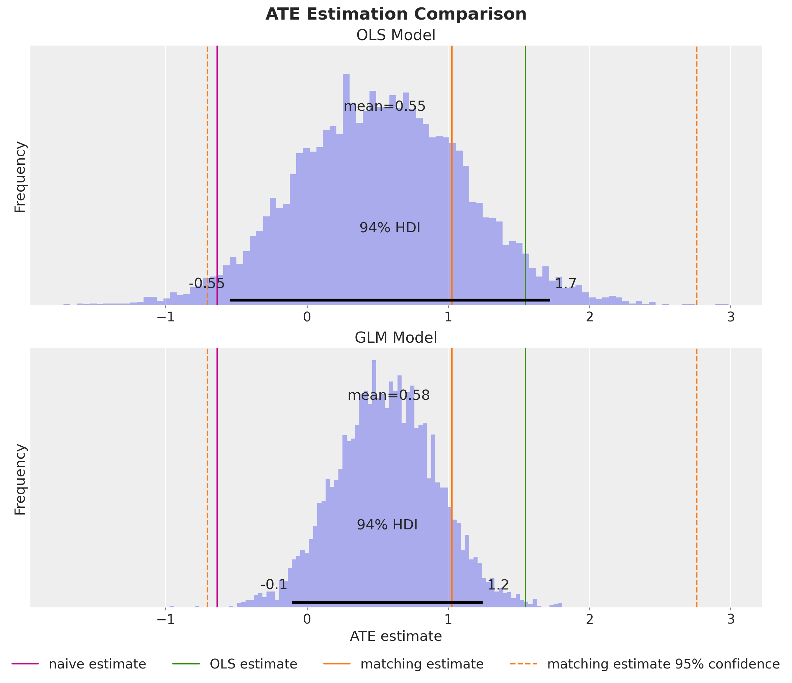
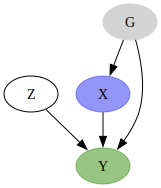
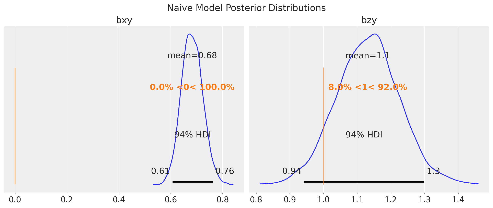
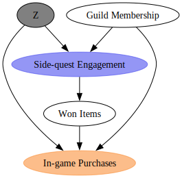
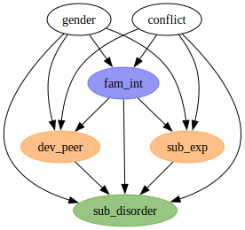
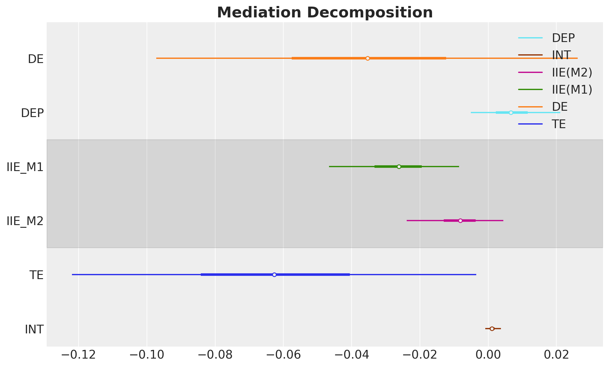

## Outline

::: {.columns}
::: {.column width="50%"}

1. Why Bayes in Causal Inference?
2. Causal Inference with PPLs (PyMC)
3. Fixed & Random Effects
4. Latent Variable Modeling (CEVAE)

:::

::: {.column width="50%"}

5. Mediation Analysis
6. Bayesian A/B Testing
7. Bayesian CUPED
8. References

:::
:::

## What is Causal Inference? {.smaller}

- **Goal:** Estimate the effect of a treatment $T$ on an outcome $Y$.
- **Potential outcomes** (Rubin, 1974): For each unit $i$, there exist two potential outcomes:
  - $Y_i(1)$: outcome if treated
  - $Y_i(0)$: outcome if not treated
- **Individual Treatment Effect:** $\tau_i = Y_i(1) - Y_i(0)$
- **Average Treatment Effect (ATE):** 

$$
\text{ATE} = \mathbb{E}[Y(1) - Y(0)]
$$


::: {.callout-warning}

## The Fundamental Problem of Causal Inference

We can **never observe both** $Y_i(1)$ and $Y_i(0)$ for the same unit. One potential outcome is always **missing** (counterfactual).

$$
\text{Observed: } Y_i = T_i \cdot Y_i(1) + (1 - T_i) \cdot Y_i(0)
$$

This is why naive comparisons (treated vs. untreated) can be **biased**:the groups may differ systematically due to **confounders**.

:::

## What is Bayesian Statistics? {.smaller}

**Bayes' theorem:** Update beliefs about parameters $\theta$ after observing data $y$:

$$
\underbrace{p(\theta \mid y)}_{\text{posterior}} \propto \underbrace{p(y \mid \theta)}_{\text{likelihood}} \cdot \underbrace{p(\theta)}_{\text{prior}}
$$

::: incremental

- **Prior** $p(\theta)$: encodes domain knowledge before seeing data.
- **Likelihood** $p(y \mid \theta)$: how probable the data is given the parameters.
- **Posterior** $p(\theta \mid y)$: updated beliefs after observing data.
- In a **generative graphical model**, all distributions start as priors over the data generating process. Once we **condition on observed data**, they become likelihoods.

:::

::: {.callout-note}

## Probabilistic Programming Languages (PPLs)

PPLs let you write generative models as code and automate posterior inference. Examples: [PyMC](https://www.pymc.io/), [NumPyro](https://num.pyro.ai/), [Stan](https://mc-stan.org/).

:::

## Why PPLs for Causal Inference?

::: {.callout-tip appearance="simple"}

- **Model = DAG:** Writing the generative process forces you to explicitly state your causal assumptions — this alone is valuable

- **Uncertainty for free:** Posterior distributions over causal effects, not just point estimates

- **Flexible modeling:** Swap likelihoods (Normal $\to$ Gamma), add hierarchical structure (Mundlak), or latent variables for unobserved confounders (CEVAE)

- **`do`-operator:** Intervene on the generative model for counterfactual reasoning

- **Fast inference:** Modern MCMC (NUTS) and SVI make posterior computation scalable and reliable

:::

## The Lalonde Dataset {.smaller}

Job training program (National Supported Work, 1970s): Does job training increase earnings?

::: {.columns}
::: {.column width="60%"}

::: incremental

- **Treatment:** Participation in a job training program
- **Outcome:** Earnings in 1978 (`re78`)
- **Covariates:** Education, age, prior earnings (`re75`), race/ethnicity, marital status, degree
- **Naive comparison** (difference in means): treated earned **$-635** less than untreated
- But treatment was **not** randomly assigned...
- **Confounders** create a spurious association!

:::

:::
::: {.column width="40%"}

::: {.bordered}
{fig-align="center" width="280"}
:::

:::
:::

::: footer
[Introduction to Causal Inference with PPLs](https://juanitorduz.github.io/intro_causal_inference_ppl_pymc/)
:::

## The Causal DAG

::: {.bordered}
{fig-align="center" width="1000"}
:::

**Backdoor criterion:** block all backdoor paths from treatment to outcome to identify the causal effect.

::: footer
[Introduction to Causal Inference with PPLs](https://juanitorduz.github.io/intro_causal_inference_ppl_pymc/)
:::

## ATE Estimation Strategies {.smaller}

Two ways to estimate the ATE:

**(1) Read the estimate from a regression coefficient:**

Fit a linear model of the form

$$
\text{earnings} = \alpha + \beta_{\text{treat}} \text{treat} + \beta_{\text{covariates}} \text{covariates} + \varepsilon
$$

and identify the estimate of $\beta_{\text{treat}}$ as the ATE.

**(2) Use the `do` operator for counterfactual computation:**

$$
\text{ATE} = \mathbb{E}[\text{earnings} \mid \text{do}(\text{treat} = 1)] - \mathbb{E}[\text{earnings} \mid \text{do}(\text{treat} = 0)]
$$


::: {.callout-note}

## Pearl's `do` operator and counterfactuals

The `do` operator implements Pearl's intervention:

$$P(Y \mid \text{do}(T = t))$$

It **cuts** incoming edges to the treatment node, simulating a randomized experiment.
:::

::: footer
[Introduction to Causal Inference with PPLs](https://juanitorduz.github.io/intro_causal_inference_ppl_pymc/)
:::


## PyMC Model: Treatment Sub-model

```{.python code-line-numbers="1|2-5|7-11|13-17|19-20"}
with pm.Model(coords=coords) as earnings_model:
    # --- Data ---
    covariates_data = pm.Data(
        "covariates_data", covariates_obs, dims=("obs_idx", "covariate")
    )

    # --- Priors ---
    intercept_treat = pm.Normal("intercept_treat", mu=0, sigma=10)
    beta_covariate_treat = pm.Normal(
        "beta_covariate_treat", mu=0, sigma=1, dims=("covariate",)
    )

    # --- Parametrization ---
    logit_p_treat = intercept_treat + pm.math.dot(
        covariates_data, beta_covariate_treat
    )
    p_treat = pm.math.sigmoid(logit_p_treat)

    # --- Likelihood ---
    treat = pm.Bernoulli("treat", p=p_treat, dims=("obs_idx",))
```

::: footer
[Introduction to Causal Inference with PPLs](https://juanitorduz.github.io/intro_causal_inference_ppl_pymc/)
:::

## PyMC Model: Earnings Sub-model

```{.python code-line-numbers="|1-7|9-15|17-20"}
    # --- Priors ---
    intercept_earnings = pm.Normal("intercept_earnings", mu=0, sigma=10)
    beta_treat_earnings = pm.Normal("beta_treat_earnings", mu=0, sigma=1)
    beta_covariate_earnings = pm.Normal(
        "beta_covariate_earnings", mu=0, sigma=1, dims=("covariate",)
    )
    sigma_earnings = pm.HalfNormal("sigma_earnings", sigma=10.0)

    # --- Parametrization ---
    mu_earnings = pm.Deterministic(
        "mu_earnings",
        intercept_earnings + beta_treat_earnings * treat
            + pm.math.dot(covariates_data, beta_covariate_earnings),
        dims=("obs_idx",),
    )
    
    # --- Likelihood ---
    pm.Normal(
      "earnings", mu=mu_earnings, sigma=sigma_earnings, dims=("obs_idx",)
    )
```

::: footer
[Introduction to Causal Inference with PPLs](https://juanitorduz.github.io/intro_causal_inference_ppl_pymc/)
:::

## PyMC Model: Generative Process

::: {.bordered}
{fig-align="center" width="850"}
:::

::: footer
[Introduction to Causal Inference with PPLs](https://juanitorduz.github.io/intro_causal_inference_ppl_pymc/)
:::

## Conditioning on Observed Data

```{.python}
conditioned_earnings_model = observe(
    earnings_model, {"treat": training_obs, "earnings": earnings_obs}
)
```

::: {.bordered}
{fig-align="center" width="700"}
:::

::: footer
[Introduction to Causal Inference with PPLs](https://juanitorduz.github.io/intro_causal_inference_ppl_pymc/)
:::

## ATE from the Regression Coefficient

::: {.bordered}
{fig-align="center" width="950"}
:::

::: footer
[Introduction to Causal Inference with PPLs](https://juanitorduz.github.io/intro_causal_inference_ppl_pymc/)
:::

## The `do` Operator

The `do` operator implements Pearl's intervention:

$$P(Y \mid \text{do}(T = t))$$

It **cuts** incoming edges to the treatment node, simulating a randomized experiment.

We can use the `do` operator to compute the ATE:

$$
ATE = \mathbb{E}[Y \mid \text{do}(T=1)] - \mathbb{E}[Y \mid \text{do}(T=0)]
$$

::: footer
[Introduction to Causal Inference with PPLs](https://juanitorduz.github.io/intro_causal_inference_ppl_pymc/)
:::

## Do-Operator Resulting Model Graph

```{.python code-line-numbers="1|2-4|5-10"}
from pymc.model.transform.conditioning import do
# Counterfactual interventions
do_0_model = do(conditioned_earnings_model, {"treat": np.zeros(n_obs)})
do_1_model = do(conditioned_earnings_model, {"treat": np.ones(n_obs)})
```

::: {.bordered}
{fig-align="center" width="1000"}
:::

::: footer
[Introduction to Causal Inference with PPLs](https://juanitorduz.github.io/intro_causal_inference_ppl_pymc/)
:::

## Individual Counterfactual Predictions

::: {.columns}
::: {.column width="50%"}

::: {.bordered}
{fig-align="center" width="1000"}
:::

:::

::: {.column width="50%"}

Computing the ATE using the `do` operator yields the same result as the regression coefficient approach.

::: {.bordered}
{fig-align="center" width="1000"}
:::

:::
:::


::: footer
[Introduction to Causal Inference with PPLs](https://juanitorduz.github.io/intro_causal_inference_ppl_pymc/)
:::

## A more meaningful likelihood
### Gamma Generalized Linear Model

::: {.bordered}
{fig-align="center" width="600"}
:::

::: footer
[Introduction to Causal Inference with PPLs](https://juanitorduz.github.io/intro_causal_inference_ppl_pymc/)
:::

## Fixed & Random Effects {.smaller}

### Group-Level Confounding

::: {.columns}
::: {.column width="35.5%"}

::: {.bordered}
{fig-align="center" width="350"}
:::

:::

::: {.column width="64.5%"}

**Problem:** Syntetic dataset where the true causal effect of $X$ on $Y$ is **zero**. We have **group-level confounding** through group-level effect $U_G$.

::: {.bordered}
{fig-align="center" width="650"}
:::

:::
:::

*Taken from Richard McElreath's Statistical Rethinking [(2026 Lectures)](https://youtube.com/watch?v=XNNcN8sU8us).*

::: footer
[Fixed and Random Effects Models: A Simulated Study](https://juanitorduz.github.io/fixed_random/)
:::

## Five Estimation Strategies

::: {.callout-note}
## Model Structure

| Model | Approach | Recovers true effect? |
|-------|----------|----------------------|
| **Naive** | Ignores groups entirely | No (biased) |
| **Fixed Effects** | Group-specific intercepts | Yes (high variance) |
| **Multilevel** | Hierarchical priors on groups | No (confounded) |
| **Mundlak** | Adds group means of $X$ | Yes (efficient) |
| **Mundlak Latent** | Latent group variable | Yes (best by LOO) |

:::

$$
y = \beta_{xy}x + \beta_{zy}z + \square + \varepsilon
$$

::: {.callout-tip appearance="simple"}

**Key insight (Mundlak trick):** Including group-level means as predictors absorbs the between-group confounding while preserving partial pooling benefits.

:::

::: footer
[Fixed and Random Effects Models: A Simulated Study](https://juanitorduz.github.io/fixed_random/)
:::

## Results: The Mundlak `Latent` Model {.smaller}

::: {.columns}
::: {.column width="60%"}

::: {.bordered}
{fig-align="center" width="550"}
:::

:::

::: {.column width="40%"}

- Fixed effects

`y ~ 0 + x + z + C(g)`

- Multilevel

`y ~ x + z + (1 | g)`

- Mundlak

`y ~ x + z + (1 | g) + x_bar`

- Mundlak Latent

\begin{align*}
\color{red}{u_{[g]}} & \sim \text{Normal}(\mu_u, \sigma_u) \\
x &= \alpha_x + \beta_{ux}{\color{red}{u_{[g]}}} + \varepsilon_x \\
y &= \alpha_{y, [g]} + \beta_{xy}x + \beta_{zy}z + \beta_{yg}{\color{red}{u_{[g]}}} + \varepsilon_y
\end{align*}

:::

:::
:::

::: footer
[Fixed and Random Effects Models: A Simulated Study](https://juanitorduz.github.io/fixed_random/)
:::

## Latent Variable Modeling {.smaller}

### Unobserved Confounders

::: {.columns}
::: {.column width="50%"}

::: {.bordered}
{fig-align="center" width="450"}
:::

:::

::: {.column width="50%"}

::: incremental

- Online game dataset: `Does side-quest engagement increase in-game purchases?`
- **Unobserved confounder** $Z$ (player motivation) affects both treatment and outcome.
- Standard backdoor adjustment is **not possible**.
- Solution: **CEVAE** framework (Louizos et al., NeurIPS 2017): learn a latent representation of $Z$.

:::

*Taken from Robert. O. N. 's book: [Causal AI](https://www.robertosazuwaness.com/causal-ai-book/).*

:::
:::

::: footer
[Causal Effect Estimation with Variational Inference and Latent Confounders](https://juanitorduz.github.io/online_game_ate/)
:::

## CEVAE Architecture {.smaller}

::: incremental

- **Model = Decoder (generative process):** Follows the causal ordering:
  1. $Z$ (player motivation) $\sim \text{Normal}(0, 1)$.
  2. Engagement (treatment) $\sim \text{Bernoulli}(f_\theta(\text{guild membership}, Z))$.
  3. Purchases (outcome) $\sim \text{Normal}(g_\theta(\text{won items}, \text{guild membership}, Z))$.

- **Guide = Encoder (recognition network):** Flax (NNX) neural network that maps observed data $(\text{guild membership}, \text{engagement}, \text{purchases})$ to the approximate posterior $q_\phi(Z \mid \cdot) = \text{Normal}(\mu_\phi, \sigma_\phi)$
  - Instead of optimizing separate $(\mu_i, \sigma_i)$ per observation, a single network with shared weights $\phi$ learns the mapping for all observations (amortized inference).

- **Inference:** SVI maximizes the ELBO, jointly training the decoder parameters $\theta$ and encoder parameters $\phi$ (NumPyro)
- **Key trick:** Use **identical** $Z$ samples for both $Y(\text{do}(T\!=\!0))$ and $Y(\text{do}(T\!=\!1))$ via `condition` + `do` handlers.

:::

::: footer
[Causal Effect Estimation with Variational Inference and Latent Confounders](https://juanitorduz.github.io/online_game_ate/)
:::


## Mediation Analysis: (In)Direct Effects {.smaller}

**Question:** How does family intervention reduce substance use disorder? Decompose total effect into direct and indirect pathways.

::: {.columns}
::: {.column width="50%"}

::: {.bordered}
{fig-align="center" width="450"}
:::

:::

::: {.column width="50%"}

- Synthetic dataset ($N = 410$) studying family intervention effects during adolescence.
- **Covariates:** `gender` (binary), `conflict` (ordinal family conflict level).
- **Treatment:** `fam_int` (family intervention program, binary).
- **Two mediators:** `dev_peer` (deviant peer engagement), `sub_exp` (drug experimentation).
- **Outcome:** `sub_disorder` (substance use disorder diagnosis, binary).

:::
:::

::: footer
[Mediation Analysis and (In)Direct Effects with PyMC](https://juanitorduz.github.io/mediation/)
:::

## Decomposition via `do`-Operator {.smaller}

::: {.callout-tip appearance="simple"}

**Effect decomposition:**

Define $E_{t, t', t''}$ as the expected outcome when `fam_int` $= t$ in the outcome equation, `dev_peer` follows its $\text{do}(T\!=\!t')$ distribution, and `sub_exp` follows its $\text{do}(T\!=\!t'')$ distribution.

$$E_{t,t',t''} = \sum_{m_1, m_2} P(M_1\!=\!m_1 \mid \text{do}(T\!=\!t')) \cdot P(M_2\!=\!m_2 \mid \text{do}(T\!=\!t''))$$
$$\quad \cdot \; P(Y\!=\!1 \mid \text{do}(T\!=\!t, M_1\!=\!m_1, M_2\!=\!m_2))$$

The mediators factor because there is **no edge** between `dev_peer` and `sub_exp` in the DAG.

We can compute the effects using the `do`-operator:

| Effect | Formula | Interpretation |
|--------|---------|----------------|
| **TE** (Total) | $E_{1,1,1} - E_{0,0,0}$ | Full treatment effect |
| **DE** (Direct) | $E_{1,0,0} - E_{0,0,0}$ | `fam_int` $\to$ `sub_disorder`, mediators at control |
| **IIE$_1$** (via `dev_peer`) | $E_{0,1,0} - E_{0,0,0}$ | Shift `dev_peer` to treated, hold rest at control |
| **IIE$_2$** (via `sub_exp`) | $E_{0,0,1} - E_{0,0,0}$ | Shift `sub_exp` to treated, hold rest at control |
| **INT** (Interaction) | $E_{0,1,1} - E_{0,1,0} - E_{0,0,1} + E_{0,0,0}$ | Joint mediator contribution beyond individual effects |

:::

::: footer
[Mediation Analysis and (In)Direct Effects with PyMC](https://juanitorduz.github.io/mediation/)
:::


## Mediation Decomposition

::: {.bordered}
{fig-align="center" width="950"}
:::

::: footer
[Mediation Analysis and (In)Direct Effects with PyMC](https://juanitorduz.github.io/mediation/)
:::

## Bayesian A/B Testing

### The Bet Test Problem

{fig-align="center" width="1000"}

::: {.callout-tip appearance="simple"}
Would you **bet your own money** on the A/B test result before seeing data? Independent informative priors can imply implausible prior lift distributions.
:::

::: footer
- [The Bet Test (Eppo)](https://www.geteppo.com/blog/the-bet-test-problems-in-bayesian-ab-test-analysis)
- [Prior Predictive Modeling in Bayesian A/B Testing](https://juanitorduz.github.io/prior_predictive_ab_testing/)
:::

## Correlated Priors: The Right Approach

```{.python code-line-numbers="|4-7|9-12|14-19"}
import pymc as pm

with pm.Model() as correlated_model:
    # Set a prior on the control conversion rate
    conversion_rate_control = pm.Beta(
      "conversion_rate_control", alpha=15, beta=600
    )

    # Set a prior on the relative lift
    relative_lift = pm.Normal(
      "relative_lift", mu=0, sigma=0.1
    )

    # Convert the relative lift to a conversion rate for the treatment
    # group deterministically
    conversion_rate_treatment = pm.Deterministic(
        "conversion_rate_treatment",
        conversion_rate_control * (1 + relative_lift)
    )
```

::: footer
[Prior Predictive Modeling in Bayesian A/B Testing](https://juanitorduz.github.io/prior_predictive_ab_testing/)
:::

## Correlated Priors: Prior vs Posterior

<!-- TODO: export prior vs posterior from prior_predictive_ab_testing.ipynb -->
{fig-align="center" width="1000"}

::: footer
[Prior Predictive Modeling in Bayesian A/B Testing](https://juanitorduz.github.io/prior_predictive_ab_testing/)
:::

## Bayesian Power Analysis {.smaller}

::: {.callout-tip appearance="simple"}

### HDI + ROPE Framework

Declare significance when the 94% HDI of the posterior lift **excludes the ROPE** (Region of Practical Equivalence) around zero.

**Five-step process:**

1. Generate parameter values from a hypothetical distribution
2. Simulate data samples using the planned sampling methods
3. Compute posterior estimates with Bayesian analysis
4. Assess whether the HDI excludes the ROPE
5. Repeat to approximate statistical power

:::

::: footer
- [Introduction to Bayesian Power Analysis](https://juanitorduz.github.io/power_sample_size_exclude_null/)
- [Bayesian Power Analysis for A/B Testing](https://juanitorduz.github.io/bayesian_power_ab_testing/)
:::

## Power Curves: Prior Specification Matters

<!-- TODO: export power curves from bayesian_power_ab_testing.ipynb -->
{fig-align="center" width="1000"}

::: {.callout-tip appearance="simple"}
Correlated model is **most conservative** but controls false positive rate. Non-informative priors $\approx$ frequentist z-test.
:::

::: footer
[Bayesian Power Analysis for A/B Testing](https://juanitorduz.github.io/bayesian_power_ab_testing/)
:::

## Bayesian CUPED

::: {.columns}
::: {.column width="50%"}

**Three approaches:**

1. **Difference-in-means** (baseline)
2. **Full Bayesian CUPED** (joint model)
3. **Graph surgery** (`do` operator)

$$Y_{\text{cuped}} = Y_{\text{post}} - \theta(Y_{\text{pre}} - \bar{Y}_{\text{pre}})$$

:::

::: {.column width="50%"}

::: {.callout-tip appearance="simple"}

**CUPED** (Controlled Use of Pre-Experiment Data): use pre-treatment outcome as a covariate to **reduce posterior variance**.

Same idea as classical CUPED but with full uncertainty quantification.

:::

:::
:::

::: footer
[Bayesian CUPED](https://juanitorduz.github.io/bayesian_cuped/)
:::

## Bayesian CUPED: Results

<!-- TODO: export posterior comparison from bayesian_cuped.ipynb -->
{fig-align="center" width="1000"}

::: {.callout-tip appearance="simple"}
Minimal difference between full Bayesian CUPED and graph surgery -- both achieve substantial variance reduction compared to difference-in-means.
:::

::: footer
[Bayesian CUPED](https://juanitorduz.github.io/bayesian_cuped/)
:::

## The Unifying Thread

::: {.callout-tip appearance="simple"}

<span style="font-size: 1.3em;">
Probabilistic programming languages provide a **single, unified language** for expressing causal assumptions, fitting models, computing counterfactuals, and quantifying uncertainty.
</span>

:::

::: incremental

- **Backdoor adjustment** -- Lalonde dataset (OLS + GLM)
- **Group-level confounding** -- Fixed/Random effects, Mundlak trick
- **Latent confounders** -- CEVAE with variational inference
- **Mediation analysis** -- Direct/Indirect effect decomposition
- **A/B testing** -- Prior specification & power analysis
- **Variance reduction** -- Bayesian CUPED with graph surgery

:::

## References {.smaller}

#### Blog Posts

- [Introduction to Causal Inference with PPLs](https://juanitorduz.github.io/intro_causal_inference_ppl_pymc/)
- [Fixed and Random Effects Models](https://juanitorduz.github.io/fixed_random/)
- [Causal Effect Estimation with Variational Inference and Latent Confounders](https://juanitorduz.github.io/online_game_ate/)
- [Mediation Analysis and (In)Direct Effects with PyMC](https://juanitorduz.github.io/mediation/)
- [Prior Predictive Modeling in Bayesian A/B Testing](https://juanitorduz.github.io/prior_predictive_ab_testing/)
- [Introduction to Bayesian Power Analysis](https://juanitorduz.github.io/power_sample_size_exclude_null/)
- [Bayesian Power Analysis for A/B Testing](https://juanitorduz.github.io/bayesian_power_ab_testing/)
- [Bayesian CUPED](https://juanitorduz.github.io/bayesian_cuped/)

## References {.smaller}

#### Books & Papers

- Pearl, J. *Causality: Models, Reasoning and Inference*
- McElreath, R. *Statistical Rethinking* (2nd ed.)
- Facure, M. *Causal Inference for The Brave and True*
- Louizos, C. et al. *Causal Effect Inference with Deep Latent-Variable Models* (NeurIPS 2017)
- Kruschke, J. *Doing Bayesian Data Analysis*

#### Packages

- [PyMC](https://www.pymc.io/) / [NumPyro](https://num.pyro.ai/)
- [DoWhy](https://github.com/py-why/dowhy)
- [CausalPy](https://causalpy.readthedocs.io/)
- [PyMC-Marketing](https://www.pymc-marketing.io/)

## Thank you! {background-image="causal_inference_ppl_files/static/images/logos/juanitorduz_logo_small.png" background-opacity="0.15"}

[**juanitorduz.github.io**](https://juanitorduz.github.io/)

{.absolute top=0 right=0 width=600 height=600}
