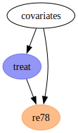
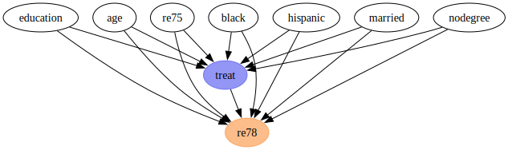
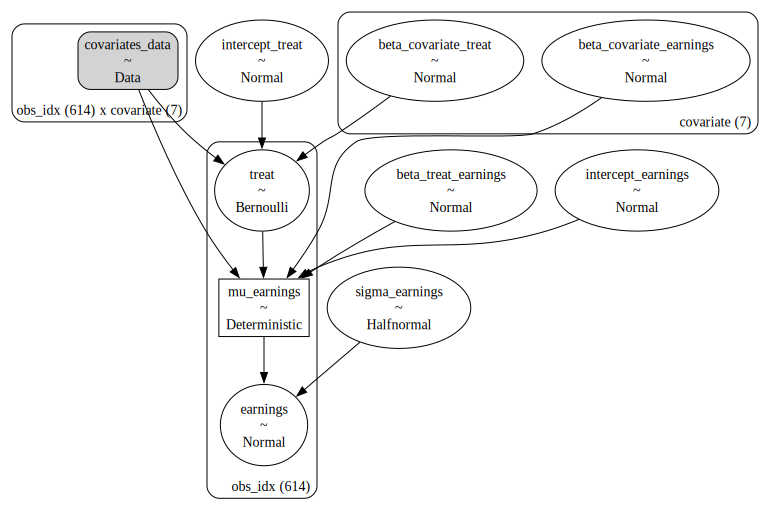
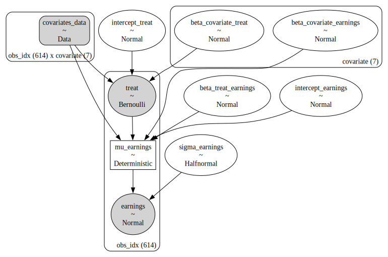
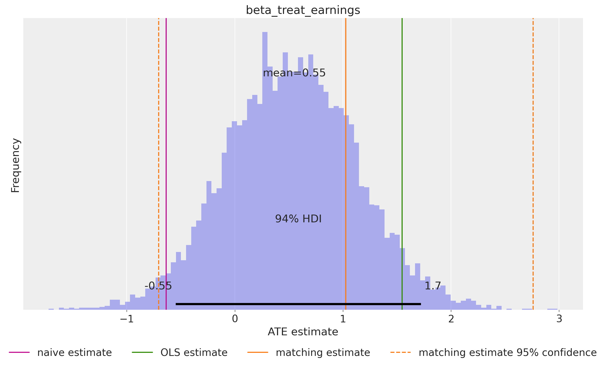
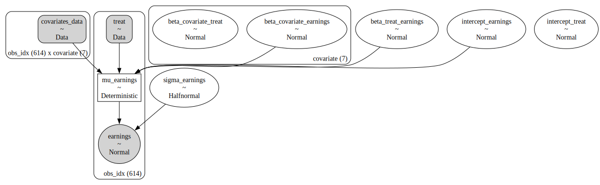
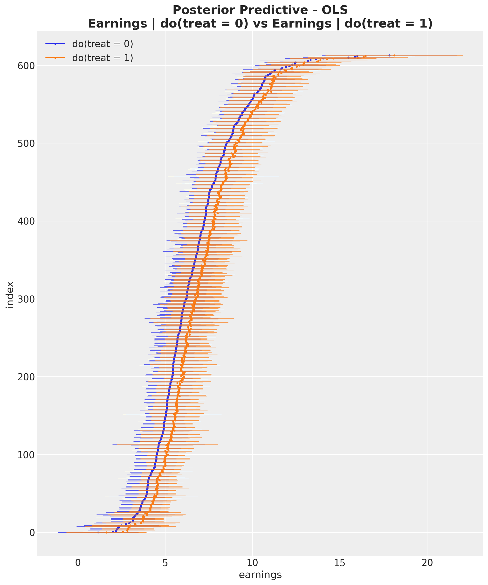
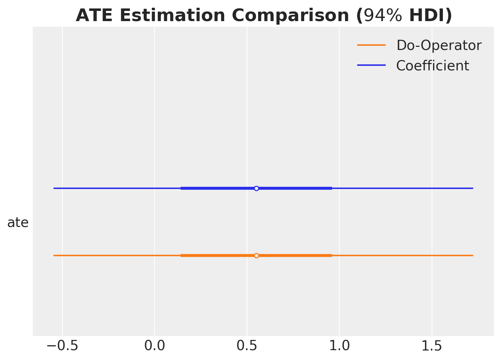

## Outline

::: {.columns}
::: {.column width="50%"}

1. Why Bayes in Causal Inference?
2. Causal Inference with PPLs (PyMC)
3. Fixed & Random Effects
4. Latent Variable Modeling (CEVAE)

:::

::: {.column width="50%"}

5. Mediation Analysis
6. Bayesian A/B Testing
7. Bayesian CUPED
8. References

:::
:::


## Why PPLs for Causal Inference?

::: {.callout-tip appearance="simple"}

- **Interpretability**
  - Explicit causal assumptions via DAGs
  - Code transparently represents the data generating process

- **Uncertainty quantification**
  - Full posterior distributions over causal effects
  - Risk assessment and decision making

- **Customization**
  - Swap likelihoods, add latent variables, encode domain knowledge
  - Non-linear and hierarchical approaches

- **Unified framework**
  - Same PPL for all causal tasks in this talk

:::

## The Lalonde Dataset {.smaller}

Job training program (National Supported Work, 1970s): Does job training increase earnings?

::: {.columns}
::: {.column width="60%"}

::: incremental

- **Treatment:** Participation in a job training program
- **Outcome:** Earnings in 1978 (`re78`)
- **Covariates:** Education, age, prior earnings (`re75`), race/ethnicity, marital status, degree
- **Naive comparison** (difference in means): treated earned **$-635** less than untreated
- But treatment was **not** randomly assigned...
- **Confounders** create a spurious association!

:::

:::
::: {.column width="40%"}

::: {.bordered}
{fig-align="center" width="280"}
:::

:::
:::

::: footer
[Introduction to Causal Inference with PPLs](https://juanitorduz.github.io/intro_causal_inference_ppl_pymc/)
:::

## The Causal DAG

::: {.bordered}
{fig-align="center" width="1000"}
:::

**Backdoor criterion:** block all backdoor paths from treatment to outcome to identify the causal effect.

::: footer
[Introduction to Causal Inference with PPLs](https://juanitorduz.github.io/intro_causal_inference_ppl_pymc/)
:::

## ATE Estimation Strategies {.smaller}

Two ways to estimate the ATE:

**(1) Read the estimate from a regression coefficient:**

Fit a linear model of the form

$$
\text{earnings} = \alpha + \beta_{\text{treat}} \text{treat} + \beta_{\text{covariates}} \text{covariates} + \varepsilon
$$

and identify the estimate of $\beta_{\text{treat}}$ as the ATE.

**(2) Use the `do` operator for counterfactual computation:**

$$
\text{ATE} = \mathbb{E}[\text{earnings} \mid \text{do}(\text{treat} = 1)] - \mathbb{E}[\text{earnings} \mid \text{do}(\text{treat} = 0)]
$$


::: {.callout-note}

## Pearl's `do` operator and counterfactuals

The `do` operator implements Pearl's intervention:

$$P(Y \mid \text{do}(T = t))$$

It **cuts** incoming edges to the treatment node, simulating a randomized experiment.
:::

::: footer
[Introduction to Causal Inference with PPLs](https://juanitorduz.github.io/intro_causal_inference_ppl_pymc/)
:::


## PyMC Model: Treatment Sub-model

```{.python code-line-numbers="1|2-5|7-11|13-17|19-20"}
with pm.Model(coords=coords) as earnings_model:
    # --- Data ---
    covariates_data = pm.Data(
        "covariates_data", covariates_obs, dims=("obs_idx", "covariate")
    )

    # --- Priors ---
    intercept_treat = pm.Normal("intercept_treat", mu=0, sigma=10)
    beta_covariate_treat = pm.Normal(
        "beta_covariate_treat", mu=0, sigma=1, dims=("covariate",)
    )

    # --- Parametrization ---
    logit_p_treat = intercept_treat + pm.math.dot(
        covariates_data, beta_covariate_treat
    )
    p_treat = pm.math.sigmoid(logit_p_treat)

    # --- Likelihood ---
    treat = pm.Bernoulli("treat", p=p_treat, dims=("obs_idx",))
```

::: footer
[Introduction to Causal Inference with PPLs](https://juanitorduz.github.io/intro_causal_inference_ppl_pymc/)
:::

## PyMC Model: Earnings Sub-model

```{.python code-line-numbers="|1-7|9-15|17-20"}
    # --- Priors ---
    intercept_earnings = pm.Normal("intercept_earnings", mu=0, sigma=10)
    beta_treat_earnings = pm.Normal("beta_treat_earnings", mu=0, sigma=1)
    beta_covariate_earnings = pm.Normal(
        "beta_covariate_earnings", mu=0, sigma=1, dims=("covariate",)
    )
    sigma_earnings = pm.HalfNormal("sigma_earnings", sigma=10.0)

    # --- Parametrization ---
    mu_earnings = pm.Deterministic(
        "mu_earnings",
        intercept_earnings + beta_treat_earnings * treat
            + pm.math.dot(covariates_data, beta_covariate_earnings),
        dims=("obs_idx",),
    )
    
    # --- Likelihood ---
    pm.Normal(
      "earnings", mu=mu_earnings, sigma=sigma_earnings, dims=("obs_idx",)
    )
```

::: footer
[Introduction to Causal Inference with PPLs](https://juanitorduz.github.io/intro_causal_inference_ppl_pymc/)
:::

## PyMC Model: Generative Process

::: {.bordered}
{fig-align="center" width="850"}
:::

::: footer
[Introduction to Causal Inference with PPLs](https://juanitorduz.github.io/intro_causal_inference_ppl_pymc/)
:::

## Conditioning on Observed Data

```{.python}
conditioned_earnings_model = observe(
    earnings_model, {"treat": training_obs, "earnings": earnings_obs}
)
```

::: {.bordered}
{fig-align="center" width="700"}
:::

::: footer
[Introduction to Causal Inference with PPLs](https://juanitorduz.github.io/intro_causal_inference_ppl_pymc/)
:::

## ATE from the Regression Coefficient

::: {.bordered}
{fig-align="center" width="950"}
:::

::: footer
[Introduction to Causal Inference with PPLs](https://juanitorduz.github.io/intro_causal_inference_ppl_pymc/)
:::

## The `do` Operator

The `do` operator implements Pearl's intervention:

$$P(Y \mid \text{do}(T = t))$$

It **cuts** incoming edges to the treatment node, simulating a randomized experiment.

We can use the `do` operator to compute the ATE:

$$
ATE = \mathbb{E}[Y \mid \text{do}(T=1)] - \mathbb{E}[Y \mid \text{do}(T=0)]
$$

::: footer
[Introduction to Causal Inference with PPLs](https://juanitorduz.github.io/intro_causal_inference_ppl_pymc/)
:::

## Do-Operator Resulting Model Graph

```{.python code-line-numbers="1|2-4|5-10"}
from pymc.model.transform.conditioning import do
# Counterfactual interventions
do_0_model = do(conditioned_earnings_model, {"treat": np.zeros(n_obs)})
do_1_model = do(conditioned_earnings_model, {"treat": np.ones(n_obs)})
```

::: {.bordered}
{fig-align="center" width="1000"}
:::

::: footer
[Introduction to Causal Inference with PPLs](https://juanitorduz.github.io/intro_causal_inference_ppl_pymc/)
:::

## Individual Counterfactual Predictions

::: {.columns}
::: {.column width="50%"}

::: {.bordered}
{fig-align="center" width="1000"}
:::

:::

::: {.column width="50%"}

::: {.bordered}
{fig-align="center" width="1000"}
:::

:::
:::


::: footer
[Introduction to Causal Inference with PPLs](https://juanitorduz.github.io/intro_causal_inference_ppl_pymc/)
:::

## Gamma GLM: A Better Likelihood

::: {.columns}
::: {.column width="50%"}

```{.python code-line-numbers="|1-2|4-5"}
    # Non-negative earnings
    # via softplus link
    mu_earnings = pm.Deterministic(
        "mu_earnings",
        pt.softplus(raw_mu_earnings),
        dims=("obs_idx",),
    )
    # Gamma likelihood
    pm.Gamma(
        "earnings",
        mu=mu_earnings,
        sigma=sigma_earnings,
        dims=("obs_idx",),
    )
```

:::

::: {.column width="50%"}

<!-- TODO: export posterior predictive check from intro_causal_inference_ppl_pymc.ipynb -->
{fig-align="center" width="500"}

:::
:::

::: {.callout-tip appearance="simple"}
Non-negative earnings constraint via `softplus` link + `Gamma` likelihood. Substantially better fit by LOO cross-validation.
:::

::: footer
[Introduction to Causal Inference with PPLs](https://juanitorduz.github.io/intro_causal_inference_ppl_pymc/)
:::

## ATE Comparison: All Methods

<!-- TODO: export ATE forest plot from intro_causal_inference_ppl_pymc.ipynb -->
{fig-align="center" width="1000"}

::: footer
[Introduction to Causal Inference with PPLs](https://juanitorduz.github.io/intro_causal_inference_ppl_pymc/)
:::

## Fixed & Random Effects {.smaller}

### Group-Level Confounding

::: {.columns}
::: {.column width="40%"}

<!-- TODO: export DAG from fixed_random.ipynb -->
{fig-align="center" width="350"}

:::

::: {.column width="60%"}

::: {.callout-tip appearance="simple"}
**Problem:** True causal effect of $X$ on $Y$ is **zero**, but naive regression shows a positive effect.

- Variable $Z$ confounds $X \to Y$
- Group $G$ influences both $X$ and $Y$  through an unobserved group-level effect $U_G$
:::

Inspired by Richard McElreath's *Statistical Rethinking* (2026 Lectures).

:::
:::

::: footer
[Fixed and Random Effects Models: A Simulated Study](https://juanitorduz.github.io/fixed_random/)
:::

## Five Estimation Strategies

::: {.callout-tip appearance="simple"}

| Model | Approach | Recovers true effect? |
|-------|----------|----------------------|
| **Naive** | Ignores groups entirely | No (biased) |
| **Fixed Effects** | Group-specific intercepts | Yes (high variance) |
| **Multilevel** | Hierarchical priors on groups | No (confounded) |
| **Mundlak** | Adds group means of $X$ | Yes (efficient) |
| **Mundlak Latent** | Latent group variable | Yes (best by LOO) |

:::

::: {.callout-tip appearance="simple"}

**Key insight (Mundlak trick):** Including group-level means as predictors absorbs the between-group confounding while preserving partial pooling benefits.

:::

::: footer
[Fixed and Random Effects Models: A Simulated Study](https://juanitorduz.github.io/fixed_random/)
:::

## Mundlak Trick: Results

<!-- TODO: export forest plot comparison from fixed_random.ipynb -->
{fig-align="center" width="1000"}

::: footer
[Fixed and Random Effects Models: A Simulated Study](https://juanitorduz.github.io/fixed_random/)
:::

## Latent Variable Modeling {.smaller}

### Unobserved Confounders

::: {.columns}
::: {.column width="40%"}

<!-- TODO: export DAG from online_game_ate.ipynb -->
{fig-align="center" width="350"}

:::

::: {.column width="60%"}

::: incremental

- Online game dataset: does guild membership increase total hours?
- **Unobserved confounder** $Z$ (player motivation) affects both treatment and outcome
- Standard backdoor adjustment is **not possible**
- Solution: **CEVAE** framework (Louizos et al., NeurIPS 2017) -- learn a latent representation of $Z$ using variational inference

:::

:::
:::

::: footer
[Causal Effect Estimation with Variational Inference and Latent Confounders](https://juanitorduz.github.io/online_game_ate/)
:::

## CEVAE Architecture

::: {.callout-tip appearance="simple"}

**Causal Effect Variational Autoencoder (CEVAE):**

- **Encoder:** Flax (NNX) neural network maps observed data to latent confounder $Z$
- **Decoder:** Generative model for treatment and outcome given $Z$
- **Inference:** Stochastic Variational Inference (SVI) in NumPyro/PyMC
- **Key trick:** Use identical $Z$ samples when computing $Y(\text{do}(T=0))$ and $Y(\text{do}(T=1))$ for consistent counterfactual comparisons

:::

<!-- TODO: export model diagram or architecture from online_game_ate.ipynb -->
{fig-align="center" width="800"}

::: footer
[Causal Effect Estimation with Variational Inference and Latent Confounders](https://juanitorduz.github.io/online_game_ate/)
:::

## CEVAE: Results

<!-- TODO: export ATE comparison from online_game_ate.ipynb -->
{fig-align="center" width="1000"}

::: {.callout-tip appearance="simple"}
CEVAE recovers a treatment effect consistent with the DoWhy frontdoor estimate, **despite never observing the confounder**.
:::

::: footer
[Causal Effect Estimation with Variational Inference and Latent Confounders](https://juanitorduz.github.io/online_game_ate/)
:::

## Mediation Analysis {.smaller}

### (In)Direct Effects

::: {.columns}
::: {.column width="40%"}

<!-- TODO: export DAG from mediation.ipynb -->
{fig-align="center" width="350"}

:::

::: {.column width="60%"}

::: incremental

- Family intervention study ($N = 553$)
- **Treatment:** Family intervention program
- **Outcome:** Substance use disorder
- **Two mediators:** Deviant peers, substance experimentation
- **Question:** How much of the effect goes through each pathway?

:::

:::
:::

::: footer
[Mediation Analysis and (In)Direct Effects with PyMC](https://juanitorduz.github.io/mediation/)
:::

## Mediation: Model Structure

::: {.callout-tip appearance="simple"}

**Four Bernoulli likelihoods with logistic links:**

```
fam_int      ~ Bernoulli(logistic(gender, conflict))
dev_peer     ~ Bernoulli(logistic(gender, conflict, fam_int))
sub_exp      ~ Bernoulli(logistic(gender, conflict, fam_int))
sub_disorder ~ Bernoulli(logistic(gender, conflict, fam_int, dev_peer, sub_exp))
```

:::

::: {.callout-tip appearance="simple"}

**Effect decomposition:**

- **Direct Effect (DE):** `fam_int` $\to$ `sub_disorder`
- **Indirect Effects (IIE):** Through each mediator
- **Interaction (INT):** Joint mediator contributions

:::

::: footer
[Mediation Analysis and (In)Direct Effects with PyMC](https://juanitorduz.github.io/mediation/)
:::

## Mediation: Analytical vs `do`-Operator

<!-- TODO: export effects comparison from mediation.ipynb -->
{fig-align="center" width="1000"}

::: {.callout-tip appearance="simple"}
Both analytical and `do`-operator approaches yield **identical results**, validating the implementation.
:::

::: footer
[Mediation Analysis and (In)Direct Effects with PyMC](https://juanitorduz.github.io/mediation/)
:::


## Bayesian A/B Testing

### The Bet Test Problem

{fig-align="center" width="1000"}

::: {.callout-tip appearance="simple"}
Would you **bet your own money** on the A/B test result before seeing data? Independent informative priors can imply implausible prior lift distributions.
:::

::: footer
- [The Bet Test (Eppo)](https://www.geteppo.com/blog/the-bet-test-problems-in-bayesian-ab-test-analysis)
- [Prior Predictive Modeling in Bayesian A/B Testing](https://juanitorduz.github.io/prior_predictive_ab_testing/)
:::

## Correlated Priors: The Right Approach

```{.python code-line-numbers="|4-7|9-12|14-19"}
import pymc as pm

with pm.Model() as correlated_model:
    # Set a prior on the control conversion rate
    conversion_rate_control = pm.Beta(
      "conversion_rate_control", alpha=15, beta=600
    )

    # Set a prior on the relative lift
    relative_lift = pm.Normal(
      "relative_lift", mu=0, sigma=0.1
    )

    # Convert the relative lift to a conversion rate for the treatment
    # group deterministically
    conversion_rate_treatment = pm.Deterministic(
        "conversion_rate_treatment",
        conversion_rate_control * (1 + relative_lift)
    )
```

::: footer
[Prior Predictive Modeling in Bayesian A/B Testing](https://juanitorduz.github.io/prior_predictive_ab_testing/)
:::

## Correlated Priors: Prior vs Posterior

<!-- TODO: export prior vs posterior from prior_predictive_ab_testing.ipynb -->
{fig-align="center" width="1000"}

::: footer
[Prior Predictive Modeling in Bayesian A/B Testing](https://juanitorduz.github.io/prior_predictive_ab_testing/)
:::

## Bayesian Power Analysis {.smaller}

::: {.callout-tip appearance="simple"}

### HDI + ROPE Framework

Declare significance when the 94% HDI of the posterior lift **excludes the ROPE** (Region of Practical Equivalence) around zero.

**Five-step process:**

1. Generate parameter values from a hypothetical distribution
2. Simulate data samples using the planned sampling methods
3. Compute posterior estimates with Bayesian analysis
4. Assess whether the HDI excludes the ROPE
5. Repeat to approximate statistical power

:::

::: footer
- [Introduction to Bayesian Power Analysis](https://juanitorduz.github.io/power_sample_size_exclude_null/)
- [Bayesian Power Analysis for A/B Testing](https://juanitorduz.github.io/bayesian_power_ab_testing/)
:::

## Power Curves: Prior Specification Matters

<!-- TODO: export power curves from bayesian_power_ab_testing.ipynb -->
{fig-align="center" width="1000"}

::: {.callout-tip appearance="simple"}
Correlated model is **most conservative** but controls false positive rate. Non-informative priors $\approx$ frequentist z-test.
:::

::: footer
[Bayesian Power Analysis for A/B Testing](https://juanitorduz.github.io/bayesian_power_ab_testing/)
:::

## Bayesian CUPED

::: {.columns}
::: {.column width="50%"}

**Three approaches:**

1. **Difference-in-means** (baseline)
2. **Full Bayesian CUPED** (joint model)
3. **Graph surgery** (`do` operator)

$$Y_{\text{cuped}} = Y_{\text{post}} - \theta(Y_{\text{pre}} - \bar{Y}_{\text{pre}})$$

:::

::: {.column width="50%"}

::: {.callout-tip appearance="simple"}

**CUPED** (Controlled Use of Pre-Experiment Data): use pre-treatment outcome as a covariate to **reduce posterior variance**.

Same idea as classical CUPED but with full uncertainty quantification.

:::

:::
:::

::: footer
[Bayesian CUPED](https://juanitorduz.github.io/bayesian_cuped/)
:::

## Bayesian CUPED: Results

<!-- TODO: export posterior comparison from bayesian_cuped.ipynb -->
{fig-align="center" width="1000"}

::: {.callout-tip appearance="simple"}
Minimal difference between full Bayesian CUPED and graph surgery -- both achieve substantial variance reduction compared to difference-in-means.
:::

::: footer
[Bayesian CUPED](https://juanitorduz.github.io/bayesian_cuped/)
:::

## The Unifying Thread

::: {.callout-tip appearance="simple"}

<span style="font-size: 1.3em;">
Probabilistic programming languages provide a **single, unified language** for expressing causal assumptions, fitting models, computing counterfactuals, and quantifying uncertainty.
</span>

:::

::: incremental

- **Backdoor adjustment** -- Lalonde dataset (OLS + GLM)
- **Group-level confounding** -- Fixed/Random effects, Mundlak trick
- **Latent confounders** -- CEVAE with variational inference
- **Mediation analysis** -- Direct/Indirect effect decomposition
- **A/B testing** -- Prior specification & power analysis
- **Variance reduction** -- Bayesian CUPED with graph surgery

:::

## References {.smaller}

#### Blog Posts

- [Introduction to Causal Inference with PPLs](https://juanitorduz.github.io/intro_causal_inference_ppl_pymc/)
- [Fixed and Random Effects Models](https://juanitorduz.github.io/fixed_random/)
- [Causal Effect Estimation with Variational Inference and Latent Confounders](https://juanitorduz.github.io/online_game_ate/)
- [Mediation Analysis and (In)Direct Effects with PyMC](https://juanitorduz.github.io/mediation/)
- [Prior Predictive Modeling in Bayesian A/B Testing](https://juanitorduz.github.io/prior_predictive_ab_testing/)
- [Introduction to Bayesian Power Analysis](https://juanitorduz.github.io/power_sample_size_exclude_null/)
- [Bayesian Power Analysis for A/B Testing](https://juanitorduz.github.io/bayesian_power_ab_testing/)
- [Bayesian CUPED](https://juanitorduz.github.io/bayesian_cuped/)

## References {.smaller}

#### Books & Papers

- Pearl, J. *Causality: Models, Reasoning and Inference*
- McElreath, R. *Statistical Rethinking* (2nd ed.)
- Facure, M. *Causal Inference for The Brave and True*
- Louizos, C. et al. *Causal Effect Inference with Deep Latent-Variable Models* (NeurIPS 2017)
- Kruschke, J. *Doing Bayesian Data Analysis*

#### Packages

- [PyMC](https://www.pymc.io/) / [NumPyro](https://num.pyro.ai/)
- [DoWhy](https://github.com/py-why/dowhy)
- [CausalPy](https://causalpy.readthedocs.io/)
- [PyMC-Marketing](https://www.pymc-marketing.io/)

## Thank you! {background-image="causal_inference_ppl_files/static/images/logos/juanitorduz_logo_small.png" background-opacity="0.15"}

[**juanitorduz.github.io**](https://juanitorduz.github.io/)

{.absolute top=0 right=0 width=600 height=600}
