# Introduction to Uplift Modeling

## [Dr. Juan Orduz](https://juanitorduz.github.io/)
**Mathematician & Data scientist**

### [PyConDE & PyData Berlin 2022](https://2022.pycon.de/)


---
<!--
_footer: Image taken from https://www.uplift-modeling.com/en/latest/user_guide/introduction/clients.html 
-->

# Motivation

## How can we optimally select customers to be treated by marketing incentives?


---

# We can not **send** and **not send** incentives to the same customers at the same time


---

# What is Uplift Modeling?

From [Gutierrez, P., & Gérardy, J. Y. (2017). "Causal Inference and Uplift Modelling: A Review of the Literature"](https://proceedings.mlr.press/v67/gutierrez17a/gutierrez17a.pdf)

 - ## Uplift modeling refers to the set of techniques used to model the incremental impact of an action or treatment on a customer outcome.
 
- ## Uplift modeling is therefore both a Causal Inference problem and a Machine Learning one.

---
<!--
_footer: Taken from [Gutierrez, P., & Gérardy, J. Y. (2017). *"Causal Inference and Uplift Modelling: A Review of the Literature"*](https://proceedings.mlr.press/v67/gutierrez17a/gutierrez17a.pdf)
-->

# Conditional Average Treatment Effect

- Let $Y^{1}_{i}$ denote person $i$'s outcome when it receives the treatment and $Y^{0}_{i}$ when it does not receive the treatment.
- We are interested in understanding the *causal effect* $Y^{1}_{i} - Y^{0}_{i}$ and the  *conditional average treatment effect* $CATE = E[Y^{1}_{i} | X_{i}] - E[Y^{0}_{i} | X_{i}]$, where $X_{i}$ is a feature vector of the $i$-th person.
- **However, we can not observe them!** 🙁

---
<!--
_footer: Taken from [Gutierrez, P., & Gérardy, J. Y. (2017). *"Causal Inference and Uplift Modelling: A Review of the Literature"*](https://proceedings.mlr.press/v67/gutierrez17a/gutierrez17a.pdf)
-->
# Uplift

Let $W_{i}$ is a binary variable indicating whether person $i$ received the treatment, so that

$$Y_{i}^{obs} = Y^{1}_{i} W_{i} + (1 - W_{i}) Y^{0}_{i}$$

## Unconfoundedness Assumption

If we **assume** that the treatment assignment $W_{i}$ is independent of $Y^{1}_{i}$  and $Y^{0}_{i}$ conditional on $X_i$, then we can estimate the $CATE$ from observational data by computing the empirical counterpart:

$$\text{\bf{uplift}} = \widehat{CATE} = E[Y_{i} | X_{i}, W_{i}=1] - E[Y_{i} | X_{i}, W_{i}=0]$$

---
<!--
_footer: Taken from https://www.uplift-modeling.com/en/latest/user_guide/introduction/data_collection.html
-->
# Data Collection


---
<!--
_footer: See [Gutierrez, P., & Gérardy, J. Y. (2017). *"Causal Inference and Uplift Modelling: A Review of the Literature"*](https://proceedings.mlr.press/v67/gutierrez17a/gutierrez17a.pdf)
-->

# Estimating Uplift

- ## **Meta Algorithms** $\longleftarrow$ Today

- ## The Class Transformation Method

- ## Direct measurements (e.g. trees)

---

# S-Learner
<!--
_footer: Taken from https://www.uplift-modeling.com/en/latest/user_guide/models/index.html
-->

### Step 1: Training

$$
\underbrace{
\left(
\begin{array}{cccc}
x_{11} & \cdots & x_{1k} & w_{1} \\
\vdots & \ddots & \vdots & \vdots \\
x_{11} & \cdots & x_{nk} & w_{n} \\
\end{array}
\right)}_{X\bigoplus W}
\xrightarrow{\mu}
\left(
\begin{array}{c}
y_{1} \\
\vdots \\
y_{n}
\end{array}
\right)
$$

### Step 2: Uplift Prediction

$$
\widehat{\text{\bf{uplift}}} =
\hat{\mu}\left(
\begin{array}{cccc}
x_{11} & \cdots & x_{1k} & 1 \\
\vdots & \ddots & \vdots & \vdots \\
x_{11} & \cdots & x_{mk} & 1 \\
\end{array}
\right)
-
\hat{\mu}
\left(
\begin{array}{cccc}
x_{11} & \cdots & x_{1k} & 0 \\
\vdots & \ddots & \vdots & \vdots \\
x_{11} & \cdots & x_{mk} & 0 \\
\end{array}
\right)
$$

---
<!--
_footer: Taken from https://causalml.readthedocs.io/en/latest/methodology.html#meta-learner-algorithms
-->

# T-Learner

### Step 1: Training

$$
\underbrace{
\left(
\begin{array}{ccc}
x_{11} & \cdots & x_{1k} \\
\vdots & \ddots & \vdots \\
x_{11} & \cdots & x_{n_{C}k} \\
\end{array}
\right)}_{X^{C}\coloneqq X|_{\text{control}}}
\xrightarrow{\mu_{C}}
\left(
\begin{array}{c}
y_{1} \\
\vdots \\
y_{n_{C}}
\end{array}
\right)
$$

$$
\underbrace{
\left(
\begin{array}{ccc}
x_{11} & \cdots & x_{1k}  \\
\vdots & \ddots & \vdots \\
x_{11} & \cdots & x_{n_{T}k} \\
\end{array}
\right)}_{X^{T}\coloneqq X |_{\text{treatment}}}
\xrightarrow{\mu_{T}}
\left(
\begin{array}{c}
y_{1} \\
\vdots \\
y_{n_{T}}
\end{array}
\right)
$$

---
<!--
_footer: Taken from https://causalml.readthedocs.io/en/latest/methodology.html#meta-learner-algorithms
-->

# T-Learner

### Step 2: Uplift Prediction

$$
\widehat{\text{\bf{uplift}}} =
\hat{\mu}_{T}\left(
\begin{array}{cccc}
x_{11} & \cdots & x_{1k} \\
\vdots & \ddots & \vdots \\
x_{11} & \cdots & x_{mk} \\
\end{array}
\right)
-
\hat{\mu}_{C}
\left(
\begin{array}{cccc}
x_{11} & \cdots & x_{1k} \\
\vdots & \ddots & \vdots \\
x_{11} & \cdots & x_{mk} \\
\end{array}
\right)
$$

---
<!--
_footer: Taken from https://causalml.readthedocs.io/en/latest/methodology.html#meta-learner-algorithms
-->

# X-Learner

### Step 1: Training: Same as T-Learner

### Step 2: Compute imputed treatment effects

$$
\tilde{D}^{T} \coloneqq
\left(
\begin{array}{c}
y_{1} \\
\vdots \\
y_{n_{T}}
\end{array}
\right)
- 
\hat{\mu}_{C}
\left(
\begin{array}{cccc}
x_{11} & \cdots & x_{1k} \\
\vdots & \ddots & \vdots \\
x_{11} & \cdots & x_{n_{T}k} \\
\end{array}
\right)
$$

$$
\tilde{D}^{C} \coloneqq
\hat{\mu}_{T}
\left(
\begin{array}{cccc}
x_{11} & \cdots & x_{1k} \\
\vdots & \ddots & \vdots \\
x_{11} & \cdots & x_{n_{C}k} \\
\end{array}
\right)
-
\left(
\begin{array}{c}
y_{1} \\
\vdots \\
y_{n_{C}}
\end{array}
\right)
$$

---
<!--
_footer: Taken from https://causalml.readthedocs.io/en/latest/methodology.html#meta-learner-algorithms
-->

# X-Learner

### Step 3: Train with different targets

$$
\underbrace{
\left(
\begin{array}{ccc}
x_{11} & \cdots & x_{1k} \\
\vdots & \ddots & \vdots \\
x_{11} & \cdots & x_{n_{C}k} \\
\end{array}
\right)}_{X|_{\text{control}}}
\xrightarrow{\tau_{C}}
\left(
\begin{array}{c}
\tilde{D}^{C}_{1} \\
\vdots \\
\tilde{D}^{C}_{n_{T}}
\end{array}
\right)
$$

$$
\underbrace{
\left(
\begin{array}{ccc}
x_{11} & \cdots & x_{1k} \\
\vdots & \ddots & \vdots \\
x_{11} & \cdots & x_{n_{C}k} \\
\end{array}
\right)}_{X|_{\text{treatment}}}
\xrightarrow{\tau_{T}}
\left(
\begin{array}{c}
\tilde{D}^{T}_{1} \\
\vdots \\
\tilde{D}^{T}_{n_{T}}
\end{array}
\right)
$$

---
<!--
_footer: Taken from https://causalml.readthedocs.io/en/latest/methodology.html#meta-learner-algorithms
-->

# X-Learner

### Step 4: Uplift Prediction

$$
\widehat{\text{\bf{uplift}}} = g(x)\hat{\tau}_{C}(x) + (1 - g(x))\hat{\tau}_{T}(x)
$$

where $g(x) \in [0, 1]$ is a weight function.

**Remark:** A common choice for $g(x)$ is an estimator of the **propensity score**, which is defined as the probability of treatment given the covariates $X$, i.e. $p(W_{i}=1|X_i)$.

---
<!--
_footer: Taken from [Sören, R, et.al. (2019) *"Meta-learners for Estimating Heterogeneous Treatment Effects using Machine Learning"*](https://arxiv.org/abs/1706.03461)
-->

# Intuition behind the X-Learner

We use an simulated example where we know the uplift is exactly $1$.


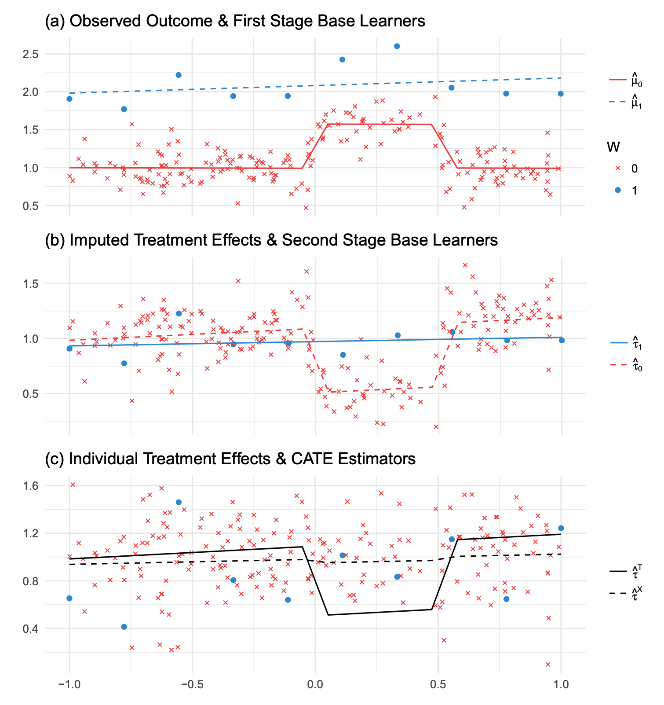

---
<!--
_footer: Taken from [Sören, R, et.al. (2019) *"Meta-learners for Estimating Heterogeneous Treatment Effects using Machine Learning"*](https://arxiv.org/abs/1706.03461)
-->

# X-Learner Step 1 (same as T-Learner):

Model fit for <span style="color:red;">control</span> (red) and <span style="color:blue;">treatment</span> (blue) groups.

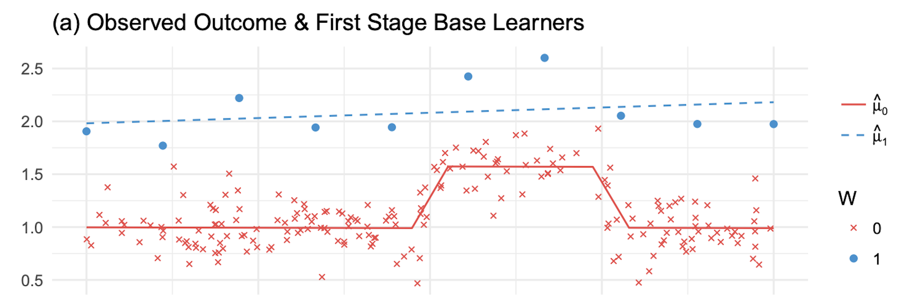

---
<!--
_footer: Taken from [Sören, R, et.al. (2019) *"Meta-learners for Estimating Heterogeneous Treatment Effects using Machine Learning"*](https://arxiv.org/abs/1706.03461)
-->

# T-Learner Estimation:

- The solid line represents the difference between the model fit for the control group and the treatment groups.
- The estimation is not good as the treatment group is very small.

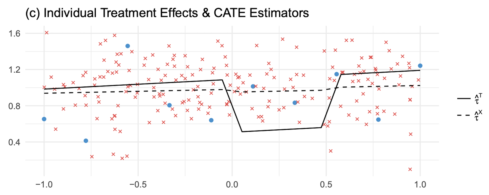

---
<!--
_footer: Taken from [Sören, R, et.al. (2019) *"Meta-learners for Estimating Heterogeneous Treatment Effects using Machine Learning"*](https://arxiv.org/abs/1706.03461)
-->

# Imputed Treatment Effects:

$$
\begin{align*}
\tilde{D}^{T} &= Y^{T} - \hat{\mu}_{C}(X^T) \\
\tilde{D}^{C} &= \hat{\mu}_{T}(X^{C}) - Y^{C} \\
\end{align*}
$$

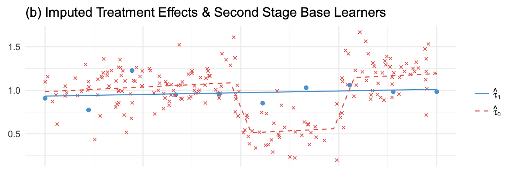

---
<!--
_footer: Taken from [Sören, R, et.al. (2019) *"Meta-learners for Estimating Heterogeneous Treatment Effects using Machine Learning"*](https://arxiv.org/abs/1706.03461)
-->

# X-Learner Estimation:

- The dashed line represents the X-Learner estimation.
- It  combines the fit from the imputed effects by using and estimator of the *propensity score*, i.e. $g(x)=\hat{e}(x)$. In this example $\hat{e}(x)$ will be small as we have much more observations in the control group. Hence the estimated uplift will be close to $\hat{\tau}^{T}$.


---

# Some Python Implementations

- [`causalml`](https://github.com/uber/causalml)


- [`EconML`](https://github.com/microsoft/EconML)


- [`scikit-uplift`](https://github.com/maks-sh/scikit-uplift)


---

# Python code: Example

```python
from causalml.inference.meta import BaseTClassifier
from sklearn.ensemble import HistGradientBoostingClassifier

# define ml model
learner = HistGradientBoostingClassifier()

# set meta-model
t_learner = BaseTClassifier(learner=learner)

# compute ate
t_ate_lwr, t_ate, t_ate_upr = t_learner.estimate_ate(X=x, treatment=w, y=y)

# predict treatment effects
t_learnet.predict(X=x)

# access ml models
t_learner.models_c[1]
t_learner.models_t[1]
```

---
<!--
_footer: Taken from [Diemert, Eustache, et.al. (2020) *"A Large Scale Benchmark for Uplift Modeling"*](http://ama.imag.fr/~amini/Publis/large-scale-benchmark.pdf)
-->

# Uplift Model Evaluation

> A **perfect model** assigns higher scores to all treated individuals
with positive outcomes than any individuals with negative outcomes.

```python
# Control Responders
cr_num = np.sum((y_true == 1) & (treatment == 0))
# Treated Non-Responders
tn_num = np.sum((y_true == 0) & (treatment == 1))

summand = y_true if cr_num > tn_num else treatment

perfect_uplift = 2 * (y_true == treatment) + summand
```

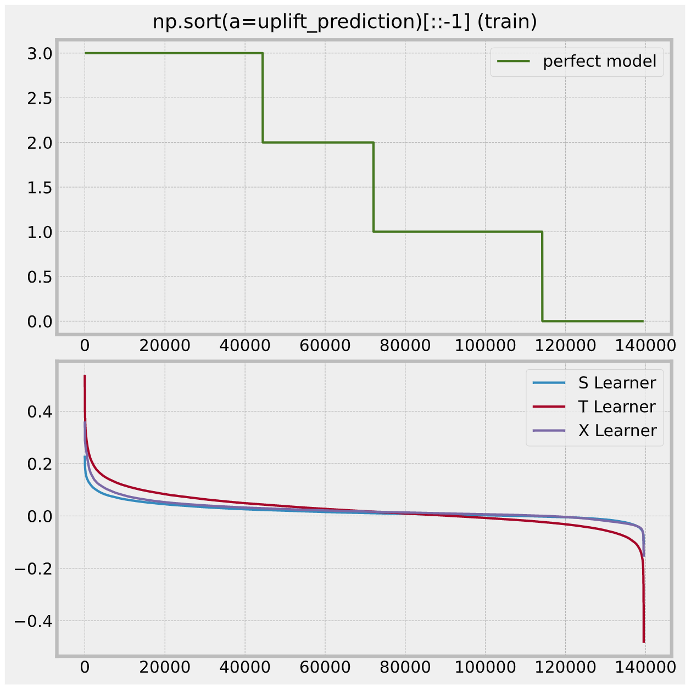


---

# Uplift Evaluation: Uplift by Percentile

1. Sort uplift predictions by decreasing order.
2. Predict uplift for both treated and control observations
3. Compute the average prediction per percentile in both groups.
4. The difference between those averages is taken for each percentile.

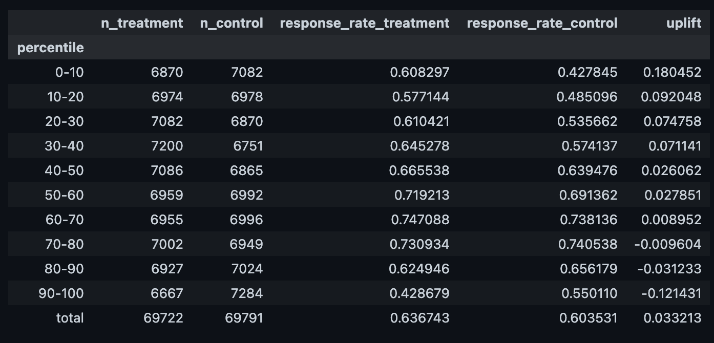

---
<!--
_footer: Plot function `plot_uplift_by_percentile` from [`scikit-uplift`](https://github.com/maks-sh/scikit-uplift).
-->

# Uplift Evaluation: Uplift by Percentile

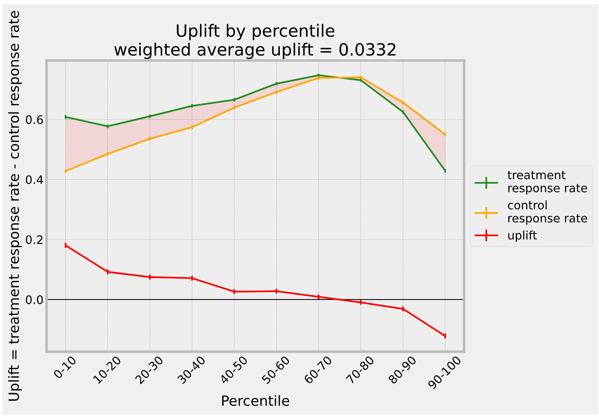

A well performing model would have large values in the first percentiles and decreasing values for larger ones

---
<!--
_footer: Taken from [Gutierrez, P., & Gérardy, J. Y. (2017). *"Causal Inference and Uplift Modelling: A Review of the Literature"*](https://proceedings.mlr.press/v67/gutierrez17a/gutierrez17a.pdf)
-->

# Uplift Evaluation: Cumulative Gain Chart

> Predict uplift for both treated and control observations and compute the average prediction per decile (bins) in both groups. Then, the difference between those averages is taken for each decile.

$$
\left(
\frac{Y^{T}}{N^{T}}
-
\frac{Y^{C}}{N^{C}}
\right)
(N^{T} + N^{C})
$$

- $Y^{T} / Y^{C}$: sum of the treated / control individual outcomes  in the bin.
- $N^{T} / N^{C}$: number of treated / control observations  in the bin.

---

# Uplift Evaluation: Cumulative Gain Chart

```python
(x["uplift"] * (x["n_treatment"] + x["n_control"])).cumsum()
```

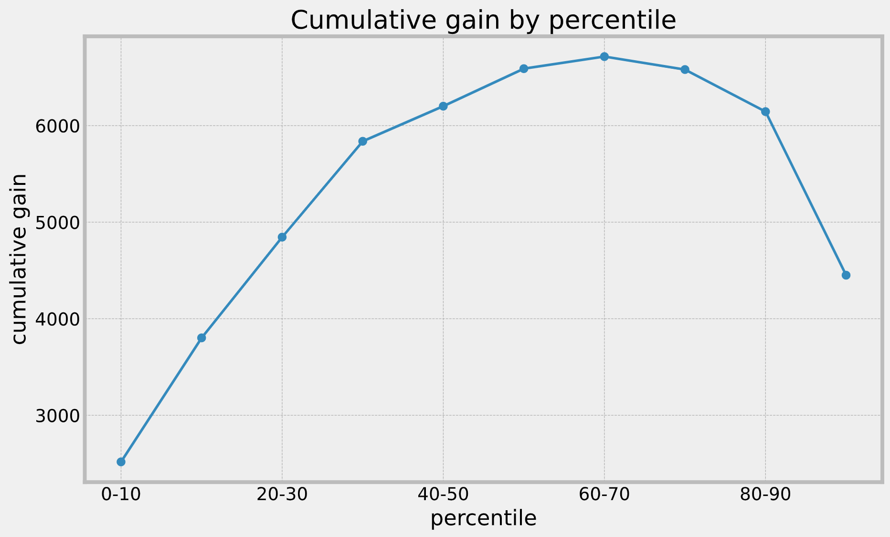

> - From this plot we see if the treatment has a global positive or negative effect and if they can expect a better gain by targeting part of the population. 
> - We can thus choose the decile that maximizes the gain as the limit of the population to be targeted.


---
<!--
_footer: Taken from [Gutierrez, P., & Gérardy, J. Y. (2017). *"Causal Inference and Uplift Modelling: A Review of the Literature"*](https://proceedings.mlr.press/v67/gutierrez17a/gutierrez17a.pdf)
_style : font-size: 13px
-->

# Uplift Metrics: Uplift Curve

*We can generalize the cumulative gain chart for each observation of the test set:*

$$
f(t)
=
\left(
\frac{Y^{T}_{t}}{N^{T}_{t}}
-
\frac{Y^{C}_{t}}{N^{C}_{t}}
\right)
(N^{T}_{t} + N^{C}_{t})
$$

*where the $t$ subscript indicates that the quantity is calculated for the first $t$ observations, sorted by inferred uplift value.*

---
<!--
_footer: Plot function `plot_uplift_curve` from [`scikit-uplift`](https://github.com/maks-sh/scikit-uplift)
-->
# Uplift Metrics: Uplift Curve & AUC

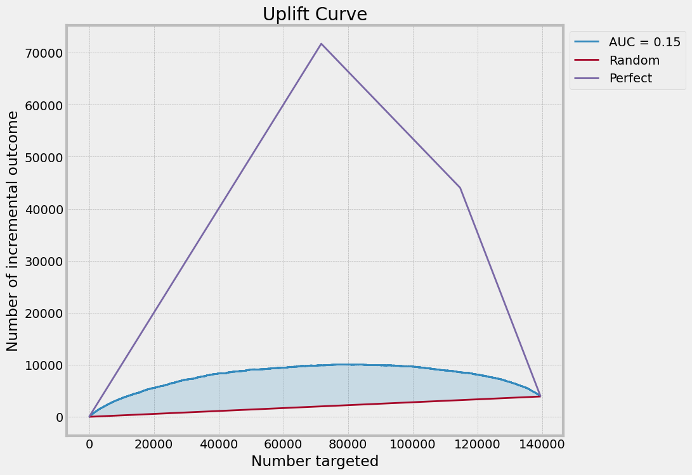

---

# Perfect Uplift Curve

```python
from sklift.metrics import uplift_curve

a, b = uplift_curve(y_true=y_true, uplift=perfect_uplift, treatment=treatment)
```

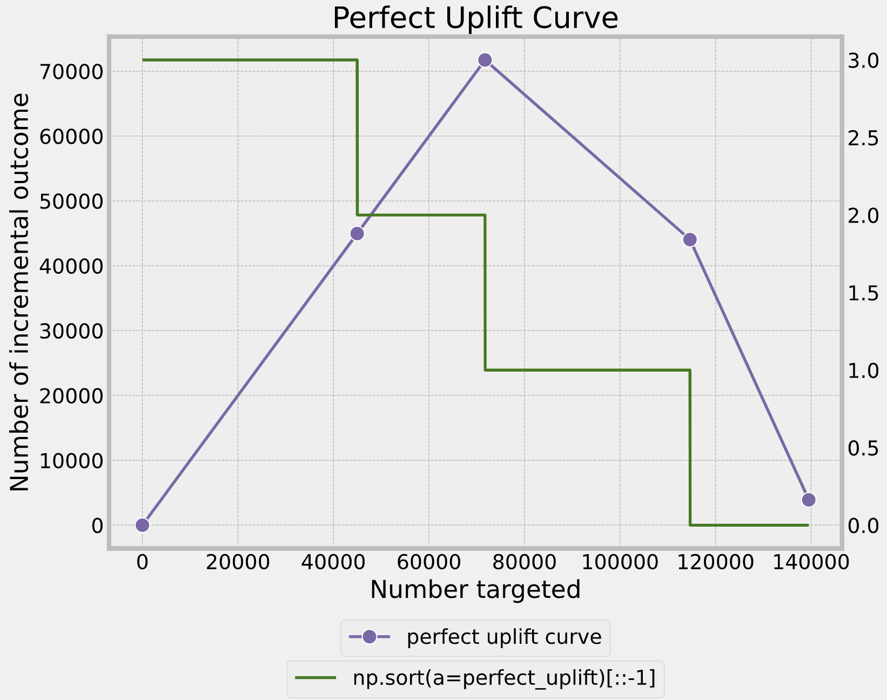

---

# Random Uplift Curves

```python
np.random.uniform(
    low=-1,
    high=1,
    size=(n, n_samples),
)
```

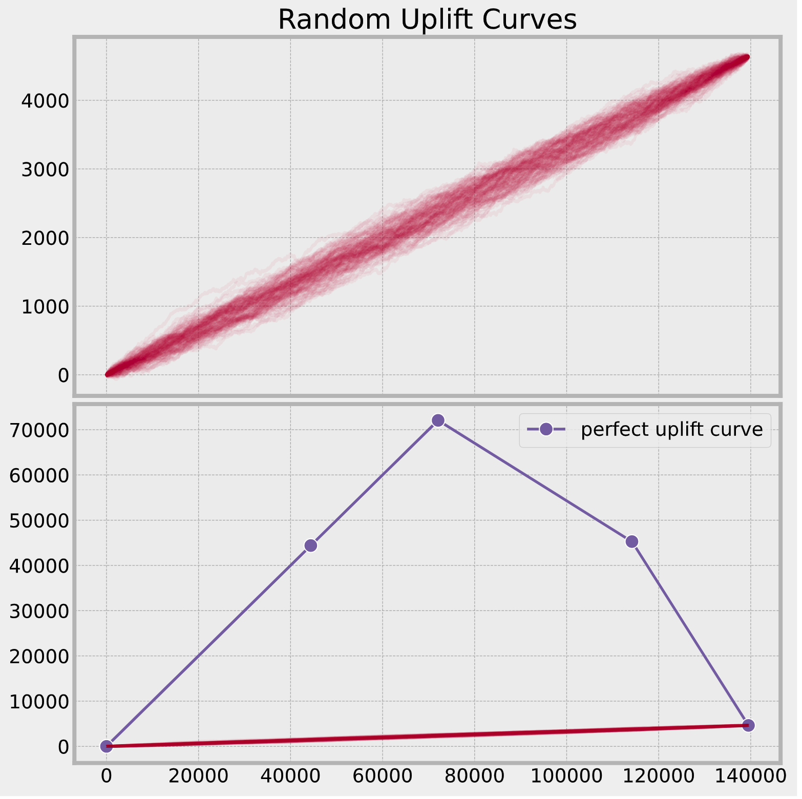

---
<!--
_footer: See https://juanitorduz.github.io/uplift/
-->
# Demo 
## [Notebook Link](https://juanitorduz.github.io/uplift/)


---

## References:

- [Diemert, Eustache, et.al. (2020) *"A Large Scale Benchmark for Uplift Modeling"*](http://ama.imag.fr/~amini/Publis/large-scale-benchmark.pdf)

- [Gutierrez, P., & Gérardy, J. Y. (2017). *"Causal Inference and Uplift Modelling: A Review of the Literature"*](https://proceedings.mlr.press/v67/gutierrez17a/gutierrez17a.pdf)

- [Karlsson, H. (2019) *"Uplift Modeling: Identifying Optimal Treatment Group Allocation and Whom to Contact to Maximize Return on Investment"*](http://www.diva-portal.org/smash/get/diva2:1328437/FULLTEXT01.pdf)

- [Sören, R, et.al. (2019) *"Meta-learners for Estimating Heterogeneous Treatment Effects using Machine Learning"*](https://arxiv.org/abs/1706.03461)

---

# Thank you!

## More Info: [juanitorduz.github.io](https://juanitorduz.github.io)


