<style>
.reveal .slides section .slideContent{
    font-size: 20pt;
}

/* slide titles */
.reveal h1 { 
  font-size: 100px;
}

</style>

Some Remedies for Several Class Imbalance
========================================================
author: Dr. Juan Orduz 
date: satRday Berlin  - 15.06.2019
autosize: true

Content 
========================================================

### 1. Data Set Description

### 2. Data Preparation  

### 3. Some Model Performance Metrics

### 4. Machine Learning Models

- PLS 
- GBM

### 5. Experiments & Results 

- Max Accuracy
- Max Sensitivity
- Altenative Cuttofs
- Sampling Methods

### 6. Other Techniques 

### 7. References & Contact 


Data Set
========================================================


```r
data(AdultUCI, package = "arules")
raw_data <- AdultUCI

glimpse(raw_data, width = 60)
```

```
Observations: 48,842
Variables: 15
$ age              <int> 39, 50, 38, 53, 28, 37, 49, 52, …
$ workclass        <fct> State-gov, Self-emp-not-inc, Pri…
$ fnlwgt           <int> 77516, 83311, 215646, 234721, 33…
$ education        <ord> Bachelors, Bachelors, HS-grad, 1…
$ `education-num`  <int> 13, 13, 9, 7, 13, 14, 5, 9, 14, …
$ `marital-status` <fct> Never-married, Married-civ-spous…
$ occupation       <fct> Adm-clerical, Exec-managerial, H…
$ relationship     <fct> Not-in-family, Husband, Not-in-f…
$ race             <fct> White, White, White, Black, Blac…
$ sex              <fct> Male, Male, Male, Male, Female, …
$ `capital-gain`   <int> 2174, 0, 0, 0, 0, 0, 0, 0, 14084…
$ `capital-loss`   <int> 0, 0, 0, 0, 0, 0, 0, 0, 0, 0, 0,…
$ `hours-per-week` <int> 40, 13, 40, 40, 40, 40, 16, 45, …
$ `native-country` <fct> United-States, United-States, Un…
$ income           <ord> small, small, small, small, smal…
```


```r
data_df <- model_list$functions$format_raw_data(df = raw_data)
```


Income Variable
========================================================
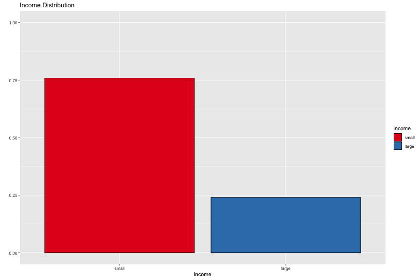

Exploratory Data Analysis - Visualization
========================================================
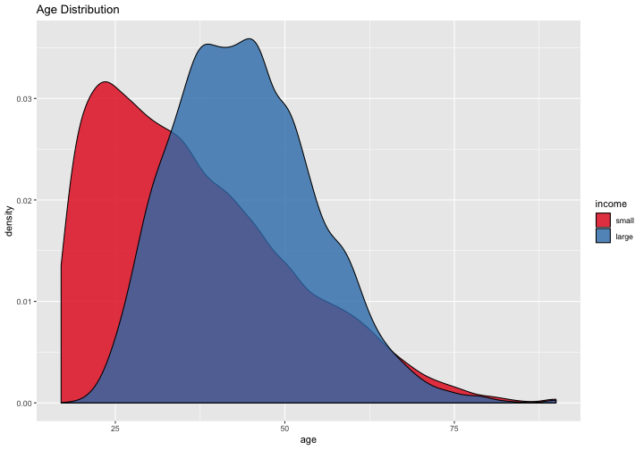

Feature Engineering
========================================================

$$
x \mapsto \log(x + 1)
$$

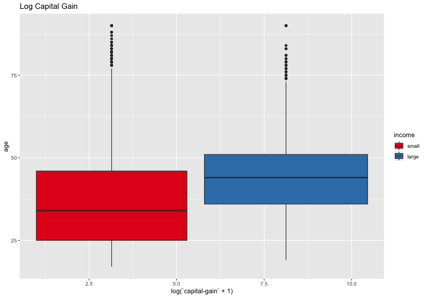


Data Preparation
========================================================

```r
df <- data_df %>% 
  mutate(capital_gain_log = log(`capital-gain` + 1), 
         capital_loss_log = log(`capital-loss` + 1)) %>% 
  select(- `capital-gain`, - `capital-loss`) %>% 
  drop_na()

# Define observation matrix and target vector. 
X <- df %>% select(- income)
y <- df %>% pull(income) %>% fct_rev()

# Add dummy variables. 
dummy_obj <- dummyVars("~ .", data = X, sep = "_")

X <- predict(object = dummy_obj, newdata = X) %>% as_tibble()

# Remove predictors with near zero variance. 
cols_to_rm <- colnames(X)[nearZeroVar(x = X, freqCut = 5000)]
  
X %<>% select(- cols_to_rm) 
```

Data Split
========================================================

```r
# Split train - other
split_index_1 <- createDataPartition(y = y, p = 0.7)$Resample1

X_train <- X[split_index_1, ]
y_train <- y[split_index_1]

X_other <- X[- split_index_1, ]
y_other <- y[- split_index_1]

split_index_2 <- createDataPartition(y = y_other, 
                                     p = 1/3)$Resample1

# Split evaluation - test
X_eval <- X_other[split_index_2, ]
y_eval <- y_other[split_index_2]

X_test <- X_other[- split_index_2, ]
y_test <- y_other[- split_index_2]
```


Confusion Matrix
========================================================

We consider positive `income` = `large`.

<table class="table" style="margin-left: auto; margin-right: auto;">
 <thead>
  <tr>
   <th style="text-align:left;">   </th>
   <th style="text-align:center;"> Condition Positive </th>
   <th style="text-align:center;"> Condition Negative </th>
  </tr>
 </thead>
<tbody>
  <tr>
   <td style="text-align:left;"> Prediction Positive </td>
   <td style="text-align:center;"> TP </td>
   <td style="text-align:center;"> FP </td>
  </tr>
  <tr>
   <td style="text-align:left;"> Prediction Negative </td>
   <td style="text-align:center;"> FN </td>
   <td style="text-align:center;"> TN </td>
  </tr>
</tbody>
</table>

  - TP = True Positive
  - TN = True Negative 
  - FP = False Positive
  - FN = False Negative
  - N = TP + TN + FP + FN
  
Performance Metrics
========================================================

- Accuracy

$$
\text{acc} = \frac{TP + TN}{N}
$$

- [Kappa](https://en.wikipedia.org/wiki/Cohen%27s_kappa) 

$$
\kappa = \frac{\text{acc} - p_e}{1 - p_e}
$$

where $p_e$ = Expected Accuracy (random chance).
  
The kappa metric can be thought as a modification of the accuracy metric based on the class proportions. 

Performance Metrics
========================================================

- [Sensitivity](https://en.wikipedia.org/wiki/Sensitivity_and_specificity) (= [Recall](https://en.wikipedia.org/wiki/Precision_and_recall))

$$
\text{sens} = \frac{TP}{TP + FN}
$$

- [Specitivity](https://en.wikipedia.org/wiki/Sensitivity_and_specificity)

$$
\text{spec} = \frac{TN}{TN + FP}
$$

- [Precision](https://en.wikipedia.org/wiki/Precision_and_recall)

$$
\text{prec} = \frac{TP}{TP + FP}
$$

- [$F_\beta$](https://en.wikipedia.org/wiki/F1_score)

$$
F_\beta = (1 + \beta^2)\frac{\text{prec}\times \text{recall}}{\beta^2\text{prec} + \text{recall}}
$$


ROC Curve
========================================================

The [ROC](https://en.wikipedia.org/wiki/Receiver_operating_characteristic) is created by plotting the true positive rate (= sensitivity) against the false positive rate (1 − specificity) at various propability threshold. 

<div align="center">
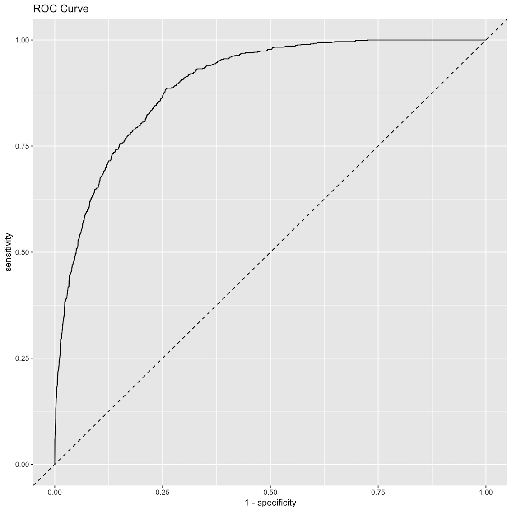
</div>

- AUC : Area under the [ROC](https://en.wikipedia.org/wiki/Receiver_operating_characteristic) curve. 


Machine Learning Models
========================================================

### 1. Trivial Model

Always predict the same class.

### 2. Partial Least Squares + Logistic Regression

Supervised dimensionality reduction. 

### 3. Stochastic Gradient Boosting

Tree ensemble model. 

Trivial Model
========================================================

We predict the same class `income` = `small`


```r
y_pred_trivial <- map_chr(.x = y_test, .f = ~ "small") %>% 
  as_factor(ordered = TRUE, levels = c("small", "large"))
```

We compute the confusion matrix to get the metrics.


```r
# Confusion Matrix. 
conf_matrix_trivial <-  confusionMatrix(data = y_pred_trivial, 
                                        reference =  y_test)
```

<table class="table" style="margin-left: auto; margin-right: auto;">
 <thead>
  <tr>
   <th style="text-align:center;"> term </th>
   <th style="text-align:center;"> estimate </th>
  </tr>
 </thead>
<tbody>
  <tr>
   <td style="text-align:center;"> accuracy </td>
   <td style="text-align:center;"> 0.751 </td>
  </tr>
  <tr>
   <td style="text-align:center;"> kappa </td>
   <td style="text-align:center;"> 0.000 </td>
  </tr>
  <tr>
   <td style="text-align:center;"> sensitivity </td>
   <td style="text-align:center;"> 0.000 </td>
  </tr>
  <tr>
   <td style="text-align:center;"> specificity </td>
   <td style="text-align:center;"> 1.000 </td>
  </tr>
</tbody>
</table>

Trivial Model - ROC
========================================================

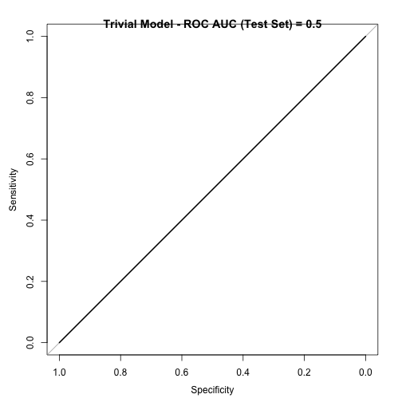

We can use the [pROC](https://cran.r-project.org/web/packages/pROC/pROC.pdf) package. 

Train Control + Train in Caret
========================================================

```
 five_stats <- function (...) {
  
  c(twoClassSummary(...), defaultSummary(...))
  
}

# Define cross validation.
cv_num <- 7

train_control <- trainControl(method = "cv",
                              number = cv_num,
                              classProbs = TRUE, 
                              summaryFunction = five_stats,
                              allowParallel = TRUE, 
                              verboseIter = FALSE)
```

```
model_obj <- train(x = X_train,
                   y = y_train,
                   method = method,
                   tuneLength = 10,
                   # For linear models we scale and center. 
                   preProcess = c("scale", "center"), 
                   trControl = train_control,
                   metric = metric)
```


PLS Model - Max Accuracy
========================================================


<table class="table" style="margin-left: auto; margin-right: auto;">
 <thead>
  <tr>
   <th style="text-align:center;"> accuracy </th>
   <th style="text-align:center;"> kappa </th>
   <th style="text-align:center;"> sensitivity </th>
   <th style="text-align:center;"> specificity </th>
  </tr>
 </thead>
<tbody>
  <tr>
   <td style="text-align:center;"> 0.838 </td>
   <td style="text-align:center;"> 0.527 </td>
   <td style="text-align:center;"> 0.552 </td>
   <td style="text-align:center;"> 0.932 </td>
  </tr>
</tbody>
</table>

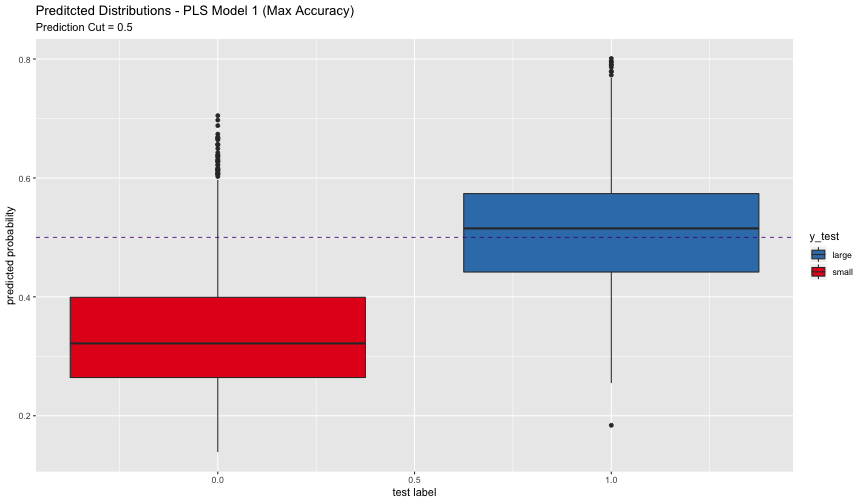

GBM Model - Max Accuracy
========================================================

<table class="table" style="margin-left: auto; margin-right: auto;">
 <thead>
  <tr>
   <th style="text-align:center;"> accuracy </th>
   <th style="text-align:center;"> kappa </th>
   <th style="text-align:center;"> sensitivity </th>
   <th style="text-align:center;"> specificity </th>
  </tr>
 </thead>
<tbody>
  <tr>
   <td style="text-align:center;"> 0.869 </td>
   <td style="text-align:center;"> 0.629 </td>
   <td style="text-align:center;"> 0.655 </td>
   <td style="text-align:center;"> 0.94 </td>
  </tr>
</tbody>
</table>


PLS Model - Max Sensitivity
========================================================

<table class="table" style="margin-left: auto; margin-right: auto;">
 <thead>
  <tr>
   <th style="text-align:center;"> accuracy </th>
   <th style="text-align:center;"> kappa </th>
   <th style="text-align:center;"> sensitivity </th>
   <th style="text-align:center;"> specificity </th>
  </tr>
 </thead>
<tbody>
  <tr>
   <td style="text-align:center;"> 0.84 </td>
   <td style="text-align:center;"> 0.535 </td>
   <td style="text-align:center;"> 0.561 </td>
   <td style="text-align:center;"> 0.932 </td>
  </tr>
</tbody>
</table>

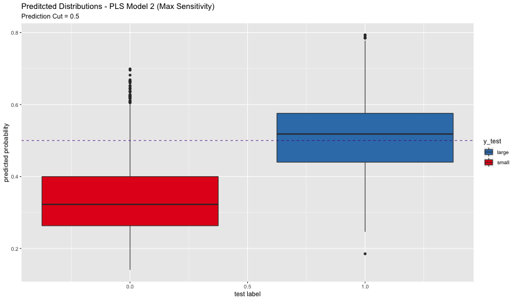


GBM Model - Max Sensitivity
========================================================

<table class="table" style="margin-left: auto; margin-right: auto;">
 <thead>
  <tr>
   <th style="text-align:center;"> accuracy </th>
   <th style="text-align:center;"> kappa </th>
   <th style="text-align:center;"> sensitivity </th>
   <th style="text-align:center;"> specificity </th>
  </tr>
 </thead>
<tbody>
  <tr>
   <td style="text-align:center;"> 0.87 </td>
   <td style="text-align:center;"> 0.635 </td>
   <td style="text-align:center;"> 0.669 </td>
   <td style="text-align:center;"> 0.936 </td>
  </tr>
</tbody>
</table>

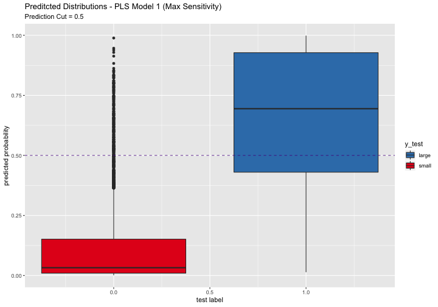

GBM Model - Max Sensitivity
========================================================

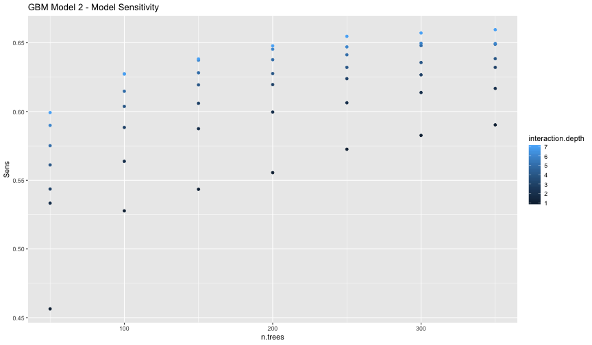

PLS Model - Alternative Cut-Off
========================================================

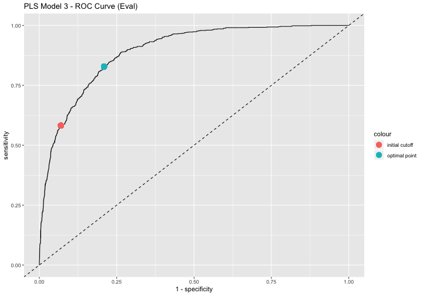

PLS Model - Alternative Cut-Off
========================================================

<table class="table" style="margin-left: auto; margin-right: auto;">
 <thead>
  <tr>
   <th style="text-align:center;"> accuracy </th>
   <th style="text-align:center;"> kappa </th>
   <th style="text-align:center;"> sensitivity </th>
   <th style="text-align:center;"> specificity </th>
  </tr>
 </thead>
<tbody>
  <tr>
   <td style="text-align:center;"> 0.8 </td>
   <td style="text-align:center;"> 0.534 </td>
   <td style="text-align:center;"> 0.82 </td>
   <td style="text-align:center;"> 0.793 </td>
  </tr>
</tbody>
</table>

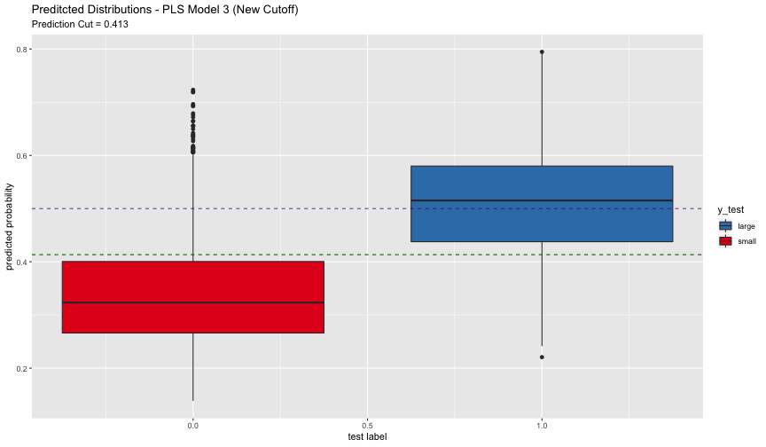

GMB Model - Alternative Cut-Off
========================================================

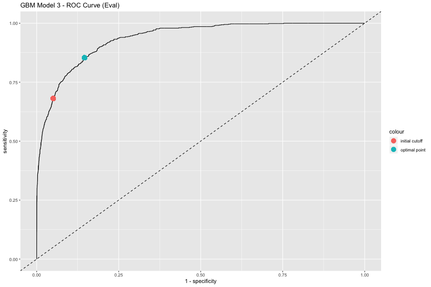

GBM Model - Alternative Cut-Off
========================================================

<table class="table" style="margin-left: auto; margin-right: auto;">
 <thead>
  <tr>
   <th style="text-align:center;"> accuracy </th>
   <th style="text-align:center;"> kappa </th>
   <th style="text-align:center;"> sensitivity </th>
   <th style="text-align:center;"> specificity </th>
  </tr>
 </thead>
<tbody>
  <tr>
   <td style="text-align:center;"> 0.836 </td>
   <td style="text-align:center;"> 0.611 </td>
   <td style="text-align:center;"> 0.862 </td>
   <td style="text-align:center;"> 0.827 </td>
  </tr>
</tbody>
</table>

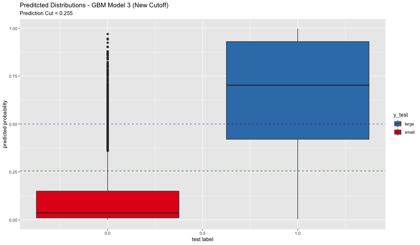

Sampling Methods - Up/Down Sampling
========================================================

- **Up-sampling** is any technique that simulates or imputes additional data points to improve balance across classes.

- **Down-sampling** is any technique that reduces the number of samples to improve the balance across classes. 

In [caret](http://topepo.github.io/caret/index.html): 
```
df_upSample_train <- upSample(x = X_train, 
                              y = y_train, 
                              yname = "income")

X_upSample_train <- df_upSample_train %>% select(- income) 
y_upSample_train <- df_upSample_train %>% pull(income)
```

<table class="table" style="margin-left: auto; margin-right: auto;">
 <thead>
  <tr>
   <th style="text-align:center;"> class </th>
   <th style="text-align:center;"> value </th>
   <th style="text-align:center;"> share </th>
  </tr>
 </thead>
<tbody>
  <tr>
   <td style="text-align:center;"> large </td>
   <td style="text-align:center;"> 16148 </td>
   <td style="text-align:center;"> 0.5 </td>
  </tr>
  <tr>
   <td style="text-align:center;"> small </td>
   <td style="text-align:center;"> 16148 </td>
   <td style="text-align:center;"> 0.5 </td>
  </tr>
</tbody>
</table>

PLS Model - Up Sampling
========================================================

<table class="table" style="margin-left: auto; margin-right: auto;">
 <thead>
  <tr>
   <th style="text-align:center;"> accuracy </th>
   <th style="text-align:center;"> kappa </th>
   <th style="text-align:center;"> sensitivity </th>
   <th style="text-align:center;"> specificity </th>
  </tr>
 </thead>
<tbody>
  <tr>
   <td style="text-align:center;"> 0.791 </td>
   <td style="text-align:center;"> 0.527 </td>
   <td style="text-align:center;"> 0.854 </td>
   <td style="text-align:center;"> 0.77 </td>
  </tr>
</tbody>
</table>

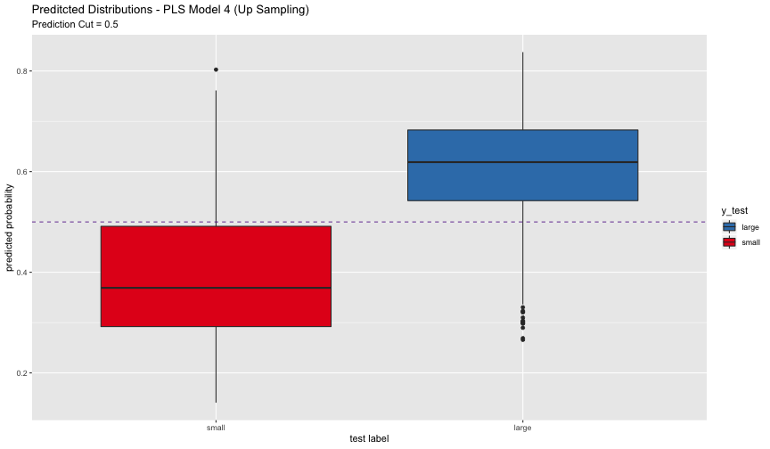

GBM Model - Up Sampling
========================================================

<table class="table" style="margin-left: auto; margin-right: auto;">
 <thead>
  <tr>
   <th style="text-align:center;"> accuracy </th>
   <th style="text-align:center;"> kappa </th>
   <th style="text-align:center;"> sensitivity </th>
   <th style="text-align:center;"> specificity </th>
  </tr>
 </thead>
<tbody>
  <tr>
   <td style="text-align:center;"> 0.841 </td>
   <td style="text-align:center;"> 0.62 </td>
   <td style="text-align:center;"> 0.854 </td>
   <td style="text-align:center;"> 0.837 </td>
  </tr>
</tbody>
</table>

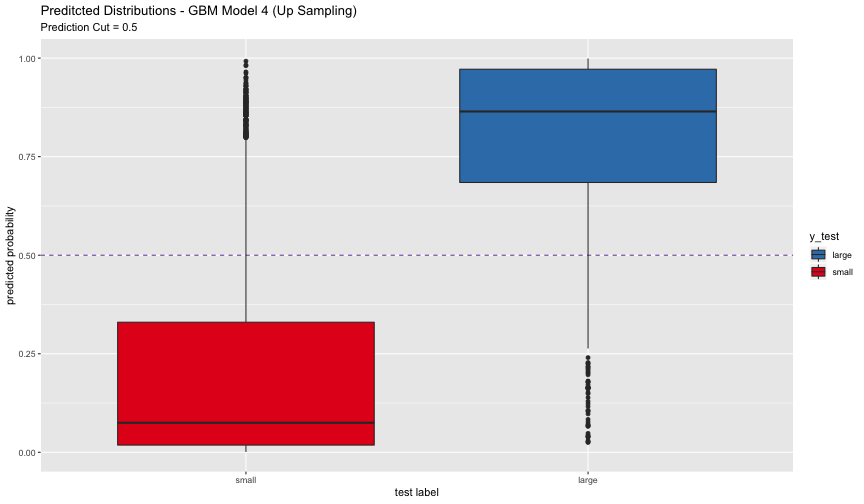

Sampling Methods - SMOTE
========================================================

**SMOTE** is a data sampling procedure that uses both up-sampling and down-sampling. To up-sample for the minority class, it synthesizes new cases: a data point is randomly selected from the minority class and its K-nearest neighbors are determined. The new synthetic data point is a random combination of the predictors of the randomly selected data point and its neighbors.

We can use the [DMwR](https://cran.r-project.org/web/packages/DMwR/index.html) package:

```
df_smote_train <-  DMwR::SMOTE(
  form = income ~ ., 
  perc.over = 200, 
  perc.under = 150, 
  data = as.data.frame(bind_cols(income = y_train, X_train))
)

X_smote_train <- df_smote_train  %>% select(- income) 
y_smote_train <- df_smote_train  %>% pull(income) 
```

<table class="table" style="margin-left: auto; margin-right: auto;">
 <thead>
  <tr>
   <th style="text-align:center;"> class </th>
   <th style="text-align:center;"> value </th>
   <th style="text-align:center;"> share </th>
  </tr>
 </thead>
<tbody>
  <tr>
   <td style="text-align:center;"> large </td>
   <td style="text-align:center;"> 16065 </td>
   <td style="text-align:center;"> 0.5 </td>
  </tr>
  <tr>
   <td style="text-align:center;"> small </td>
   <td style="text-align:center;"> 16065 </td>
   <td style="text-align:center;"> 0.5 </td>
  </tr>
</tbody>
</table>


PLS Model - SMOTE
========================================================

<table class="table" style="margin-left: auto; margin-right: auto;">
 <thead>
  <tr>
   <th style="text-align:center;"> accuracy </th>
   <th style="text-align:center;"> kappa </th>
   <th style="text-align:center;"> sensitivity </th>
   <th style="text-align:center;"> specificity </th>
  </tr>
 </thead>
<tbody>
  <tr>
   <td style="text-align:center;"> 0.799 </td>
   <td style="text-align:center;"> 0.52 </td>
   <td style="text-align:center;"> 0.774 </td>
   <td style="text-align:center;"> 0.807 </td>
  </tr>
</tbody>
</table>

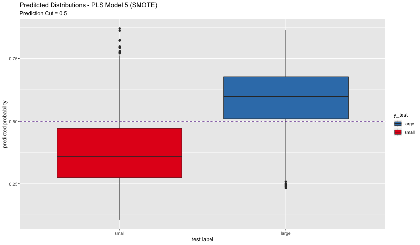

GBM Model - SMOTE
========================================================

<table class="table" style="margin-left: auto; margin-right: auto;">
 <thead>
  <tr>
   <th style="text-align:center;"> accuracy </th>
   <th style="text-align:center;"> kappa </th>
   <th style="text-align:center;"> sensitivity </th>
   <th style="text-align:center;"> specificity </th>
  </tr>
 </thead>
<tbody>
  <tr>
   <td style="text-align:center;"> 0.864 </td>
   <td style="text-align:center;"> 0.624 </td>
   <td style="text-align:center;"> 0.678 </td>
   <td style="text-align:center;"> 0.925 </td>
  </tr>
</tbody>
</table>

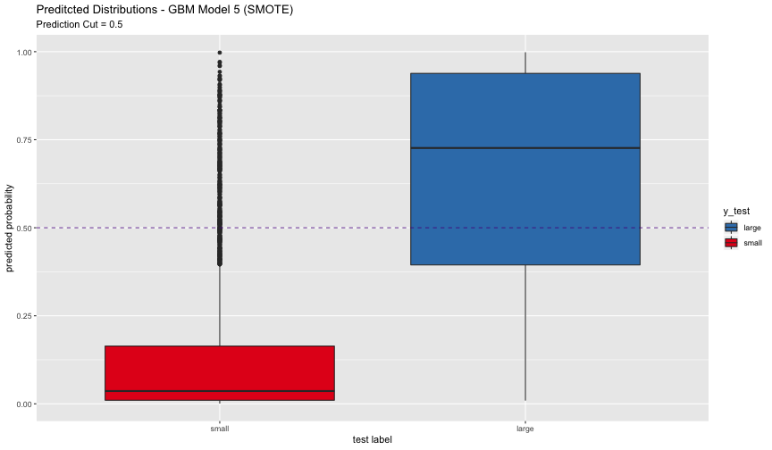

Model Summary - PLS
========================================================


<table class="table" style="margin-left: auto; margin-right: auto;">
 <thead>
  <tr>
   <th style="text-align:center;"> Method </th>
   <th style="text-align:center;"> Tag </th>
   <th style="text-align:center;"> Sensitivity </th>
   <th style="text-align:center;"> Specificity </th>
   <th style="text-align:center;"> Precision </th>
   <th style="text-align:center;"> Recall </th>
   <th style="text-align:center;"> F1 </th>
  </tr>
 </thead>
<tbody>
  <tr>
   <td style="text-align:center;"> pls </td>
   <td style="text-align:center;"> Accuracy </td>
   <td style="text-align:center;"> 0.552 </td>
   <td style="text-align:center;"> 0.932 </td>
   <td style="text-align:center;"> 0.730 </td>
   <td style="text-align:center;"> 0.552 </td>
   <td style="text-align:center;"> 0.628 </td>
  </tr>
  <tr>
   <td style="text-align:center;"> pls </td>
   <td style="text-align:center;"> Sens </td>
   <td style="text-align:center;"> 0.561 </td>
   <td style="text-align:center;"> 0.932 </td>
   <td style="text-align:center;"> 0.733 </td>
   <td style="text-align:center;"> 0.561 </td>
   <td style="text-align:center;"> 0.636 </td>
  </tr>
  <tr>
   <td style="text-align:center;"> pls </td>
   <td style="text-align:center;"> Alt Cutoff </td>
   <td style="text-align:center;"> 0.820 </td>
   <td style="text-align:center;"> 0.793 </td>
   <td style="text-align:center;"> 0.568 </td>
   <td style="text-align:center;"> 0.820 </td>
   <td style="text-align:center;"> 0.671 </td>
  </tr>
  <tr>
   <td style="text-align:center;"> pls </td>
   <td style="text-align:center;"> Up Sampling </td>
   <td style="text-align:center;"> 0.854 </td>
   <td style="text-align:center;"> 0.770 </td>
   <td style="text-align:center;"> 0.552 </td>
   <td style="text-align:center;"> 0.854 </td>
   <td style="text-align:center;"> 0.670 </td>
  </tr>
  <tr>
   <td style="text-align:center;"> pls </td>
   <td style="text-align:center;"> SMOTE </td>
   <td style="text-align:center;"> 0.774 </td>
   <td style="text-align:center;"> 0.807 </td>
   <td style="text-align:center;"> 0.571 </td>
   <td style="text-align:center;"> 0.774 </td>
   <td style="text-align:center;"> 0.657 </td>
  </tr>
</tbody>
</table>

Model Summary - GMB
========================================================

<table class="table" style="margin-left: auto; margin-right: auto;">
 <thead>
  <tr>
   <th style="text-align:center;"> Method </th>
   <th style="text-align:center;"> Tag </th>
   <th style="text-align:center;"> Sensitivity </th>
   <th style="text-align:center;"> Specificity </th>
   <th style="text-align:center;"> Precision </th>
   <th style="text-align:center;"> Recall </th>
   <th style="text-align:center;"> F1 </th>
  </tr>
 </thead>
<tbody>
  <tr>
   <td style="text-align:center;"> gbm </td>
   <td style="text-align:center;"> Accuracy </td>
   <td style="text-align:center;"> 0.655 </td>
   <td style="text-align:center;"> 0.940 </td>
   <td style="text-align:center;"> 0.782 </td>
   <td style="text-align:center;"> 0.655 </td>
   <td style="text-align:center;"> 0.713 </td>
  </tr>
  <tr>
   <td style="text-align:center;"> gbm </td>
   <td style="text-align:center;"> Sens </td>
   <td style="text-align:center;"> 0.669 </td>
   <td style="text-align:center;"> 0.936 </td>
   <td style="text-align:center;"> 0.777 </td>
   <td style="text-align:center;"> 0.669 </td>
   <td style="text-align:center;"> 0.719 </td>
  </tr>
  <tr>
   <td style="text-align:center;"> gbm </td>
   <td style="text-align:center;"> Alt Cutoff </td>
   <td style="text-align:center;"> 0.862 </td>
   <td style="text-align:center;"> 0.827 </td>
   <td style="text-align:center;"> 0.624 </td>
   <td style="text-align:center;"> 0.862 </td>
   <td style="text-align:center;"> 0.724 </td>
  </tr>
  <tr>
   <td style="text-align:center;"> gbm </td>
   <td style="text-align:center;"> Up Sampling </td>
   <td style="text-align:center;"> 0.854 </td>
   <td style="text-align:center;"> 0.837 </td>
   <td style="text-align:center;"> 0.635 </td>
   <td style="text-align:center;"> 0.854 </td>
   <td style="text-align:center;"> 0.728 </td>
  </tr>
  <tr>
   <td style="text-align:center;"> gbm </td>
   <td style="text-align:center;"> SMOTE </td>
   <td style="text-align:center;"> 0.678 </td>
   <td style="text-align:center;"> 0.925 </td>
   <td style="text-align:center;"> 0.751 </td>
   <td style="text-align:center;"> 0.678 </td>
   <td style="text-align:center;"> 0.713 </td>
  </tr>
</tbody>
</table>

Other Techniques
========================================================

- Adjusting Prior Probabilities

- Cost-Sensitive Training

- ...


References & Contact 
========================================================

### Book: 

[Applied Predictive Modeling](http://appliedpredictivemodeling.com/), by Max Kuhn and Kjell Johnson.

### Blog Post:

[https://juanitorduz.github.io/class_imbalance](https://juanitorduz.github.io/class_imbalance)

### Contact:

<juanitorduz@gmail.com>
